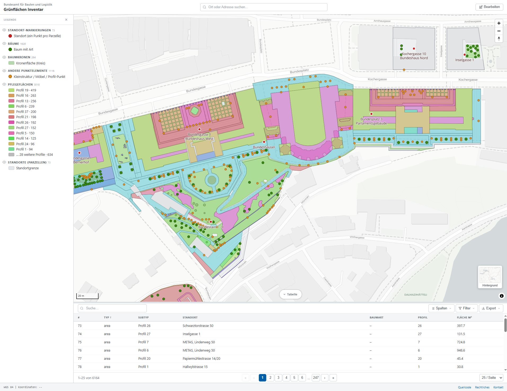

# Green Area Inventory / Grünflächeninventar


[](https://opensource.org/licenses/MIT)
[](https://bbl-dres.github.io/green-inventory/)
[](https://developer.mozilla.org/en-US/docs/Web/JavaScript)
[](https://maplibre.org/)
[](#tech-stack)

> [!CAUTION]
> **This is an unofficial mockup for demonstration purposes only.**
> All data is fictional. Not all features are fully functional. This project serves as a visual and conceptual prototype — it is not intended for production use.

## What is this?

A pair of interactive **GIS web prototypes** for urban green-space inventory, maintenance planning, and field survey of properties managed by the Swiss Federal Office for Buildings and Logistics (BBL). The main app loads ~6 000 features extracted from a Bundesgärtnerei FileGDB and shows them on a map with care-profile classification, attribute filtering, table view, and identify against external swisstopo layers.

Both prototypes are **vanilla HTML/CSS/JS, zero build step, zero npm dependencies**, served as static files via GitHub Pages.

## Solutions

### Main App (Standorte / Grünflächen)

The current focus: GDB-backed inventory of 73 sites (Standorte) and ~6 000 green-area features (areas, trees, canopies, small structures). MapLibre GL JS, four basemaps, 2D / 3D toggle with OSM building extrusion + tree cylinders, right-click Distanz / Teilen / Drucken, identify-on-click for external swisstopo layers, scoped table view (Standorte / Grünflächen tabs).

- Link: https://bbl-dres.github.io/green-inventory/

<p align="center">
  
  
</p>

---

### Prototype 1 — Earlier mock-up

Original feature-rich mock-up exploring care profiles, contracts, inspections, tasks, and cost tracking against a denormalised dataset. Multilingual support, separate data model, more attribute panels per entity.

- Link: https://bbl-dres.github.io/green-inventory/prototype1/

<p align="center">
  
</p>


## Features (Main App)

### Map
- **MapLibre GL JS** map with four basemaps: CARTO Positron / Dark Matter / Voyager + **swisstopo Luftbild** (vector tiles).
- **2D / 3D toggle** — camera pitches to 60°; OSM building footprints extrude (via [OpenFreeMap](https://openfreemap.org) `render_height` with 8 m default); each tree renders as a 12-gon cylinder coloured by species class.
- **Home button** resets to the data bbox; full-screen zoom range to z22.
- **Identify on click** for external swisstopo layers via the federal MapServer API; results returned as `geoJSON` in LV95 and re-projected client-side.

### Legend (left drawer)
- **GSZ Profilkatalog grouping** — Rasen / Wiesen / Rabatten / Hecken / Gehölzflächen / Spezielle Bepflanzungsformen / Beläge / Wasserflächen / Anderes, plus Baum / Spezielle Bepflanzungsformen (Punkt) / Kleinstrukturen.
- **PDF-faithful colours and pattern swatches** (Wechselflor purple dots, Magerrasen brown dots, Rasengittersteine cross-hatch, Bollensteine grey dots, etc.).
- Eye-toggle per group filters the map at the **profile-code** level (e.g. hide all `Hecken` codes 16/17/18 in one click).

### Filter sidebar (right drawer)
- Collapsible accordion groups: Standort / Profil / Baumart / Typ / Los / Pflegeklasse / Eigentümer / Pflege durch.
- Search-within-filters auto-expands matching groups; per-group active-count chip; "Alle zurücksetzen" link.
- Mobile: slides in from the right with scrim, same pattern as the legend drawer.

### Table panel
- **Standorte / Grünflächen tabs** — segmented control filters table to sites only (73) or green features only (~6 000); per-tab column-visibility defaults.
- Search, sort, configurable columns, 100/200/500 rows-per-page pagination, CSV / GeoJSON / Excel export (all data or filtered set).
- Selecting a row pans the map and opens its popup; row hover highlights the feature on the map.

### Coordinate handling
- Footer shows live **WGS 84** + **LV95** (Swiss-grid) coordinates as the cursor moves; right-click copies both forms.
- Identify-on-click converts the query point to LV95 (`EPSG:2056`) because many swisstopo WMS layers refuse `sr=4326`.

### Header actions
- **Filter** (with active-count badge), **Share** (Web Share API + clipboard fallback), **Drucken** (preserveDrawingBuffer print pipeline), 2D/3D toggle.
- All view state — center, zoom, selection, active external layers, tab scope — round-trips through URL parameters (`?center=…&zoom=…&sel=…&ext=…&scope=…`).

## Data pipeline

The map data lives in [`data/data.geojson`](data/data.geojson) (~10 MB, 6 164 features). It's generated from a Bundesgärtnerei FileGDB by [`scripts/gdb_to_geojson.py`](scripts/gdb_to_geojson.py), which:

1. Reads three GDB layers via **pyogrio** + the bundled GDAL FileGDB driver.
2. Extracts **17 field-domain codelists** (idPP polygon profiles, idPP point profiles, idBa species list, etc.) via `ctypes` against the GDAL OGR field-domain API.
3. Reprojects **LV03 → LV95** (CHENyx06 NTv2 grid, 0.2 m accuracy) **→ WGS 84** (1.0 m accuracy, the published ceiling for non-Reframe transforms).
4. Validates geometry (`make_valid`), simplifies high-vertex outliers at 5 cm in LV95, enforces RFC 7946 right-hand winding.
5. Embeds all codelists, accuracy info, attribution, and `bbox` into the output metadata.

The full data-model contract — source GDB schema, codelists, conversion rules, and output contract — is documented in **[docs/DATAMODEL.md](https://github.com/bbl-dres/green-inventory/blob/main/docs/DATAMODEL.md)**.

## Tech Stack

| Technology | Version | Usage |
|---|---|---|
| Vanilla JavaScript | ES6+ | Application logic |
| MapLibre GL JS | v4.7 | Map rendering (WebGL) |
| CSS3 | Modern | Design tokens + flex/grid layouts |
| GeoJSON | RFC 7946 | Geospatial data format |
| swisstopo MapServer | v3 | External-layer search + identify |
| OpenFreeMap | planet | 3D OSM building tiles |
| pyogrio + GDAL | 0.12 / 3.11 | FileGDB read + field domain extraction (Python pipeline) |
| pyproj | 3.x | CRS reprojection (CHENyx06 grid) |
| shapely | 2.x | Geometry validation + simplification |

No build tools or frameworks for the frontend; pure static files.

## Getting Started

```bash
# Any static file server works:
python -m http.server 8000
# or
npx http-server
```

Then open <http://localhost:8000>. The root page is the main app; `/prototype1/` is the earlier mock-up.

To regenerate `data/data.geojson` from a fresh GDB:

```bash
pip install pyogrio pyproj shapely pandas
python scripts/gdb_to_geojson.py
```

Edit the `GDB_PATH` constant at the top of the script if your GDB lives elsewhere.

## Project Structure

```
green-inventory/
├── index.html                 # Main app entry point
├── README.md
├── assets/
│   ├── images/                # Preview screenshots (used by README)
│   ├── Preview1.jpg           # Social-media preview
│   └── swiss-logo-*           # Federal logos
├── js/
│   ├── config.js              # Legend groups, profile styles, table columns, basemaps
│   ├── map.js                 # MapLibre init, layers, controls, popups, search
│   └── table.js               # Table widget: tabs, scope, filtering, export
├── css/
│   ├── tokens.css             # Design tokens (colors, spacing, shadows, …)
│   └── styles.css             # Component styles
├── data/
│   └── data.geojson           # Single FeatureCollection (6 164 features)
├── scripts/
│   └── gdb_to_geojson.py      # GDB → GeoJSON conversion pipeline
├── docs/
│   └── DATAMODEL.md           # Source GDB schema, codelists, output contract
└── prototype1/                # Earlier prototype (separate app, own README)
```

## Deployment

**GitHub Pages:** push to `main` deploys automatically.

**Alternatives:** Netlify, Vercel, CloudFlare Pages, or any static file server.

## License

Licensed under [MIT](https://opensource.org/licenses/MIT).

---

> [!CAUTION]
> **This is an unofficial mockup for demonstration purposes only.**
> All data is fictional. Not all features are fully functional. This project serves as a visual and conceptual prototype — it is not intended for production use.
