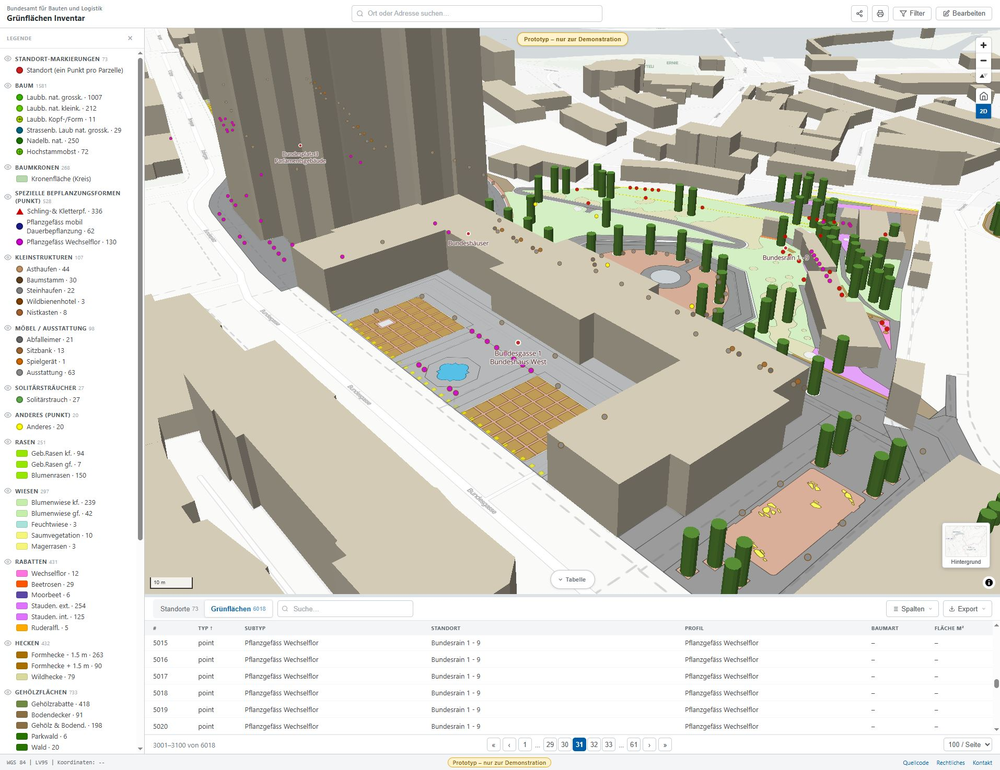
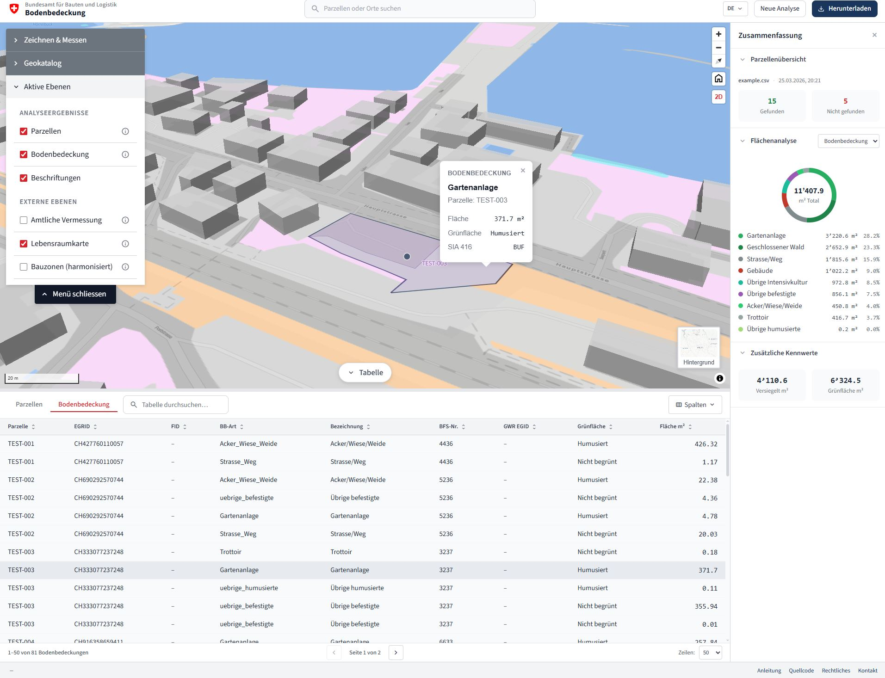
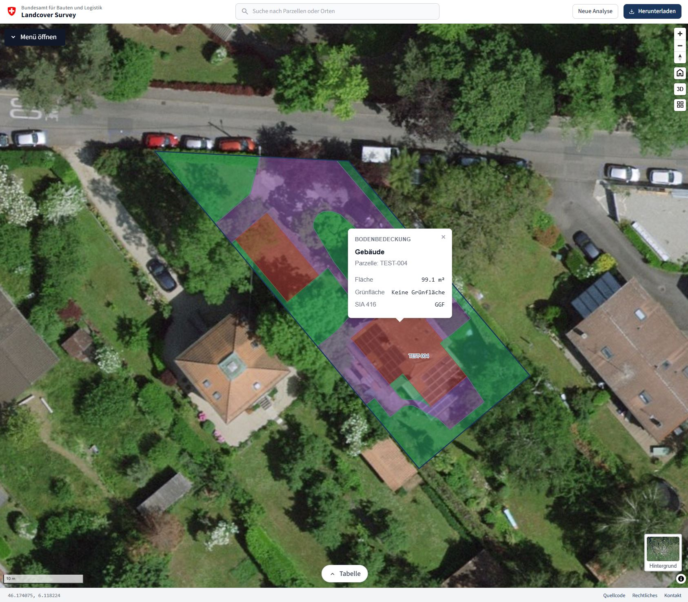
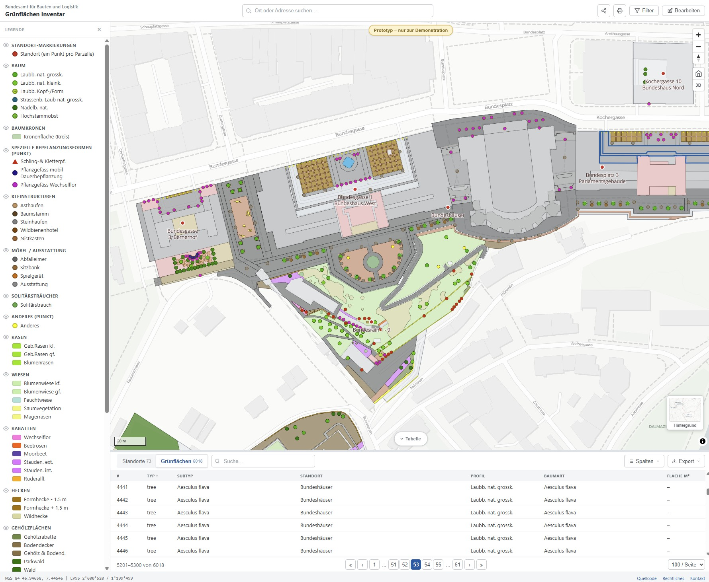

# Green Inventory / Grünflächeninventar


[](https://opensource.org/licenses/MIT)
[](https://bbl-dres.github.io/green-inventory/)
[](https://developer.mozilla.org/en-US/docs/Web/JavaScript)
[](https://maplibre.org/)
[](#running-locally)

> [!CAUTION]
> **Unofficial mockup for demonstration purposes only.**
> The data shown is a limited sample for demonstration only — not the full dataset. Not all features are fully functional. This project is a visual and conceptual prototype — not intended for production use.

Interactive GIS web-app mockups for urban green-space inventory, maintenance planning, and field survey of properties managed by the Swiss Federal Office for Buildings and Logistics (BBL / Bundesgärtnerei). The repo holds **two independent prototypes**, each in its own folder with its own README.

## Prototypes

### Main App — Green Areas

GDB-backed inventory of 73 sites (Standorte) and ~6 000 green-area features on a MapLibre GL map: care-profile classification, PDF-faithful legend grouping, attribute filters, scoped table view (Standorte / Grünflächen), 2D/3D toggle, and identify against external swisstopo layers.
- Live app: https://bbl-dres.github.io/green-inventory/prototype-main/
- Source code: [`prototype-main/`](prototype-main/)

<p align="center">
  
  
</p>

---

### Landcover Survey

Aggregate land cover area (m²) per Swiss cadastral parcel from official Amtliche Vermessung (AV) data — supports single-parcel EGRID lookup and full municipal batch processing.

- Live app: https://bbl-dres.github.io/landcover-survey/web/
- Source Code: https://github.com/bbl-dres/landcover-survey

<p align="center">
  
  
</p>


---

### Care & Maintenance Prototype

Earlier feature-rich mockup exploring care profiles, contracts, inspections, task planning, and cost tracking against a denormalised data model. Multilingual, with tabbed per-property detail views and more attribute panels per entity.

Built on **public sample data** from the [BBL Bundesgärtnerei](https://www.bbl.admin.ch/de/bundesgaertnerei) — a representative excerpt for demonstration only; the full dataset is not published here.

- Live app: https://bbl-dres.github.io/green-inventory/prototype-care/
- Source code: [`prototype-care/`](prototype-care/)

<p align="center">
  
</p>

## Running locally

No build tools, no dependencies — just static files. From the repo root:

```bash
# Python
python -m http.server 8000

# Node
npx http-server

# PHP
php -S localhost:8000
```

Then open <http://localhost:8000/>. The root redirects to the main app; each prototype lives at its own path (e.g. `/prototype-care/`). The old `/prototype1/` path still redirects to `/prototype-care/`.

## Deployment

**GitHub Pages:** push to `main` deploys automatically. Alternatives: Netlify, Vercel, CloudFlare Pages, or any static file server.

## License

[MIT](LICENSE)
