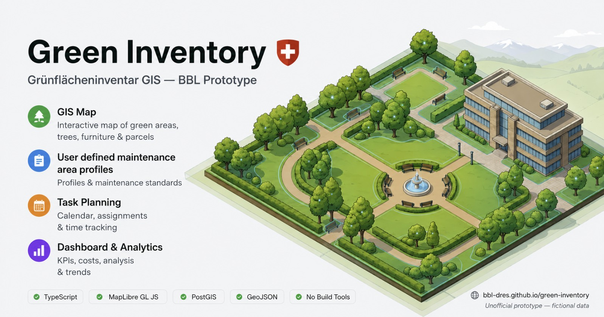
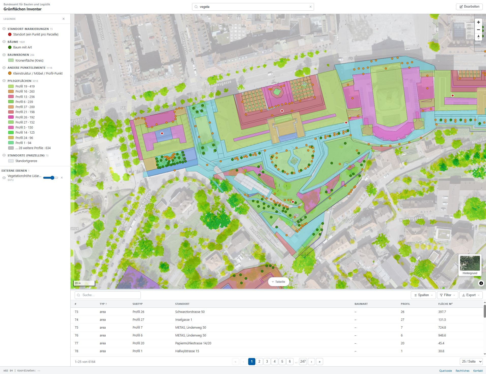
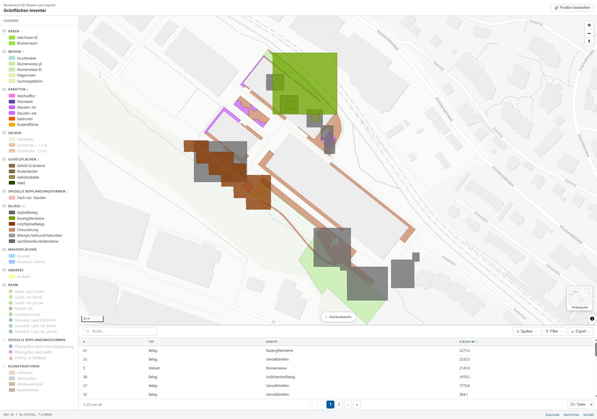

# Green Area Inventory / Grünflächeninventar



> [!CAUTION]
> **This is an unofficial mockup for demonstration purposes only.**
> All data is fictional. Not all features are fully functional. This project serves as a visual and conceptual prototype — it is not intended for production use.

**Simple Viewer:** https://bbl-dres.github.io/green-inventory

**Advanced Prototype:** https://bbl-dres.github.io/green-inventory/prototype1

Interactive GIS web application mockup for urban green space inventory, maintenance planning, and field survey — built around interactive maps, care profiles, and task management.

<p align="center">
  
  
</p>

---

## Project structure

```
green-inventory/
├── index.html              # Map viewer (MapLibre GL JS + CARTO basemap)
├── extract_features.py     # PDF → GeoJSON extraction script
├── data/
│   ├── [838147959] 1602.GR_Mühlestrasse 2+4+6+8Grünflächenpflege.pdf
│   └── [838147959] 1602.GR_Mühlestrasse 2+4+6+8Grünflächenpflege.geojson
└── prototype1/             # Earlier prototype (separate app)
```

---

## extract_features.py

Extracts vector features from a Swiss landscape plan PDF (*Grünflächenpflege*, scale 1:650) and outputs a WGS 84 GeoJSON file.

### Dependencies

```bash
pip install pymupdf shapely numpy pyproj
```

### Usage

```bash
python extract_features.py
```

Input and output paths are configured at the top of the script (`PDF_PATH`, `OUTPUT_PATH`).

### How it works

The script reads all vector drawing paths from the PDF page using **PyMuPDF** and processes them in two passes:

#### Pass 1 — Large filled areas (`>= 20 pt` in both dimensions)
These are solid-colour polygons and hatching stripes that define feature boundaries directly. Paths are grouped by their classified feature type, then merged using a **buffer → union → erode** operation (`MERGE_BUFFER_M = 1.8 m`) to collapse individual hatch stripes into unified area polygons. The result is exploded back into individual polygons per spatially disconnected region.

#### Pass 2 — Pattern tiles (`< 20 pt`)
These are the small repeated elements (dots, dashes, crosshatch marks) that fill patterned areas. Each tile's bounding rect is converted to a small Shapely polygon, then the same **buffer → union → erode** approach merges adjacent tiles into area polygons. This replaces the earlier convex-hull-of-centroids approach, which over-estimated boundaries.

#### Color classification
Each path's fill RGB is matched against `FEATURE_COLORS` (a lookup table of ~30 entries) using Euclidean distance in RGB space with a tolerance of `0.04`. Unclassified fills (white building footprints, etc.) are skipped — those will be sourced from official survey data.

#### Georeferencing
A single ground control point (GCP) is used:

| GCP | WGS 84 | Assumed local position |
|-----|--------|----------------------|
| 1 | 46.97510 N, 7.47417 E | Map centre |

The scale is calibrated from the plan's scale bar (174.49 PDF points = 40 m → **1 pt ≈ 0.2292 m**). Local metre coordinates are converted to WGS 84 via Swiss LV95 (EPSG:2056) as an intermediate CRS for accurate metric offsets.

> **Note:** North is assumed to be up. The plan may have a slight rotation. Use the **Position bearbeiten** tool in the map viewer to drag and correct the position, then save the updated GeoJSON.

---

## Legend layers

Building footprints and the site boundary (red outline) are intentionally excluded — these will be sourced from official Swiss survey data (amtliche Vermessung).

**How to read the matching column:**
- **Solid fill** — one or more large closed polygons drawn with this fill colour. Directly converted to geometry.
- **Hatch stripes** — many overlapping diagonal parallelograms in this colour tiling the area. Merged via buffer→union→erode.
- **Pattern tiles** — thousands of tiny (< 5 mm²) repeated dot/dash/crosshatch elements. Merged the same way.
- ⚠️ **Cannot distinguish** — two or more legend subtypes share an identical fill colour; they are merged into a single subtype in the output.
- ➖ **Not present** — this legend type does not appear in this particular plan file.

---

### Rasen

| Subtype | Category | PDF colour | Match method |
|---------|----------|-----------|--------------|
| Geb.Rasen kf. | `lawn` | `#97e600` rgb(0.596, 0.902, 0) | Solid fill |
| Blumenrasen | `lawn` | `#97e600` on white | ⚠️ Same base colour as Geb.Rasen kf. — dot tiles not yet distinguished; merged into `lawn` |

### Wiesen

| Subtype | Category | PDF colour | Match method |
|---------|----------|-----------|--------------|
| Feuchtwiese | `meadow` | `#a8e3d9` rgb(0.659, 0.890, 0.851) | ➖ Not present in this plan |
| Blumenwiese gf. | `meadow` | `#e9ffbd` rgb(0.914, 1.0, 0.745) | ⚠️ Same colour as Blumenwiese kf. — stripe overlay tiles not yet distinguished; both merged into `Blumenwiese` |
| Blumenwiese kf. | `meadow` | `#e9ffbd` rgb(0.914, 1.0, 0.745) | Solid fill |
| Magerrasen | `meadow` | `#f5f579` rgb(0.961, 0.961, 0.478) | ⚠️ Same base colour as Saumvegetation — dot tile colours differ but not yet classified separately; merged into `Saumvegetation` |
| Saumvegetation | `meadow` | `#f5f579` rgb(0.961, 0.961, 0.478) | Solid fill |

### Rabatten

| Subtype | Category | PDF colour | Match method |
|---------|----------|-----------|--------------|
| Wechselflor | `planting_bed` | `#ff73df` rgb(1.0, 0.451, 0.875) | ➖ Not present in this plan |
| Moorbeet | `planting_bed` | `#5c45a8` rgb(0.361, 0.271, 0.659) | ➖ Not present in this plan |
| Stauden. int. | `planting_bed` | `#df73ff` rgb(0.875, 0.451, 1.0) | ⚠️ Same base colour as Stauden ext. — stripe tiles not yet distinguished; both merged into `Stauden` |
| Stauden. ext. | `planting_bed` | `#df73ff` rgb(0.875, 0.451, 1.0) | Solid fill |
| Beetrosen | `planting_bed` | `#ff5500` rgb(1.0, 0.333, 0) | ➖ Not present in this plan |
| Ruderalfläche | `planting_bed` | `#ffaa00` rgb(1.0, 0.667, 0) | ➖ Not present in this plan |

### Hecken

| Subtype | Category | PDF colour | Match method |
|---------|----------|-----------|--------------|
| Wildhecke | `hedge` | `#d9d89e` rgb(0.843, 0.843, 0.620) | ➖ Not present in this plan |
| Formhecke + 1.5 m | `hedge` | `#a86f00` rgb(0.659, 0.439, 0) | ⚠️ Same tile colour as Formhecke - 1.5 m — height cannot be read from fill alone; merged into `Formhecke` |
| Formhecke - 1.5 m | `hedge` | `#a86f00` rgb(0.659, 0.439, 0) | Pattern tiles (small hatch marks) |

### Gehölzflächen

| Subtype | Category | PDF colour | Match method |
|---------|----------|-----------|--------------|
| Gehölz & Bodend. | `woody_area` | `#896e44` rgb(0.537, 0.439, 0.267) | ➖ Not present in this plan |
| Bodendecker | `woody_area` | `#896e44` rgb(0.537, 0.439, 0.267) | ➖ Not present in this plan |
| Gehölzrabatte | `woody_area` | `#718844` rgb(0.447, 0.537, 0.267) | Pattern tiles (small dots) |
| Wald | `woody_area` | `#267300` rgb(0.150, 0.450, 0) | ➖ Not present in this plan |

### Spezielle Bepflanzungsformen

| Subtype | Category | PDF colour | Match method |
|---------|----------|-----------|--------------|
| Dach: ext. Stauden | `special_planting` | `#ffbdbd` rgb(1.0, 0.745, 0.745) | Solid fill |

### Beläge

| Subtype | Category | PDF colour | Match method |
|---------|----------|-----------|--------------|
| Asphaltbelag | `surface` | `#686868` rgb(0.408, 0.408, 0.408) | ➖ Not present in this plan — the dark-grey tiles (`#4e4e4e`) are 12-sided circle polygons (Bollensteine), not asphalt texture |
| Rasengittersteine | `surface` | `#6fa800` rgb(0.439, 0.659, 0) | Pattern tiles (green diamond crosshatch, ~1 760 tiles) |
| Holzhäckselbelag | `surface` | `#a83800` rgb(0.659, 0.220, 0) | Pattern tiles (dark-brown diamond crosshatch, ~7 500 tiles) |
| Chaussierung | `surface` | `#cd8866` rgb(0.804, 0.537, 0.4) | Fill+stroke boundaries (17 direct polygon outlines) |
| Betonpl./Verbund/Naturstein | `surface` | `#9c9c9c` rgb(0.612, 0.612, 0.612) | ➖ Not present in this plan |
| Geröllstreifen/Bollensteine | `surface` | `#4e4e4e` rgb(0.306, 0.306, 0.306) | Pattern tiles (dark-grey 12-gon circle polygons, ~2 280 tiles) — previously misidentified as Asphaltbelag |

### Wasserflächen

| Subtype | Category | PDF colour | Match method |
|---------|----------|-----------|--------------|
| Brunnen | `water` | `#00a9e6` rgb(0, 0.663, 0.902) | ➖ Not present in this plan |
| Gewässer, ruhend | `water` | `#006fff` rgb(0, 0.439, 1.0) | ➖ Not present in this plan |

### Anderes

| Subtype | Category | PDF colour | Match method |
|---------|----------|-----------|--------------|
| Anderes | `other` | `#ffff00` rgb(1.0, 1.0, 0) | ➖ Not present in this plan |

---

### Known limitations

| Issue | Affected subtypes | Workaround |
|-------|-------------------|------------|
| Identical base fill colour | Blumenwiese gf. vs kf. / Stauden int. vs ext. / Formhecke +1.5m vs -1.5m | The distinguishing feature is the overlay pattern colour, not the base fill. Future improvement: cross-reference tile colour with base polygon area to resolve. |
| Magerrasen vs Saumvegetation | Both use `#f5f579` base | Tile dot colour differs (yellow vs orange-brown) — could be classified separately with a lower `COLOR_TOL`. |
| Gehölz & Bodend. vs Bodendecker | Both use `#896e44` | These differ only by the presence/absence of dot overlay tiles. |
| Formhecke only partially in map | 8 tiles at the east edge (x ≈ MAP_X_MAX) | The hedge runs mostly outside the plan extent; the 8 edge tiles are too small to produce a meaningful polygon after merging. |
| Plan-specific presence | Many types absent | Only the feature types drawn in a given PDF will appear. Run the script on a different plan to get different results. |

---

## GeoJSON output format

```json
{
  "type": "FeatureCollection",
  "crs": { "type": "name", "properties": { "name": "urn:ogc:def:crs:OGC:1.3:CRS84" } },
  "metadata": {
    "source_pdf": "...",
    "site": "Muehlestrasse 2-6, 3063 Ittigen",
    "scale": "1:650",
    "gcp1_wgs84": [46.97510, 7.47417],
    "map_extent_m": [245.7, 251.8],
    "approx_bbox_wgs84": [7.4726, 46.9740, 7.4758, 46.9762],
    "offset_m": [0.0, 0.0]
  },
  "features": [
    {
      "type": "Feature",
      "geometry": { "type": "Polygon", "coordinates": [...] },
      "properties": {
        "feature_type": "Belag",
        "subtype": "Chaussierung",
        "category": "surface",
        "fill_rgb": [0.804, 0.537, 0.4],
        "source": "area_merged",
        "area_m2": 283.0
      }
    }
  ]
}
```

**`source` field values:**
- `area_merged` — reconstructed from large filled paths (solid areas or merged hatch stripes)
- `pattern_merged` — reconstructed from small pattern tiles (dots, dashes, crosshatch)

---

## Map viewer

Open `index.html` via a local HTTP server (required for the `fetch` call):

```bash
python -m http.server 8000
# then open http://localhost:8000
```

Features:
- CARTO Positron basemap via MapLibre GL JS (no API key required)
- Full legend panel matching the plan legend, grouped identically
- Eye icon toggles per legend group
- Hover popup with feature type, subtype, area m²
- **Position bearbeiten** — drag the entire layer to correct georeferencing offset, then download the updated GeoJSON
