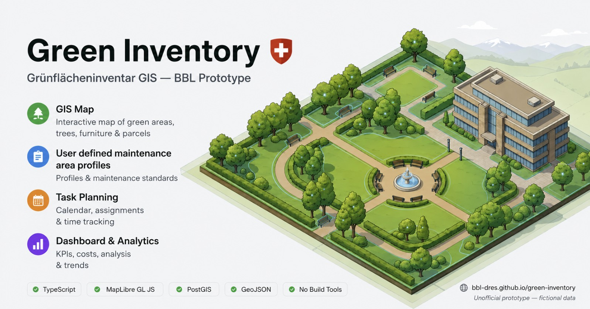

# Green Inventory / Grünflächeninventar



Interactive GIS prototypes for green-space inventory, maintenance planning, and field
survey of properties managed by the Swiss Federal Office for Buildings and Logistics
(BBL / Bundesgärtnerei).

> [!CAUTION]
> **Unofficial prototype for demonstration purposes only.** The applications use a
> limited public sample and mock content, are not feature-complete, and are not
> intended for production use.

## Demo

**Main app:** https://bbl-dres.github.io/green-inventory/

The repository root opens the Green Areas prototype.

## Prototypes

| Prototype | Purpose | Demo | Details |
|---|---|---|---|
| Main App — Green Areas | Inventory, care profiles, contracts, inspections, tasks, and costs | [Open app](https://bbl-dres.github.io/green-inventory/prototype-main/) | [README](prototype-main/README.md) |
| Care & Maintenance | Geometry editing, care-profile library, filtering, and export | [Open app](https://bbl-dres.github.io/green-inventory/prototype-care/) | [README](prototype-care/README.md) |

## Run locally

Serve the repository root with any static web server:

```bash
python -m http.server 8000
```

Then open <http://localhost:8000/>. It redirects to the main app; the other prototype
is available at `/prototype-care/`.

## Documentation

- [Main App documentation](prototype-main/README.md) — features, data pipeline,
  technology, and layout.
- [Care & Maintenance documentation](prototype-care/README.md) — workflows, care
  profiles, standards, setup, and structure.
- Related project: [Land Cover Survey source](https://github.com/bbl-dres/landcover-survey)
  and [live app](https://bbl-dres.github.io/landcover-survey/) for parcel-level land-cover analysis.

## License

[MIT](LICENSE)
