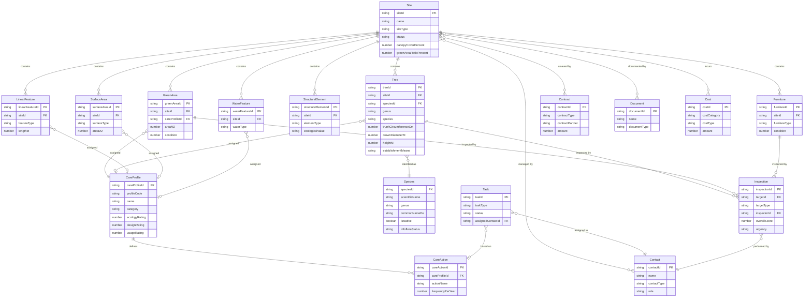

# Green Area Inventory — Data Model

This document describes the data model for the Green Area Inventory application.

---

## 1. Introduction

### 1.1 Purpose & Scope

This document defines the canonical data model for the Green Area Inventory — a web-based GIS system for the inventory, management, and maintenance of municipal green spaces. The model supports:

- Green space visualization and GIS-based exploration
- Inventory management (green areas, trees, furniture, structures)
- Species reference data with taxonomy, neophyte status, and ecosystem service parameters
- Care profile assignment based on the GSZ «Mehr als Grün» catalog
- Structured inspection and condition assessment workflows
- Maintenance planning and task management
- Contact and contract management
- Cost tracking and budget planning

### 1.2 Design Principles

| Principle | Description |
|-----------|-------------|
| **Flat Structure** | All fields live at the top level of each entity — no nested `extensionData` objects. This simplifies querying and aligns with the standalone nature of the application. |
| **Traceability** | All entities include `validFrom`/`validUntil` for temporal tracking and `eventType` for domain events. |
| **Standards Compliance** | Uses ISO 8601 for dates, ISO 4217 for currencies (`CHF`), Darwin Core for species taxonomy, and aligns with the GSZ Profilkatalog for care profiles. |
| **Spatial First** | Core entities carry geometry; GeoJSON files comply with RFC 7946 (WGS84 coordinates). Optional LV95 fields provide Swiss coordinate support. |
| **Bilingual Support** | All enumerations provide both English (EN) and German (DE) values; the demo uses German values. |
| **GSZ Alignment** | Care profiles align with the Grün Stadt Zürich «Mehr als Grün» Profilkatalog (ZHAW/GSZ 2019), providing 46 standardized profiles as a baseline. |
| **Inspection History** | Condition scores on spatial entities reflect the latest snapshot; the Inspection entity provides full assessment history per FLL and DIN standards. |

### 1.3 Swiss Context

| Standard / Identifier | Description | Usage |
|-----------------------|-------------|-------|
| **LV95 (EPSG:2056)** | Swiss coordinate reference system | Optional `lv95East`/`lv95North` fields on spatial entities. GeoJSON geometry uses WGS84. |
| **GSZ Profilkatalog** | 46 standardized care profiles from «Mehr als Grün» (ZHAW/GSZ 2019) | CareProfile entity; pre-configured system profiles |
| **ÖREB-Kataster** | Public-law restrictions on land ownership | Layer integration (Gewässerschutzzonen, Waldgrenzen, Nutzungsplanung) |
| **Amtliche Vermessung (AV)** | Official Swiss cadastral survey | Layer integration (Liegenschaften, Bodenbedeckung) |
| **DMAV Bodenbedeckung** | Minimales Geodatenmodell amtliche Vermessung — Bodenbedeckung (V1.0, swisstopo). Defines the official land-cover classification (BoFlaechenart) replacing DM.01-AV-CH. | Reference model for SurfaceArea / GreenArea land-cover alignment. Legal basis: VAV (SR 211.432.2). |
| **swisstopo WMTS** | Federal mapping services (Landeskarte, SWISSIMAGE, swissTLM3D) | Base map layers |
| **Infoflora** | Swiss flora database; Black List / Watch List of invasive neophytes | Species entity neophyte status; field reporting |
| **FLL Baumkontrollrichtlinie** | German-language standard for tree inspection (VTA protocol) | Inspection entity schema (damage zones, urgency levels) |
| **Darwin Core** | Biodiversity data standard (TDWG) | Species taxonomy alignment; GBIF interoperability |

### 1.4 Standards Alignment

The data model aligns with the following international and Swiss standards:

| Standard | Alignment | Mapped Entities |
|----------|-----------|-----------------|
| **OGC CityGML 3.0** — Vegetation Module | SolitaryVegetationObject → Tree; PlantCover → GreenArea; species, height, trunkDiameter mapped directly | Tree, GreenArea |
| **EU INSPIRE** — Protected Sites / Land Use | Site boundary → ProtectedSite; CareProfile → PlannedLandUse; temporal model aligns with INSPIRE lifecycle | Site, GreenArea, CareProfile |
| **FLL Baumkontrollrichtlinie** | VTA inspection zones (root/collar/trunk/crown/branches) mapped to Inspection.damageFindings; urgency levels aligned | Inspection, Tree |
| **DIN EN 1176/1177** | Playground safety inspection protocol supported via Inspection.inspectionType = `PlaygroundDIN1176` | Inspection, Furniture |
| **SIA 318** | Swiss landscape construction standard referenced for quality levels and maintenance categories | CareProfile, CareAction |
| **i-Tree Eco** | Species code, DBH derivation, ecosystem outputs (CO₂, canopy area, replacement value) mapped to computed fields | Tree, Species |
| **Darwin Core** (TDWG) | scientificName, genus, specificEpithet, establishmentMeans aligned with Darwin Core Taxon terms | Species, Tree |
| **GBIF** | Species entity supports Darwin Core export for GBIF occurrence data interchange | Species |
| **FIWARE Smart Data Models** | Garden → Site; FlowerBed → GreenArea; GreenspaceRecord → CareAction/Task mapping documented | Site, GreenArea, Task |
| **Open311 / GeoReport v2** | Issue entity [Preview] aligned with service_request schema | Issue [Preview] |
| **Schema.org Park** | Site exportable as Schema.org Park type with JSON-LD for public discoverability | Site |
| **EU NRR (2024/1991)** | No-net-loss tracking via Site aggregate metrics (canopyCoverPercent, greenAreaRatioPercent) with temporal versioning | Site, Tree |
| **ISO 55000** | Asset lifecycle management concepts reflected in condition tracking, inspection history, and cost entities | Inspection, Cost, all spatial entities |
| **DCAT-AP CH** | Metadata export for opendata.swiss publication supported via standard dataset description fields | All entities (export) |

---

## 2. Architecture Overview

### 2.1 Entity Relationship Diagram



#### Entity Overview

| # | Entity (EN) | Entity (DE) | Geometry | Source (Demo) | Description |
|--:|-------------|-------------|----------|---------------|-------------|
| 1 | **Site** | Standort | Polygon / MultiPolygon | `data/sites.geojson` | Top-level container for green spaces — parks, school grounds, sports facilities, street-side strips. All other spatial objects belong to exactly one site. |
| 2 | **GreenArea** | Grünfläche | Polygon | `data/green-areas.geojson` | Vegetated area within a site. Each green area is assigned exactly one care profile that defines its maintenance regime. Primary spatial unit for care planning. |
| 3 | **Tree** | Baum | Point | `data/trees.geojson` | Individual tree with dendrometric data (trunk, crown, height), multi-level taxonomy, condition assessment, and optional care profile. |
| 4 | **LinearFeature** | Linienobjekt | LineString / MultiLineString | — *(planned)* | Line-shaped object within a site — hedges, walls, fences, footpaths, cycle paths. |
| 5 | **Furniture** | Mobiliar | Point | `data/furniture.geojson` | Point installation within a site — benches, fountains, play equipment, waste bins, lighting, signage. |
| 6 | **StructureElement** | Strukturelement | Point / Polygon | `data/furniture.json` | Ecological feature tracked for biodiversity value — dry stone walls, brush piles, stone piles, nesting aids, dead wood. |
| 7 | **SurfaceArea** | Belagsfläche | Polygon | — *(planned)* | Hard surface or paved area within a site — gravel paths, asphalt, paving, play surfaces. |
| 8 | **WaterFeature** | Gewässer | Polygon / LineString | — *(planned)* | Water body or water installation — ponds, streams, fountains, water basins. |
| 9 | **Species** | Art | — | `data/species.json` | Taxonomic reference record for plant species. Links to Infoflora neophyte status, GALK suitability, and i-Tree ecosystem service parameters. |
| 10 | **CareProfile** | Pflegeprofil | — | `data/care-profiles.json` | Standardized maintenance regime. 46 pre-configured profiles based on the GSZ «Mehr als Grün» Profilkatalog, with ecology/design/usage tension-field ratings. |
| 11 | **CareAction** | Pflegemassnahme | — | `data/care-profiles.json` | Specific maintenance task defined within a care profile — action name, timing, frequency, equipment, and duration. Templates for generating concrete tasks. |
| 12 | **Task** | Massnahme | — | — *(planned)* | Concrete, scheduled or completed maintenance work order. Links to spatial objects and a responsible contact. Workflow: Geplant → In Bearbeitung → Abgeschlossen → Abgenommen. |
| 13 | **Inspection** | Kontrolle | — | — *(planned)* | Structured field assessment of a spatial object with standardized scoring, damage documentation, urgency, and recommended actions. Supports FLL VTA tree inspections, DIN EN 1176 playground inspections, and general condition assessments. |
| 14 | **Contact** | Kontakt | — | `data/contacts.json` | People and organisations involved in green space management — internal staff, external contractors, authorities, suppliers. |
| 15 | **Contract** | Vertrag | — | `data/contracts.json` | Service agreements for green space maintenance — care contracts, tree inspection agreements, supplier contracts. |
| 16 | **Document** | Dokument | — | `data/documents.json` | Files and records associated with green space objects — care plans, photos, tree assessments, cadastral plans, reports. |
| 17 | **Cost** | Kosten | — | `data/costs.json` | Financial entries for maintenance — personnel, materials, external services, equipment, disposal. Supports budget vs. actual tracking. |

### 2.2 Entity Hierarchy

Entities are organized into functional layers:

| Layer | Entities | Description |
|-------|----------|-------------|
| **Spatial** | Site, GreenArea, Tree, LinearFeature, Furniture, StructureElement, SurfaceArea, WaterFeature | Geo-referenced objects displayed on the map |
| **Reference Data** | Species | Taxonomic lookup with neophyte status and ecosystem service parameters |
| **Profile & Maintenance** | CareProfile, CareAction, Task | Care instructions and operational work orders |
| **Assessment** | Inspection | Structured condition assessments with history |
| **Supporting** | Contact, Contract, Document, Cost | People, agreements, files, and financials |
| **Future** | NeophyteReport, MachineCatalog, Issue | Planned entities for future releases (see Section 8) |

### 2.3 Demo vs. Production Implementation

**Current Demo Implementation:**

For the demo stage, entities are stored in flat JSON and GeoJSON files:

```
data/sites.geojson          → Site polygons
data/green-areas.geojson    → GreenArea polygons
data/trees.geojson          → Tree points
data/furniture.geojson      → Furniture points (GeoJSON)
data/furniture.json         → Furniture + StructureElement (flat JSON)
data/species.json           → Species lookup table
data/care-profiles.json     → CareProfile + CareAction
data/contacts.json          → Contact
data/contracts.json         → Contract
data/costs.json             → Cost
data/documents.json         → Document
data/buildings.geojson      → Building footprints (reference layer)
data/parcels.geojson        → Parcel boundaries (reference layer)
data/area-measurements.json → Area measurement records
data/assets.json            → Asset registry
```

**Production Implementation:**

In a production system, these would be stored in PostGIS with proper foreign key constraints, enabling:

- Independent lifecycle management per entity
- Many-to-many relationships (e.g., one contact managing multiple sites)
- Efficient spatial querying and indexing
- Event sourcing for audit trails
- Concurrent multi-user editing with conflict detection

---

## 3. Spatial Entities

### 3.1 Site (Standort)

A site represents a top-level container for green spaces, such as a park, school grounds, sports facility, or street-side green strip. All spatial objects belong to exactly one site. Sites carry aggregate metrics for reporting (EU NRR, SDG 11.7.1, Singapore Index).

#### Schema Definition

| Field | PK/FK | Type | Description | Constraints | Alias (EN) | Alias (DE) |
|-------|-------|------|-------------|-------------|------------|------------|
| **siteId** | PK | string | Unique identifier for the site. | **mandatory**, minLength: 1, maxLength: 50 | Site ID | Standort-ID |
| **name** | | string | Name of the site (e.g., «Parkanlage Sonnenberg»). | **mandatory**, minLength: 1, maxLength: 200 | Site Name | Standortname |
| **siteType** | | string, enum | Type of site. See [Site Types](#a1-site-types). | **mandatory** | Site Type | Standortart |
| **municipality** | | string | Municipality where the site is located. | **mandatory**, minLength: 1, maxLength: 100 | Municipality | Gemeinde |
| **canton** | | string | Canton code (e.g., «ZH», «BE», «GE»). | **mandatory**, minLength: 2, maxLength: 2 | Canton | Kanton |
| **address** | | string | Street address of the main entrance. | minLength: 1, maxLength: 200 | Address | Adresse |
| **totalAreaM2** | | number | Total site area in square meters. | **mandatory**, minimum: 0 | Total Area | Gesamtfläche |
| **greenAreaM2** | | number | Total green area in square meters. | minimum: 0 | Green Area | Grünfläche |
| **hardSurfaceAreaM2** | | number | Total hard surface area in square meters. | minimum: 0 | Hard Surface | Hartfläche |
| **canopyCoverPercent** | | number | Tree canopy cover as percentage of total area. Computed: `Σ(Tree.canopyAreaM2) / totalAreaM2 × 100`. | minimum: 0, maximum: 100 | Canopy Cover | Kronendachanteil |
| **greenAreaRatioPercent** | | number | Green area ratio as percentage of total area. Computed: `greenAreaM2 / totalAreaM2 × 100`. | minimum: 0, maximum: 100 | Green Ratio | Grünflächenanteil |
| **treeCount** | | number | Count of active trees within the site. Computed. | minimum: 0 | Tree Count | Baumanzahl |
| **nativeSpeciesRatioPercent** | | number | Percentage of trees with `establishmentMeans = native`. Computed. | minimum: 0, maximum: 100 | Native Ratio | Anteil einheimisch |
| **biodiversityScore** | | number | Site-level biodiversity score (1–5 scale). Manual or semi-computed. | minimum: 1, maximum: 5 | Biodiversity | Biodiversität |
| **ownershipType** | | string, enum | Ownership type. See [Ownership Types](#a2-shared-enumerations). | **mandatory** | Ownership | Eigentum |
| **managingOrganisation** | | string | Organisation responsible for maintenance. | minLength: 1, maxLength: 200 | Organisation | Organisation |
| **responsibleContactId** | FK | string | Primary responsible contact. | minLength: 1, maxLength: 50 | Responsible | Verantwortlich |
| **status** | | string, enum | Current status of the site. See [Status Types](#a2-shared-enumerations). | **mandatory** | Status | Status |
| **lv95East** | | number | LV95 easting coordinate (EPSG:2056) of site centroid. | minimum: 2480000, maximum: 2840000 | LV95 E | LV95 Ost |
| **lv95North** | | number | LV95 northing coordinate (EPSG:2056) of site centroid. | minimum: 1070000, maximum: 1300000 | LV95 N | LV95 Nord |
| **validFrom** | | string | Record validity start date. ISO 8601 format. | **mandatory**, minLength: 20 | Valid From | Gültig von |
| **validUntil** | | string | Record validity end date. ISO 8601 format. Null if still active. | null allowed | Valid Until | Gültig bis |
| **createdAt** | | string | Timestamp of record creation. ISO 8601 format. | | Created | Erstellt |
| **updatedAt** | | string | Timestamp of last update. ISO 8601 format. | | Updated | Aktualisiert |
| **eventType** | | string, enum | Domain event type. Options: `SiteAdded`, `SiteUpdated`, `SiteDeleted` | | Event Type | Ereignistyp |

> **Computed fields:** `canopyCoverPercent`, `greenAreaRatioPercent`, `treeCount`, and `nativeSpeciesRatioPercent` are derived from child entities and updated when child records change. They are stored denormalized for query performance but should not be manually edited.

#### Geometry

Sites use **Polygon** or **MultiPolygon** geometry representing the site perimeter boundary. Coordinates are WGS84 (EPSG:4326) per GeoJSON RFC 7946.

#### Example: Site Object

```json
{
  "type": "Feature",
  "properties": {
    "siteId": "SITE-001",
    "name": "Parkanlage Sonnenberg",
    "siteType": "Park",
    "municipality": "Zürich",
    "canton": "ZH",
    "address": "Sonnenbergstrasse 20, 8032 Zürich",
    "totalAreaM2": 18500,
    "greenAreaM2": 14200,
    "hardSurfaceAreaM2": 4300,
    "canopyCoverPercent": 34.2,
    "greenAreaRatioPercent": 76.8,
    "treeCount": 47,
    "nativeSpeciesRatioPercent": 72.3,
    "biodiversityScore": 3,
    "ownershipType": "Öffentlich",
    "managingOrganisation": "Grün Stadt Zürich",
    "responsibleContactId": "CONT-001",
    "status": "Aktiv",
    "lv95East": 2683200,
    "lv95North": 1247550,
    "validFrom": "2020-01-01T00:00:00Z",
    "validUntil": null,
    "createdAt": "2025-03-15T10:30:00Z",
    "updatedAt": "2026-01-20T14:15:00Z",
    "eventType": "SiteUpdated"
  },
  "geometry": {
    "type": "Polygon",
    "coordinates": [[
      [8.5180, 47.3640],
      [8.5230, 47.3640],
      [8.5230, 47.3665],
      [8.5180, 47.3665],
      [8.5180, 47.3640]
    ]]
  }
}
```

> **Note:** The demo uses German values (e.g., `"siteType": "Park"`, `"status": "Aktiv"`). For English implementations, use `"siteType": "Park"`, `"status": "Active"`.

---

### 3.2 GreenArea (Grünfläche)

A green area represents a vegetated polygon within a site. Each green area is assigned exactly one active care profile that defines its maintenance regime. Green areas are the primary spatial unit for care planning.

#### Schema Definition

| Field | PK/FK | Type | Description | Constraints | Alias (EN) | Alias (DE) |
|-------|-------|------|-------------|-------------|------------|------------|
| **greenAreaId** | PK | string | Unique identifier for the green area. | **mandatory**, minLength: 1, maxLength: 50 | Green Area ID | Grünflächen-ID |
| **siteId** | FK | string | Reference to the parent site. | **mandatory**, minLength: 1, maxLength: 50 | Site ID | Standort-ID |
| **name** | | string | Descriptive name (e.g., «Blumenwiese Süd»). | **mandatory**, minLength: 1, maxLength: 200 | Name | Bezeichnung |
| **careProfileId** | FK | string | Reference to the assigned care profile. | **mandatory**, minLength: 1, maxLength: 50 | Care Profile | Pflegeprofil |
| **areaM2** | | number | Area in square meters (computed from geometry or manually entered). | **mandatory**, minimum: 0 | Area | Fläche |
| **condition** | | number, enum | Condition rating (1–5 scale). See [Condition Scale](#a2-shared-enumerations). Updated by latest Inspection. | **mandatory**, minimum: 1, maximum: 5 | Condition | Zustand |
| **usageIntensity** | | string, enum | Usage intensity level. See [Usage Intensity](#a2-shared-enumerations). | | Usage Intensity | Nutzungsintensität |
| **vegetationType** | | string | Description of the vegetation type or species composition. | minLength: 1, maxLength: 500 | Vegetation | Vegetation |
| **soilType** | | string | Soil type description. | minLength: 1, maxLength: 200 | Soil Type | Bodentyp |
| **irrigated** | | boolean | Is the area irrigated? | | Irrigated | Bewässert |
| **lastCareDate** | | string | Date of last care activity. ISO 8601 format. | | Last Care | Letzte Pflege |
| **notes** | | string | Free-text notes. | maxLength: 2000 | Notes | Bemerkungen |
| **lv95East** | | number | LV95 easting of centroid. | | LV95 E | LV95 Ost |
| **lv95North** | | number | LV95 northing of centroid. | | LV95 N | LV95 Nord |
| **validFrom** | | string | Record validity start date. ISO 8601 format. | **mandatory** | Valid From | Gültig von |
| **validUntil** | | string | Record validity end date. ISO 8601 format. | null allowed | Valid Until | Gültig bis |
| **createdAt** | | string | Timestamp of record creation. ISO 8601 format. | | Created | Erstellt |
| **updatedAt** | | string | Timestamp of last update. ISO 8601 format. | | Updated | Aktualisiert |
| **eventType** | | string, enum | Domain event type. Options: `GreenAreaAdded`, `GreenAreaUpdated`, `GreenAreaDeleted` | | Event Type | Ereignistyp |

#### Geometry

Green areas use **Polygon** geometry representing the area boundary. Coordinates are WGS84 (EPSG:4326).

#### Example: GreenArea Object

```json
{
  "type": "Feature",
  "properties": {
    "greenAreaId": "GA-001",
    "siteId": "SITE-001",
    "name": "Blumenwiese Sonnenberg Süd",
    "careProfileId": "CP-BW",
    "areaM2": 3200,
    "condition": 2,
    "usageIntensity": "Gering",
    "vegetationType": "Artenreiche Blumenwiese mit Margeriten, Wiesensalbei und Glockenblumen",
    "soilType": "Lehmig-sandig",
    "irrigated": false,
    "lastCareDate": "2025-09-15T00:00:00Z",
    "notes": "Herbstschnitt 2025 durchgeführt. Artenvielfalt nimmt seit Umstellung zu.",
    "validFrom": "2022-04-01T00:00:00Z",
    "validUntil": null,
    "createdAt": "2022-04-01T08:00:00Z",
    "updatedAt": "2025-09-16T10:00:00Z",
    "eventType": "GreenAreaUpdated"
  },
  "geometry": {
    "type": "Polygon",
    "coordinates": [[
      [8.5190, 47.3642],
      [8.5210, 47.3642],
      [8.5210, 47.3652],
      [8.5190, 47.3652],
      [8.5190, 47.3642]
    ]]
  }
}
```

> **Note:** The demo uses German values (e.g., `"usageIntensity": "Gering"`). For English implementations, use `"usageIntensity": "Low"`.

---

### 3.3 Tree (Baum)

A tree represents an individual tree within a site. Trees are tracked as point objects with dendrometric data (trunk, crown, height), multi-level taxonomy linked to the Species entity, condition assessment, ecosystem service metrics, and optional care profile assignment.

#### Schema Definition

| Field | PK/FK | Type | Description | Constraints | Alias (EN) | Alias (DE) |
|-------|-------|------|-------------|-------------|------------|------------|
| **treeId** | PK | string | Unique identifier for the tree. | **mandatory**, minLength: 1, maxLength: 50 | Tree ID | Baum-ID |
| **siteId** | FK | string | Reference to the parent site. | **mandatory**, minLength: 1, maxLength: 50 | Site ID | Standort-ID |
| **treeNumber** | | string | Local tree number within the site (e.g., «B-047»). | minLength: 1, maxLength: 20 | Tree No. | Baum-Nr. |
| **speciesId** | FK | string | Reference to the Species lookup entity. | minLength: 1, maxLength: 50 | Species ID | Art-ID |
| **genus** | | string | Genus name (e.g., «Tilia»). Derivable from Species but stored for direct access. | **mandatory** (for trees), minLength: 1, maxLength: 100 | Genus | Gattung |
| **species** | | string | Full scientific name (Latin binomial, e.g., «Tilia cordata»). | minLength: 1, maxLength: 200 | Species | Art (wiss.) |
| **cultivar** | | string | Cultivar name if applicable (e.g., «Greenspire»). | maxLength: 100 | Cultivar | Sorte |
| **commonNameDe** | | string | Common German name (e.g., «Winterlinde»). | minLength: 1, maxLength: 200 | Common Name (DE) | Volksname |
| **commonNameFr** | | string | Common French name (for bilingual cantons). | maxLength: 200 | Common Name (FR) | Nom commun (FR) |
| **establishmentMeans** | | string, enum | Origin/establishment. See [Establishment Means](#a2-shared-enumerations). Aligned with Darwin Core. | | Establishment | Etablierungsart |
| **treeCategory** | | string, enum | Functional category. See [Tree Categories](#a4-tree-categories). | **mandatory** | Category | Kategorie |
| **careProfileId** | FK | string | Reference to the assigned care profile. | minLength: 1, maxLength: 50 | Care Profile | Pflegeprofil |
| **trunkCircumferenceCm** | | number | Trunk circumference in cm, measured at 1m height (Swiss/European standard). | minimum: 0, maximum: 2000 | Trunk Circ. | Stammumfang |
| **crownDiameterM** | | number | Crown diameter in meters (average of N-S and E-W measurements). | minimum: 0, maximum: 50 | Crown Diam. | Kronendurchmesser |
| **crownBaseHeightM** | | number | Height to lowest live branch in meters. | minimum: 0, maximum: 60 | Crown Base | Kronenansatz |
| **heightM** | | number | Total height in meters. | minimum: 0, maximum: 60 | Height | Höhe |
| **canopyAreaM2** | | number | Crown projection area in m². Computed: `π × (crownDiameterM / 2)²`. | minimum: 0 | Canopy Area | Kronenfläche |
| **co2SequestrationKgYr** | | number | Annual CO₂ sequestration in kg/yr. Computed from species + DBH + growth rate via i-Tree coefficients. | minimum: 0 | CO₂ Seq. | CO₂-Bindung |
| **co2StoredKg** | | number | Total CO₂ stored in biomass in kg. Computed. | minimum: 0 | CO₂ Stored | CO₂-Speicher |
| **replacementValueCHF** | | number | Monetary replacement value in CHF (trunk formula method per FLL Gehölzwertermittlung). Computed. | minimum: 0 | Repl. Value | Ersatzwert |
| **plantingYear** | | number | Year the tree was planted. | minimum: 1800, maximum: 2100 | Planting Year | Pflanzjahr |
| **condition** | | number, enum | Condition rating (1–5 scale). See [Condition Scale](#a2-shared-enumerations). Updated by latest Inspection. | **mandatory**, minimum: 1, maximum: 5 | Condition | Zustand |
| **protectionStatus** | | string, enum | Protection status. See [Protection Status](#a2-shared-enumerations). | | Protection | Schutzstatus |
| **lastInspectionDate** | | string | Date of last tree inspection. ISO 8601 format. Updated by latest Inspection. | | Last Inspection | Letzte Kontrolle |
| **nextInspectionDate** | | string | Date of next scheduled inspection. ISO 8601 format. Set by latest Inspection. | | Next Inspection | Nächste Kontrolle |
| **notes** | | string | Free-text notes (diseases, damage, special features). | maxLength: 2000 | Notes | Bemerkungen |
| **lv95East** | | number | LV95 easting. | | LV95 E | LV95 Ost |
| **lv95North** | | number | LV95 northing. | | LV95 N | LV95 Nord |
| **validFrom** | | string | Record validity start date. ISO 8601 format. | **mandatory** | Valid From | Gültig von |
| **validUntil** | | string | Record validity end date. ISO 8601 format. | null allowed | Valid Until | Gültig bis |
| **createdAt** | | string | Timestamp of record creation. ISO 8601 format. | | Created | Erstellt |
| **updatedAt** | | string | Timestamp of last update. ISO 8601 format. | | Updated | Aktualisiert |
| **eventType** | | string, enum | Domain event type. Options: `TreeAdded`, `TreeUpdated`, `TreeDeleted` | | Event Type | Ereignistyp |

> **Computed fields:** `canopyAreaM2`, `co2SequestrationKgYr`, `co2StoredKg`, and `replacementValueCHF` are derived from dendrometric data and species coefficients (i-Tree Eco, FLL Gehölzwertermittlung). They are recalculated after each Inspection or annual update cycle. `condition`, `lastInspectionDate`, and `nextInspectionDate` are denormalized from the latest Inspection record.

> **Trunk measurement note:** `trunkCircumferenceCm` follows the Swiss/European standard (measured at 1.0m height). DBH for i-Tree calculations is derived: `DBH_cm = trunkCircumferenceCm / π`.

#### Geometry

Trees use **Point** geometry representing the trunk base position. Coordinates are WGS84 (EPSG:4326).

#### Example: Tree Object

```json
{
  "type": "Feature",
  "properties": {
    "treeId": "TREE-001",
    "siteId": "SITE-001",
    "treeNumber": "B-001",
    "speciesId": "SP-TICO",
    "genus": "Tilia",
    "species": "Tilia cordata",
    "cultivar": null,
    "commonNameDe": "Winterlinde",
    "commonNameFr": "Tilleul à petites feuilles",
    "establishmentMeans": "Einheimisch",
    "treeCategory": "Parkbaum",
    "careProfileId": "CP-PB",
    "trunkCircumferenceCm": 220,
    "crownDiameterM": 12.5,
    "crownBaseHeightM": 3.5,
    "heightM": 18,
    "canopyAreaM2": 122.7,
    "co2SequestrationKgYr": 48.3,
    "co2StoredKg": 2850,
    "replacementValueCHF": 45000,
    "plantingYear": 1952,
    "condition": 2,
    "protectionStatus": "Geschützt",
    "lastInspectionDate": "2025-11-10T00:00:00Z",
    "nextInspectionDate": "2028-11-01T00:00:00Z",
    "notes": "Imposanter Solitärbaum am Hauptweg. Leichter Totholzanteil in Krone.",
    "validFrom": "2020-01-01T00:00:00Z",
    "validUntil": null,
    "createdAt": "2020-01-15T09:00:00Z",
    "updatedAt": "2025-11-10T15:30:00Z",
    "eventType": "TreeUpdated"
  },
  "geometry": {
    "type": "Point",
    "coordinates": [8.5195, 47.3648]
  }
}
```

> **Note:** The demo uses German values (e.g., `"treeCategory": "Parkbaum"`, `"protectionStatus": "Geschützt"`, `"establishmentMeans": "Einheimisch"`). For English implementations, use `"treeCategory": "Park tree"`, `"protectionStatus": "Protected"`, `"establishmentMeans": "Native"`.

---

### 3.4 LinearFeature (Linienobjekt)

A linear feature represents a line-shaped object within a site, such as hedges, walls, fences, or paths.

#### Schema Definition

| Field | PK/FK | Type | Description | Constraints | Alias (EN) | Alias (DE) |
|-------|-------|------|-------------|-------------|------------|------------|
| **linearFeatureId** | PK | string | Unique identifier. | **mandatory**, minLength: 1, maxLength: 50 | Feature ID | Linienobjekt-ID |
| **siteId** | FK | string | Reference to the parent site. | **mandatory**, minLength: 1, maxLength: 50 | Site ID | Standort-ID |
| **name** | | string | Descriptive name. | **mandatory**, minLength: 1, maxLength: 200 | Name | Bezeichnung |
| **featureType** | | string, enum | Type of linear feature. See [Linear Feature Types](#a6-linear-feature-types). | **mandatory** | Feature Type | Objektart |
| **careProfileId** | FK | string | Reference to the assigned care profile. | minLength: 1, maxLength: 50 | Care Profile | Pflegeprofil |
| **lengthM** | | number | Length in meters. | **mandatory**, minimum: 0 | Length | Länge |
| **heightM** | | number | Height in meters (for hedges, walls). | minimum: 0 | Height | Höhe |
| **widthM** | | number | Width in meters. | minimum: 0 | Width | Breite |
| **material** | | string | Material description (for walls, fences). | maxLength: 200 | Material | Material |
| **condition** | | number, enum | Condition rating (1–5 scale). See [Condition Scale](#a2-shared-enumerations). | minimum: 1, maximum: 5 | Condition | Zustand |
| **installationYear** | | number | Year of installation or planting. | minimum: 1800, maximum: 2100 | Installation | Erstellungsjahr |
| **notes** | | string | Free-text notes. | maxLength: 2000 | Notes | Bemerkungen |
| **validFrom** | | string | Record validity start date. ISO 8601 format. | **mandatory** | Valid From | Gültig von |
| **validUntil** | | string | Record validity end date. | null allowed | Valid Until | Gültig bis |
| **createdAt** | | string | Timestamp of record creation. | | Created | Erstellt |
| **updatedAt** | | string | Timestamp of last update. | | Updated | Aktualisiert |
| **eventType** | | string, enum | Domain event type. Options: `LinearFeatureAdded`, `LinearFeatureUpdated`, `LinearFeatureDeleted` | | Event Type | Ereignistyp |

#### Geometry

Linear features use **LineString** or **MultiLineString** geometry. Coordinates are WGS84 (EPSG:4326).

#### Example: LinearFeature Object

```json
{
  "type": "Feature",
  "properties": {
    "linearFeatureId": "LF-001",
    "siteId": "SITE-001",
    "name": "Formhecke Hauptweg Nord",
    "featureType": "Formhecke",
    "careProfileId": "CP-FH",
    "lengthM": 45,
    "heightM": 1.2,
    "widthM": 0.6,
    "condition": 2,
    "installationYear": 2005,
    "notes": "Hainbuche (Carpinus betulus), wird 2x jährlich geschnitten.",
    "validFrom": "2020-01-01T00:00:00Z",
    "validUntil": null,
    "createdAt": "2020-01-15T09:00:00Z",
    "updatedAt": "2025-06-20T11:00:00Z",
    "eventType": "LinearFeatureUpdated"
  },
  "geometry": {
    "type": "LineString",
    "coordinates": [
      [8.5192, 47.3645],
      [8.5200, 47.3650],
      [8.5210, 47.3656]
    ]
  }
}
```

> **Note:** The demo uses German values (e.g., `"featureType": "Formhecke"`). For English implementations, use `"featureType": "Formal hedge"`.

---

### 3.5 Furniture (Mobiliar)

Furniture represents point objects for benches, fountains, play equipment, waste bins, lighting, and other installations within a site.

#### Schema Definition

| Field | PK/FK | Type | Description | Constraints | Alias (EN) | Alias (DE) |
|-------|-------|------|-------------|-------------|------------|------------|
| **furnitureId** | PK | string | Unique identifier. | **mandatory**, minLength: 1, maxLength: 50 | Furniture ID | Mobiliar-ID |
| **siteId** | FK | string | Reference to the parent site. | **mandatory**, minLength: 1, maxLength: 50 | Site ID | Standort-ID |
| **name** | | string | Descriptive name (e.g., «Parkbank am Teich»). | **mandatory**, minLength: 1, maxLength: 200 | Name | Bezeichnung |
| **furnitureType** | | string, enum | Type of furniture. See [Furniture Types](#a7-furniture-types). | **mandatory** | Furniture Type | Mobiliarart |
| **manufacturer** | | string | Manufacturer or brand. | maxLength: 200 | Manufacturer | Hersteller |
| **material** | | string | Primary material (e.g., «Holz/Metall», «Granit»). | maxLength: 200 | Material | Material |
| **installationYear** | | number | Year of installation. | minimum: 1800, maximum: 2100 | Installation | Einbaujahr |
| **condition** | | number, enum | Condition rating (1–5 scale). See [Condition Scale](#a2-shared-enumerations). Updated by latest Inspection. | minimum: 1, maximum: 5 | Condition | Zustand |
| **lastMaintenanceDate** | | string | Date of last maintenance. ISO 8601 format. | | Last Maintenance | Letzte Wartung |
| **nextMaintenanceDate** | | string | Date of next scheduled maintenance. ISO 8601 format. | | Next Maintenance | Nächste Wartung |
| **notes** | | string | Free-text notes. | maxLength: 2000 | Notes | Bemerkungen |
| **validFrom** | | string | Record validity start date. ISO 8601 format. | **mandatory** | Valid From | Gültig von |
| **validUntil** | | string | Record validity end date. | null allowed | Valid Until | Gültig bis |
| **createdAt** | | string | Timestamp of record creation. | | Created | Erstellt |
| **updatedAt** | | string | Timestamp of last update. | | Updated | Aktualisiert |
| **eventType** | | string, enum | Domain event type. Options: `FurnitureAdded`, `FurnitureUpdated`, `FurnitureDeleted` | | Event Type | Ereignistyp |

#### Geometry

Furniture uses **Point** geometry. Coordinates are WGS84 (EPSG:4326).

#### Example: Furniture Object

```json
{
  "type": "Feature",
  "properties": {
    "furnitureId": "FURN-001",
    "siteId": "SITE-001",
    "name": "Parkbank Sonnenberg 1",
    "furnitureType": "Sitzbank",
    "manufacturer": "Velopa AG",
    "material": "Holz/Metall",
    "installationYear": 2018,
    "condition": 2,
    "lastMaintenanceDate": "2025-04-10T00:00:00Z",
    "nextMaintenanceDate": "2026-04-01T00:00:00Z",
    "notes": "Standardbank mit Rückenlehne, 1.8m Sitzfläche.",
    "validFrom": "2018-06-01T00:00:00Z",
    "validUntil": null,
    "createdAt": "2018-06-01T10:00:00Z",
    "updatedAt": "2025-04-10T14:00:00Z",
    "eventType": "FurnitureUpdated"
  },
  "geometry": {
    "type": "Point",
    "coordinates": [8.5198, 47.3650]
  }
}
```

> **Note:** The demo uses German values (e.g., `"furnitureType": "Sitzbank"`). For English implementations, use `"furnitureType": "Bench"`.

---

### 3.6 StructureElement (Strukturelement)

A structure element represents an ecological feature within a site, such as dry stone walls, brush piles, stone piles, nesting aids, or dead wood. These elements are tracked for their biodiversity value per the GSZ Profilkatalog.

#### Schema Definition

| Field | PK/FK | Type | Description | Constraints | Alias (EN) | Alias (DE) |
|-------|-------|------|-------------|-------------|------------|------------|
| **structureElementId** | PK | string | Unique identifier. | **mandatory**, minLength: 1, maxLength: 50 | Element ID | Strukturelement-ID |
| **siteId** | FK | string | Reference to the parent site. | **mandatory**, minLength: 1, maxLength: 50 | Site ID | Standort-ID |
| **name** | | string | Descriptive name. | **mandatory**, minLength: 1, maxLength: 200 | Name | Bezeichnung |
| **elementType** | | string, enum | Type of structure element. See [Structure Element Types](#a8-structure-element-types). | **mandatory** | Element Type | Elementtyp |
| **careProfileId** | FK | string | Reference to the assigned care profile. | minLength: 1, maxLength: 50 | Care Profile | Pflegeprofil |
| **dimensionDescription** | | string | Description of dimensions (e.g., «3m lang, 1.5m hoch, 0.8m breit»). | maxLength: 500 | Dimensions | Abmessungen |
| **ecologicalValue** | | string, enum | Ecological value assessment. See [Ecological Value](#a2-shared-enumerations). | | Eco Value | Ökologischer Wert |
| **targetSpecies** | | string | Target species or species groups. | maxLength: 500 | Target Species | Zielarten |
| **installationYear** | | number | Year of creation. | minimum: 1800, maximum: 2100 | Installation | Erstellungsjahr |
| **condition** | | number, enum | Condition rating (1–5 scale). | minimum: 1, maximum: 5 | Condition | Zustand |
| **notes** | | string | Free-text notes. | maxLength: 2000 | Notes | Bemerkungen |
| **validFrom** | | string | Record validity start date. ISO 8601 format. | **mandatory** | Valid From | Gültig von |
| **validUntil** | | string | Record validity end date. | null allowed | Valid Until | Gültig bis |
| **createdAt** | | string | Timestamp of record creation. | | Created | Erstellt |
| **updatedAt** | | string | Timestamp of last update. | | Updated | Aktualisiert |
| **eventType** | | string, enum | Domain event type. Options: `StructureElementAdded`, `StructureElementUpdated`, `StructureElementDeleted` | | Event Type | Ereignistyp |

#### Geometry

Structure elements use **Point** geometry for small features or **Polygon** geometry for larger areas (e.g., dry stone walls). Coordinates are WGS84 (EPSG:4326).

#### Example: StructureElement Object

```json
{
  "type": "Feature",
  "properties": {
    "structureElementId": "STRUCT-001",
    "siteId": "SITE-001",
    "name": "Trockenmauer Rosengarten",
    "elementType": "Trockenmauer",
    "careProfileId": "CP-TM",
    "dimensionDescription": "8m lang, 1.2m hoch, 0.6m breit",
    "ecologicalValue": "Hoch",
    "targetSpecies": "Eidechsen, Wildbienen, Schnecken",
    "installationYear": 2019,
    "condition": 1,
    "notes": "Natursteinmauer aus lokalem Kalkstein. Fugen bewusst offen gehalten.",
    "validFrom": "2019-10-01T00:00:00Z",
    "validUntil": null,
    "createdAt": "2019-10-01T08:00:00Z",
    "updatedAt": "2025-05-20T10:00:00Z",
    "eventType": "StructureElementUpdated"
  },
  "geometry": {
    "type": "Point",
    "coordinates": [8.5205, 47.3649]
  }
}
```

> **Note:** The demo uses German values (e.g., `"elementType": "Trockenmauer"`, `"ecologicalValue": "Hoch"`). For English implementations, use `"elementType": "Dry stone wall"`, `"ecologicalValue": "High"`.

---

### 3.7 SurfaceArea (Belagsfläche)

A surface area represents a hard surface or paved area within a site, such as gravel paths, asphalt areas, play surface materials, or paved plazas.

#### Schema Definition

| Field | PK/FK | Type | Description | Constraints | Alias (EN) | Alias (DE) |
|-------|-------|------|-------------|-------------|------------|------------|
| **surfaceAreaId** | PK | string | Unique identifier. | **mandatory**, minLength: 1, maxLength: 50 | Surface ID | Belagsflächen-ID |
| **siteId** | FK | string | Reference to the parent site. | **mandatory**, minLength: 1, maxLength: 50 | Site ID | Standort-ID |
| **name** | | string | Descriptive name. | **mandatory**, minLength: 1, maxLength: 200 | Name | Bezeichnung |
| **surfaceType** | | string, enum | Type of surface. See [Surface Types](#a9-surface-types). | **mandatory** | Surface Type | Belagsart |
| **careProfileId** | FK | string | Reference to the assigned care profile. | minLength: 1, maxLength: 50 | Care Profile | Pflegeprofil |
| **areaM2** | | number | Area in square meters. | **mandatory**, minimum: 0 | Area | Fläche |
| **condition** | | number, enum | Condition rating (1–5 scale). | minimum: 1, maximum: 5 | Condition | Zustand |
| **installationYear** | | number | Year of installation. | minimum: 1800, maximum: 2100 | Installation | Erstellungsjahr |
| **notes** | | string | Free-text notes. | maxLength: 2000 | Notes | Bemerkungen |
| **validFrom** | | string | Record validity start date. ISO 8601 format. | **mandatory** | Valid From | Gültig von |
| **validUntil** | | string | Record validity end date. | null allowed | Valid Until | Gültig bis |
| **createdAt** | | string | Timestamp of record creation. | | Created | Erstellt |
| **updatedAt** | | string | Timestamp of last update. | | Updated | Aktualisiert |
| **eventType** | | string, enum | Domain event type. Options: `SurfaceAreaAdded`, `SurfaceAreaUpdated`, `SurfaceAreaDeleted` | | Event Type | Ereignistyp |

#### Geometry

Surface areas use **Polygon** geometry. Coordinates are WGS84 (EPSG:4326).

#### Example: SurfaceArea Object

```json
{
  "type": "Feature",
  "properties": {
    "surfaceAreaId": "SURF-001",
    "siteId": "SITE-001",
    "name": "Hauptweg Chaussierung",
    "surfaceType": "Chaussierung",
    "careProfileId": "CP-CH",
    "areaM2": 680,
    "condition": 2,
    "installationYear": 2015,
    "notes": "Wassergebundene Decke, wird jährlich nachgeschottert.",
    "validFrom": "2020-01-01T00:00:00Z",
    "validUntil": null,
    "createdAt": "2020-01-15T09:00:00Z",
    "updatedAt": "2025-03-10T08:00:00Z",
    "eventType": "SurfaceAreaUpdated"
  },
  "geometry": {
    "type": "Polygon",
    "coordinates": [[
      [8.5193, 47.3643],
      [8.5196, 47.3643],
      [8.5215, 47.3660],
      [8.5212, 47.3660],
      [8.5193, 47.3643]
    ]]
  }
}
```

> **Note:** The demo uses German values (e.g., `"surfaceType": "Chaussierung"`). For English implementations, use `"surfaceType": "Gravel surface"`.

---

### 3.8 WaterFeature (Gewässer)

A water feature represents a water body or water installation within a site, including ponds, streams, fountains, and water basins.

#### Schema Definition

| Field | PK/FK | Type | Description | Constraints | Alias (EN) | Alias (DE) |
|-------|-------|------|-------------|-------------|------------|------------|
| **waterFeatureId** | PK | string | Unique identifier. | **mandatory**, minLength: 1, maxLength: 50 | Water Feature ID | Gewässer-ID |
| **siteId** | FK | string | Reference to the parent site. | **mandatory**, minLength: 1, maxLength: 50 | Site ID | Standort-ID |
| **name** | | string | Descriptive name. | **mandatory**, minLength: 1, maxLength: 200 | Name | Bezeichnung |
| **waterType** | | string, enum | Type of water feature. See [Water Feature Types](#a10-water-feature-types). | **mandatory** | Water Type | Gewässerart |
| **careProfileId** | FK | string | Reference to the assigned care profile. | minLength: 1, maxLength: 50 | Care Profile | Pflegeprofil |
| **areaM2** | | number | Area in square meters (for still water bodies). | minimum: 0 | Area | Fläche |
| **lengthM** | | number | Length in meters (for flowing water). | minimum: 0 | Length | Länge |
| **depthM** | | number | Maximum depth in meters. | minimum: 0 | Depth | Tiefe |
| **waterQuality** | | string, enum | Water quality rating. See [Water Quality](#a2-shared-enumerations). | | Water Quality | Wasserqualität |
| **condition** | | number, enum | Condition rating (1–5 scale). | minimum: 1, maximum: 5 | Condition | Zustand |
| **notes** | | string | Free-text notes. | maxLength: 2000 | Notes | Bemerkungen |
| **validFrom** | | string | Record validity start date. ISO 8601 format. | **mandatory** | Valid From | Gültig von |
| **validUntil** | | string | Record validity end date. | null allowed | Valid Until | Gültig bis |
| **createdAt** | | string | Timestamp of record creation. | | Created | Erstellt |
| **updatedAt** | | string | Timestamp of last update. | | Updated | Aktualisiert |
| **eventType** | | string, enum | Domain event type. Options: `WaterFeatureAdded`, `WaterFeatureUpdated`, `WaterFeatureDeleted` | | Event Type | Ereignistyp |

#### Geometry

Water features use **Polygon** geometry for still water bodies or **LineString** geometry for flowing water. Coordinates are WGS84 (EPSG:4326).

#### Example: WaterFeature Object

```json
{
  "type": "Feature",
  "properties": {
    "waterFeatureId": "WF-001",
    "siteId": "SITE-001",
    "name": "Weiher Sonnenberg",
    "waterType": "Ruhend",
    "careProfileId": "CP-GW-RU",
    "areaM2": 180,
    "depthM": 1.2,
    "waterQuality": "Gut",
    "condition": 2,
    "notes": "Naturnaher Weiher mit Seerosen und Schilfgürtel. Amphibienlaichgebiet.",
    "validFrom": "2020-01-01T00:00:00Z",
    "validUntil": null,
    "createdAt": "2020-01-15T09:00:00Z",
    "updatedAt": "2025-08-20T16:00:00Z",
    "eventType": "WaterFeatureUpdated"
  },
  "geometry": {
    "type": "Polygon",
    "coordinates": [[
      [8.5207, 47.3647],
      [8.5212, 47.3646],
      [8.5214, 47.3648],
      [8.5211, 47.3650],
      [8.5207, 47.3649],
      [8.5207, 47.3647]
    ]]
  }
}
```

> **Note:** The demo uses German values (e.g., `"waterType": "Ruhend"`, `"waterQuality": "Gut"`). For English implementations, use `"waterType": "Still"`, `"waterQuality": "Good"`.

---

## 4. Reference Data

### 4.1 Species (Art)

A species record provides the authoritative taxonomic reference for trees and other plant species. It centralizes taxonomy, neophyte status, ecosystem service parameters, and suitability ratings — eliminating inconsistencies from free-text species entry across individual tree records.

The species lookup table is seeded with ~200 common Swiss urban species covering genera found across the Zürich, Basel, Bern, and Geneva open tree datasets.

#### Schema Definition

| Field | PK/FK | Type | Description | Constraints | Alias (EN) | Alias (DE) |
|-------|-------|------|-------------|-------------|------------|------------|
| **speciesId** | PK | string | Unique identifier (e.g., «SP-TICO» for Tilia cordata). | **mandatory**, minLength: 1, maxLength: 50 | Species ID | Art-ID |
| **scientificName** | | string | Full binomial scientific name (e.g., «Tilia cordata»). | **mandatory**, minLength: 1, maxLength: 200 | Scientific Name | Wiss. Name |
| **genus** | | string | Genus name (e.g., «Tilia»). | **mandatory**, minLength: 1, maxLength: 100 | Genus | Gattung |
| **specificEpithet** | | string | Species epithet (e.g., «cordata»). Aligned with Darwin Core `specificEpithet`. | minLength: 1, maxLength: 100 | Species Epithet | Artepitheton |
| **family** | | string | Botanical family (e.g., «Malvaceae»). | minLength: 1, maxLength: 100 | Family | Familie |
| **commonNameDe** | | string | Common German name (e.g., «Winterlinde»). | minLength: 1, maxLength: 200 | Common Name (DE) | Volksname (DE) |
| **commonNameFr** | | string | Common French name (e.g., «Tilleul à petites feuilles»). | maxLength: 200 | Common Name (FR) | Volksname (FR) |
| **commonNameEn** | | string | Common English name (e.g., «Small-leaved linden»). | maxLength: 200 | Common Name (EN) | Volksname (EN) |
| **isNative** | | boolean | Native to Switzerland (per Infoflora). | | Native | Einheimisch |
| **establishmentMeans** | | string, enum | Origin classification. See [Establishment Means](#a2-shared-enumerations). Aligned with Darwin Core. | | Establishment | Etablierungsart |
| **infofloraStatus** | | string, enum | Infoflora neophyte classification. See [Infoflora Status](#a20-infoflora-status). | | Infoflora Status | Infoflora-Status |
| **galkRating** | | string | GALK street tree suitability rating (if applicable). | maxLength: 50 | GALK Rating | GALK-Eignung |
| **iTreeSpeciesCode** | | string | i-Tree Eco species code for ecosystem service calculations. | maxLength: 20 | i-Tree Code | i-Tree-Code |
| **treeForm** | | string, enum | General tree form. See [Tree Forms](#a21-tree-forms). | | Tree Form | Baumform |
| **maxHeightM** | | number | Typical maximum height in meters (for planting guidance). | minimum: 0, maximum: 60 | Max Height | Max. Höhe |
| **maxCrownDiameterM** | | number | Typical maximum crown spread in meters. | minimum: 0, maximum: 30 | Max Crown | Max. Krone |
| **createdAt** | | string | Timestamp of record creation. | | Created | Erstellt |
| **updatedAt** | | string | Timestamp of last update. | | Updated | Aktualisiert |

> **Note:** The Species entity does not use `validFrom`/`validUntil` temporal versioning since species records are reference data that are updated in place rather than versioned.

#### Example: Species Object

```json
{
  "speciesId": "SP-TICO",
  "scientificName": "Tilia cordata",
  "genus": "Tilia",
  "specificEpithet": "cordata",
  "family": "Malvaceae",
  "commonNameDe": "Winterlinde",
  "commonNameFr": "Tilleul à petites feuilles",
  "commonNameEn": "Small-leaved linden",
  "isNative": true,
  "establishmentMeans": "Einheimisch",
  "infofloraStatus": "Keine",
  "galkRating": "Geeignet",
  "iTreeSpeciesCode": "TICO",
  "treeForm": "Laubbaum",
  "maxHeightM": 30,
  "maxCrownDiameterM": 15,
  "createdAt": "2026-01-01T00:00:00Z",
  "updatedAt": "2026-01-01T00:00:00Z"
}
```

```json
{
  "speciesId": "SP-AIAL",
  "scientificName": "Ailanthus altissima",
  "genus": "Ailanthus",
  "specificEpithet": "altissima",
  "family": "Simaroubaceae",
  "commonNameDe": "Götterbaum",
  "commonNameFr": "Ailante glanduleux",
  "commonNameEn": "Tree of Heaven",
  "isNative": false,
  "establishmentMeans": "Invasiv",
  "infofloraStatus": "Schwarze Liste",
  "galkRating": null,
  "iTreeSpeciesCode": "AIAL",
  "treeForm": "Laubbaum",
  "maxHeightM": 25,
  "maxCrownDiameterM": 12,
  "createdAt": "2026-01-01T00:00:00Z",
  "updatedAt": "2026-01-01T00:00:00Z"
}
```

> **Note:** The demo uses German values (e.g., `"establishmentMeans": "Einheimisch"`, `"infofloraStatus": "Schwarze Liste"`). For English implementations, use `"establishmentMeans": "Native"`, `"infofloraStatus": "Black list"`.

---

## 5. Profile & Maintenance Entities

### 5.1 CareProfile (Pflegeprofil)

A care profile defines a standardized maintenance regime for a type of green space. The system ships with 46 pre-configured profiles based on the GSZ «Mehr als Grün» Profilkatalog. Profiles can be customized and extended by administrators.

Each profile includes a tension field rating (ecology vs. design vs. usage) and references a list of care actions with their timing and frequency.

#### Schema Definition

| Field | PK/FK | Type | Description | Constraints | Alias (EN) | Alias (DE) |
|-------|-------|------|-------------|-------------|------------|------------|
| **careProfileId** | PK | string | Unique identifier (e.g., «CP-GR» for Gebrauchsrasen). | **mandatory**, minLength: 1, maxLength: 50 | Profile ID | Profil-ID |
| **profileCode** | | string | Short code for map labelling (e.g., «GR», «BW», «PB»). | **mandatory**, minLength: 1, maxLength: 10 | Profile Code | Profilcode |
| **name** | | string | Full profile name. | **mandatory**, minLength: 1, maxLength: 200 | Name | Bezeichnung |
| **category** | | string, enum | Profile category. See [Profile Categories](#a3-care-profile-categories). | **mandatory** | Category | Kategorie |
| **description** | | string | Detailed description of the profile. | maxLength: 2000 | Description | Beschreibung |
| **naturalCareGuidelines** | | string | Principles of nature-based care for this profile. | maxLength: 2000 | Natural Care | Grundsätze naturnahe Pflege |
| **ecologyRating** | | number | Ecology rating in the tension field (1–5 scale). | **mandatory**, minimum: 1, maximum: 5 | Ecology | Ökologie |
| **designRating** | | number | Design rating in the tension field (1–5 scale). | **mandatory**, minimum: 1, maximum: 5 | Design | Gestaltung |
| **usageRating** | | number | Usage rating in the tension field (1–5 scale). | **mandatory**, minimum: 1, maximum: 5 | Usage | Nutzung |
| **mapColor** | | string | Hex color for map rendering (e.g., «#7CB342»). | **mandatory**, pattern: `^#[0-9A-Fa-f]{6}$` | Map Color | Kartenfarbe |
| **mapSymbol** | | string | Symbol identifier for map rendering. | maxLength: 50 | Map Symbol | Kartensymbol |
| **costPerM2Year** | | number | Estimated annual maintenance cost in CHF per m². | minimum: 0 | Cost/m²/yr | Kosten/m²/Jahr |
| **isSystemProfile** | | boolean | Is this a pre-configured GSZ standard profile? | | System Profile | Standardprofil |
| **referenceImageUrl** | | string | URL to reference image. | maxLength: 500 | Reference Image | Referenzbild |
| **validFrom** | | string | Record validity start date. ISO 8601 format. | **mandatory** | Valid From | Gültig von |
| **validUntil** | | string | Record validity end date. | null allowed | Valid Until | Gültig bis |
| **createdAt** | | string | Timestamp of record creation. | | Created | Erstellt |
| **updatedAt** | | string | Timestamp of last update. | | Updated | Aktualisiert |
| **eventType** | | string, enum | Domain event type. Options: `CareProfileAdded`, `CareProfileUpdated`, `CareProfileDeleted` | | Event Type | Ereignistyp |

#### Example: CareProfile Object

```json
{
  "careProfileId": "CP-BW",
  "profileCode": "BW",
  "name": "Blumenwiese",
  "category": "Rasen & Wiesen",
  "description": "Artenreiche, extensiv gepflegte Wiese mit standortgerechten Wildblumen und Gräsern. Wichtiger Lebensraum für Insekten und Kleintiere.",
  "naturalCareGuidelines": "Reduktion der Schnittfrequenz auf 1–2 Schnitte pro Jahr. Schnittgut abführen (Aushagerung). Verzicht auf Düngung und Herbizid-Einsatz. Zeitlich gestaffelte Mahd zur Sicherung von Rückzugsstreifen.",
  "ecologyRating": 5,
  "designRating": 3,
  "usageRating": 2,
  "mapColor": "#8BC34A",
  "mapSymbol": "meadow",
  "costPerM2Year": 2.50,
  "isSystemProfile": true,
  "referenceImageUrl": "/assets/images/profiles/blumenwiese.jpg",
  "validFrom": "2020-01-01T00:00:00Z",
  "validUntil": null,
  "createdAt": "2020-01-01T00:00:00Z",
  "updatedAt": "2025-01-15T10:00:00Z",
  "eventType": "CareProfileUpdated"
}
```

---

### 5.2 CareAction (Pflegemassnahme)

A care action is a specific maintenance task defined within a care profile. It specifies what to do, when, how often, and with what equipment. Care actions serve as templates for generating concrete tasks.

#### Schema Definition

| Field | PK/FK | Type | Description | Constraints | Alias (EN) | Alias (DE) |
|-------|-------|------|-------------|-------------|------------|------------|
| **careActionId** | PK | string | Unique identifier. | **mandatory**, minLength: 1, maxLength: 50 | Action ID | Massnahmen-ID |
| **careProfileId** | FK | string | Reference to the parent care profile. | **mandatory**, minLength: 1, maxLength: 50 | Profile ID | Profil-ID |
| **actionName** | | string | Name of the action (e.g., «Mahd», «Schnitt», «Düngung»). | **mandatory**, minLength: 1, maxLength: 200 | Action Name | Massnahme |
| **description** | | string | Detailed description of the action. | maxLength: 2000 | Description | Beschreibung |
| **timingMonths** | | array[number] | Months when the action should be performed (1=Jan, 12=Dec). | items: minimum: 1, maximum: 12 | Timing | Zeitpunkt |
| **frequencyPerYear** | | number | How many times per year this action should be performed. | **mandatory**, minimum: 0 | Frequency | Häufigkeit/Jahr |
| **durationMinutesPerUnit** | | number | Estimated duration in minutes per 100m² or per tree. | minimum: 0 | Duration | Dauer |
| **equipmentNeeded** | | array[string] | List of required equipment. | | Equipment | Geräte/Maschinen |
| **materialsNeeded** | | array[string] | List of required materials. | | Materials | Materialien |
| **isNaturalCare** | | boolean | Is this action specific to the nature-based care variant? | | Natural Care | Naturnahe Pflege |
| **remarks** | | string | Additional remarks or caveats. | maxLength: 1000 | Remarks | Bemerkungen |

#### Example: CareAction Object

```json
{
  "careActionId": "CA-BW-01",
  "careProfileId": "CP-BW",
  "actionName": "Mahd",
  "description": "Wiese mit Balkenmäher oder Sense mähen. Schnittgut 2–3 Tage trocknen lassen, dann abführen.",
  "timingMonths": [6, 9],
  "frequencyPerYear": 2,
  "durationMinutesPerUnit": 15,
  "equipmentNeeded": ["Balkenmäher", "Rechen", "Heugabel"],
  "materialsNeeded": [],
  "isNaturalCare": true,
  "remarks": "Rückzugsstreifen (10–20%) stehen lassen und alternierend mähen."
}
```

---

### 5.3 Task (Massnahme)

A task represents a concrete, scheduled or completed maintenance work order. Tasks can be generated automatically from care profiles or created manually. Each task is linked to one or more spatial objects and assigned to a contact.

#### Schema Definition

| Field | PK/FK | Type | Description | Constraints | Alias (EN) | Alias (DE) |
|-------|-------|------|-------------|-------------|------------|------------|
| **taskId** | PK | string | Unique identifier. | **mandatory**, minLength: 1, maxLength: 50 | Task ID | Massnahmen-ID |
| **title** | | string | Short title describing the task. | **mandatory**, minLength: 1, maxLength: 200 | Title | Titel |
| **description** | | string | Detailed description. | maxLength: 2000 | Description | Beschreibung |
| **taskType** | | string, enum | Type of task. See [Task Types](#a11-task-types). | **mandatory** | Task Type | Massnahmentyp |
| **priority** | | string, enum | Priority level. See [Priority Levels](#a2-shared-enumerations). | **mandatory** | Priority | Priorität |
| **status** | | string, enum | Workflow status. See [Task Status](#a12-task-status). | **mandatory** | Status | Status |
| **targetIds** | FK | array[string] | IDs of the spatial objects this task applies to. | **mandatory**, minLength: 1 | Targets | Zielobjekte |
| **targetType** | | string, enum | Type of target object. See [Target Types](#a2-shared-enumerations). | **mandatory** | Target Type | Zielobjekttyp |
| **siteId** | FK | string | Reference to the site. | **mandatory**, minLength: 1, maxLength: 50 | Site ID | Standort-ID |
| **careActionId** | FK | string | Reference to the care action template (if auto-generated). | maxLength: 50 | Care Action | Pflegemassnahme |
| **assignedContactId** | FK | string | Contact responsible for execution. | maxLength: 50 | Assigned To | Zugewiesen an |
| **dueDate** | | string | Planned due date. ISO 8601 format. | **mandatory** | Due Date | Fälligkeitsdatum |
| **startDate** | | string | Actual start date. ISO 8601 format. | | Start Date | Startdatum |
| **completedDate** | | string | Actual completion date. ISO 8601 format. | | Completed | Abschlussdatum |
| **approvedDate** | | string | Date of acceptance/sign-off. ISO 8601 format. | | Approved | Abnahmedatum |
| **plannedHours** | | number | Estimated work hours. | minimum: 0 | Planned Hours | Geplante Stunden |
| **actualHours** | | number | Actual work hours. | minimum: 0 | Actual Hours | Effektive Stunden |
| **equipmentUsed** | | array[string] | Equipment actually used. | | Equipment Used | Eingesetzte Geräte |
| **materialsUsed** | | array[string] | Materials actually used. | | Materials Used | Eingesetzte Materialien |
| **checklist** | | array[object] | Checklist items: `{ "item": string, "done": boolean }`. | | Checklist | Checkliste |
| **notes** | | string | Free-text notes. | maxLength: 2000 | Notes | Bemerkungen |
| **createdAt** | | string | Timestamp of record creation. | | Created | Erstellt |
| **updatedAt** | | string | Timestamp of last update. | | Updated | Aktualisiert |
| **eventType** | | string, enum | Domain event type. Options: `TaskAdded`, `TaskUpdated`, `TaskDeleted` | | Event Type | Ereignistyp |

#### Task Status Workflow

```
Geplant → In Bearbeitung → Abgeschlossen → Abgenommen
```

Each transition records a timestamp and the responsible user.

#### Example: Task Object

```json
{
  "taskId": "TASK-001",
  "title": "Frühjahrsschnitt Blumenwiese Süd",
  "description": "Erster Schnitt der Blumenwiese gemäss Profil BW. Rückzugsstreifen 15% stehen lassen.",
  "taskType": "Pflege",
  "priority": "Mittel",
  "status": "Geplant",
  "targetIds": ["GA-001"],
  "targetType": "GreenArea",
  "siteId": "SITE-001",
  "careActionId": "CA-BW-01",
  "assignedContactId": "CONT-002",
  "dueDate": "2026-06-15T00:00:00Z",
  "startDate": null,
  "completedDate": null,
  "approvedDate": null,
  "plannedHours": 4,
  "actualHours": null,
  "equipmentUsed": [],
  "materialsUsed": [],
  "checklist": [
    { "item": "Balkenmäher vorbereiten", "done": false },
    { "item": "Rückzugsstreifen markieren", "done": false },
    { "item": "Mahd durchführen", "done": false },
    { "item": "Schnittgut 2 Tage trocknen lassen", "done": false },
    { "item": "Schnittgut abführen", "done": false }
  ],
  "notes": null,
  "createdAt": "2026-01-10T08:00:00Z",
  "updatedAt": "2026-01-10T08:00:00Z",
  "eventType": "TaskAdded"
}
```

> **Note:** The demo uses German values (e.g., `"taskType": "Pflege"`, `"status": "Geplant"`, `"priority": "Mittel"`). For English implementations, use `"taskType": "Maintenance"`, `"status": "Planned"`, `"priority": "Medium"`.

---

### 5.4 Inspection (Kontrolle)

An inspection represents a structured field assessment of a spatial object — a tree, green area, furniture item, or playground. Inspections provide the full condition history that the snapshot `condition` field on each spatial entity summarizes.

The entity supports multiple inspection protocols through the `inspectionType` field: FLL VTA tree inspections (with zone-based damage findings), DIN EN 1176/1177 playground safety inspections, and general condition assessments.

**Relationship:** n Inspections → 1 Spatial Object (Tree, GreenArea, Furniture, etc.)

#### Schema Definition

| Field | PK/FK | Type | Description | Constraints | Alias (EN) | Alias (DE) |
|-------|-------|------|-------------|-------------|------------|------------|
| **inspectionId** | PK | string | Unique identifier. | **mandatory**, minLength: 1, maxLength: 50 | Inspection ID | Kontrolle-ID |
| **targetId** | FK | string | ID of the inspected object. | **mandatory**, minLength: 1, maxLength: 50 | Target ID | Zielobjekt-ID |
| **targetType** | | string, enum | Type of inspected object. See [Target Types](#a2-shared-enumerations). | **mandatory** | Target Type | Zielobjekttyp |
| **inspectionType** | | string, enum | Type of inspection protocol. See [Inspection Types](#a19-inspection-types). | **mandatory** | Inspection Type | Kontrolltyp |
| **inspectorId** | FK | string | Contact who performed the inspection. | **mandatory**, minLength: 1, maxLength: 50 | Inspector | Kontrolleur/in |
| **inspectionDate** | | string | Date of the inspection. ISO 8601 format. | **mandatory** | Inspection Date | Kontrolldatum |
| **overallScore** | | number, enum | Overall condition score (1–5 scale). See [Condition Scale](#a2-shared-enumerations). | **mandatory**, minimum: 1, maximum: 5 | Overall Score | Gesamtbewertung |
| **urgency** | | string, enum | Action urgency resulting from findings. See [Urgency Levels](#a22-urgency-levels). | **mandatory** | Urgency | Dringlichkeit |
| **damageFindings** | | array[object] | Structured damage findings. See [Damage Findings Structure](#damage-findings-structure). | | Damage Findings | Schadensbefunde |
| **recommendedActions** | | array[string] | Recommended follow-up actions (free text). | | Recommended Actions | Empfohlene Massnahmen |
| **photographs** | | array[string] | Document IDs of photographs taken during inspection. | | Photographs | Fotos |
| **nextInspectionDate** | | string | Recommended date for next inspection. ISO 8601 format. | | Next Inspection | Nächste Kontrolle |
| **protocol** | | string | Reference to the inspection protocol or standard used (e.g., «FLL 2020», «DIN EN 1176»). | maxLength: 200 | Protocol | Protokoll |
| **notes** | | string | Free-text notes. | maxLength: 2000 | Notes | Bemerkungen |
| **validFrom** | | string | Inspection record date (same as inspectionDate). ISO 8601 format. | **mandatory** | Valid From | Gültig von |
| **createdAt** | | string | Timestamp of record creation. | | Created | Erstellt |
| **updatedAt** | | string | Timestamp of last update. | | Updated | Aktualisiert |
| **eventType** | | string, enum | Domain event type. Options: `InspectionAdded`, `InspectionUpdated`, `InspectionDeleted` | | Event Type | Ereignistyp |

#### Damage Findings Structure

For structured damage documentation, each finding contains:

| Field | Type | Description |
|-------|------|-------------|
| **zone** | string, enum | Inspection zone. For VTA tree inspections: `Wurzel` / `Stammfuss` / `Stamm` / `Krone` / `Äste` (per FLL Baumkontrollrichtlinie). For playground: `Fundament` / `Tragwerk` / `Fallraum` / `Oberfläche`. For general: `Gesamt`. See [VTA Damage Zones](#a23-vta-damage-zones). |
| **damageType** | string | Damage type (e.g., «Pilzbefall», «Totholz», «Rissbildung», «Faulstelle», «Korrosion»). | 
| **severity** | string, enum | `Gering` / `Mittel` / `Schwer` (Minor / Moderate / Severe) |
| **description** | string | Free-text detail. |

#### Side Effects

When an Inspection is created, the following fields on the target entity should be updated:

- `condition` ← `Inspection.overallScore`
- `lastInspectionDate` ← `Inspection.inspectionDate` (Tree, Furniture)
- `nextInspectionDate` ← `Inspection.nextInspectionDate` (Tree, Furniture)

#### Example: Inspection Object (Tree VTA)

```json
{
  "inspectionId": "INSP-001",
  "targetId": "TREE-001",
  "targetType": "Baum",
  "inspectionType": "BaumkontrolleVTA",
  "inspectorId": "CONT-003",
  "inspectionDate": "2025-11-10T00:00:00Z",
  "overallScore": 2,
  "urgency": "Routinemässig",
  "damageFindings": [
    {
      "zone": "Krone",
      "damageType": "Totholz",
      "severity": "Gering",
      "description": "Leichter Totholzanteil in oberer Krone, ca. 5% der Kronenmasse."
    },
    {
      "zone": "Stammfuss",
      "damageType": "Pilzbefall",
      "severity": "Gering",
      "description": "Kleiner Fruchtkörper (vermutl. Hallimasch) am Stammfuss Nordseite. Beobachten."
    }
  ],
  "recommendedActions": [
    "Totholzentfernung bei nächster Baumpflege",
    "Pilzbefall bei nächster Kontrolle dokumentieren"
  ],
  "photographs": ["DOC-010", "DOC-011"],
  "nextInspectionDate": "2028-11-01T00:00:00Z",
  "protocol": "FLL Baumkontrollrichtlinie 2020",
  "notes": "Imposanter Solitärbaum. Gesamteindruck gut, Vitalität hoch.",
  "validFrom": "2025-11-10T00:00:00Z",
  "createdAt": "2025-11-10T15:30:00Z",
  "updatedAt": "2025-11-10T15:30:00Z",
  "eventType": "InspectionAdded"
}
```

#### Example: Inspection Object (Playground DIN 1176)

```json
{
  "inspectionId": "INSP-002",
  "targetId": "FURN-005",
  "targetType": "Mobiliar",
  "inspectionType": "SpielplatzDIN1176",
  "inspectorId": "CONT-003",
  "inspectionDate": "2025-10-15T00:00:00Z",
  "overallScore": 3,
  "urgency": "Prioritär",
  "damageFindings": [
    {
      "zone": "Fallraum",
      "damageType": "Verdichtung",
      "severity": "Mittel",
      "description": "Holzschnitzel im Fallbereich stark verdichtet, Fallhöhe nicht mehr gewährleistet."
    }
  ],
  "recommendedActions": [
    "Holzschnitzel im Fallbereich auflockern und ggf. ergänzen (mind. 30cm)"
  ],
  "photographs": ["DOC-015"],
  "nextInspectionDate": "2026-04-15T00:00:00Z",
  "protocol": "DIN EN 1176/1177",
  "notes": null,
  "validFrom": "2025-10-15T00:00:00Z",
  "createdAt": "2025-10-15T14:00:00Z",
  "updatedAt": "2025-10-15T14:00:00Z",
  "eventType": "InspectionAdded"
}
```

> **Note:** The demo uses German values (e.g., `"inspectionType": "BaumkontrolleVTA"`, `"urgency": "Routinemässig"`, `"zone": "Krone"`). For English implementations, use `"inspectionType": "TreeVTA"`, `"urgency": "Routine"`, `"zone": "Crown"`.

---

## 6. Supporting Entities

### 6.1 Contact (Kontakt)

Contacts represent people and organisations involved in green space management — internal staff, external contractors, authorities, and suppliers.

#### Schema Definition

| Field | PK/FK | Type | Description | Constraints | Alias (EN) | Alias (DE) |
|-------|-------|------|-------------|-------------|------------|------------|
| **contactId** | PK | string | Unique identifier. | **mandatory**, minLength: 1, maxLength: 50 | Contact ID | Kontakt-ID |
| **name** | | string | Full name of person or organisation. | **mandatory**, minLength: 1, maxLength: 200 | Name | Name |
| **contactType** | | string, enum | Type of contact. See [Contact Types](#a14-contact-types). | **mandatory** | Contact Type | Kontaktart |
| **role** | | string, enum | Role or function. See [Contact Roles](#a15-contact-roles). | **mandatory** | Role | Rolle |
| **organisation** | | string | Organisation or department. | minLength: 1, maxLength: 200 | Organisation | Organisation |
| **phone** | | string | Phone number. | maxLength: 30 | Phone | Telefon |
| **email** | | string | Email address. | maxLength: 100, format: email | Email | E-Mail |
| **siteIds** | FK | array[string] | Array of site IDs this contact is associated with. | | Sites | Standorte |
| **isPrimary** | | boolean | Is this the primary contact for associated sites? | | Primary | Hauptkontakt |
| **validFrom** | | string | Contact assignment start date. ISO 8601 format. | **mandatory** | Valid From | Gültig von |
| **validUntil** | | string | Contact assignment end date. | null allowed | Valid Until | Gültig bis |
| **createdAt** | | string | Timestamp of record creation. | | Created | Erstellt |
| **updatedAt** | | string | Timestamp of last update. | | Updated | Aktualisiert |
| **eventType** | | string, enum | Domain event type. Options: `ContactAdded`, `ContactUpdated`, `ContactDeleted` | | Event Type | Ereignistyp |

#### Example: Contact Object

```json
{
  "contactId": "CONT-001",
  "name": "Martin Huber",
  "contactType": "Mitarbeiter",
  "role": "Bereichsleiter Grünflächen",
  "organisation": "Grün Stadt Zürich",
  "phone": "+41 44 412 27 00",
  "email": "martin.huber@zuerich.ch",
  "siteIds": ["SITE-001", "SITE-002"],
  "isPrimary": true,
  "validFrom": "2020-01-01T00:00:00Z",
  "validUntil": null,
  "createdAt": "2020-01-01T00:00:00Z",
  "updatedAt": "2025-06-01T10:00:00Z",
  "eventType": "ContactUpdated"
}
```

> **Note:** The demo uses German values (e.g., `"contactType": "Mitarbeiter"`, `"role": "Bereichsleiter Grünflächen"`). For English implementations, use `"contactType": "Employee"`, `"role": "Head of Green Spaces"`.

---

### 6.2 Contract (Vertrag)

Contracts represent service agreements for green space maintenance, including care contracts, tree inspection agreements, and supplier contracts.

#### Schema Definition

| Field | PK/FK | Type | Description | Constraints | Alias (EN) | Alias (DE) |
|-------|-------|------|-------------|-------------|------------|------------|
| **contractId** | PK | string | Unique identifier. | **mandatory**, minLength: 1, maxLength: 50 | Contract ID | Vertrags-ID |
| **contractType** | | string, enum | Type of contract. See [Contract Types](#a16-contract-types). | **mandatory** | Contract Type | Vertragsart |
| **title** | | string | Contract title or description. | **mandatory**, minLength: 1, maxLength: 200 | Title | Titel |
| **contractPartner** | | string | Name of the contract partner. | **mandatory**, minLength: 1, maxLength: 200 | Partner | Vertragspartner |
| **siteIds** | FK | array[string] | Array of site IDs covered by this contract. | **mandatory**, minLength: 1 | Sites | Standorte |
| **contactId** | FK | string | Contact person for this contract. | maxLength: 50 | Contact | Ansprechperson |
| **validFrom** | | string | Contract start date. ISO 8601 format. | **mandatory** | Valid From | Vertragsbeginn |
| **validUntil** | | string | Contract end date. ISO 8601 format. | null allowed | Valid Until | Vertragsende |
| **amount** | | number | Contract value (annual or total). | minimum: 0 | Amount | Betrag |
| **currency** | | string | Currency code (ISO 4217). | minLength: 3, maxLength: 3 | Currency | Währung |
| **status** | | string, enum | Contract status. See [Contract Status](#a2-shared-enumerations). | **mandatory** | Status | Status |
| **reminderDate** | | string | Reminder date before expiry. ISO 8601 format. | | Reminder | Erinnerung |
| **autoRenewal** | | boolean | Does the contract auto-renew? | | Auto Renewal | Autom. Verlängerung |
| **notes** | | string | Free-text notes. | maxLength: 2000 | Notes | Bemerkungen |
| **createdAt** | | string | Timestamp of record creation. | | Created | Erstellt |
| **updatedAt** | | string | Timestamp of last update. | | Updated | Aktualisiert |
| **eventType** | | string, enum | Domain event type. Options: `ContractAdded`, `ContractUpdated`, `ContractDeleted` | | Event Type | Ereignistyp |

#### Example: Contract Object

```json
{
  "contractId": "CONTR-001",
  "contractType": "Pflegevertrag",
  "title": "Grünflächenpflege Sonnenberg 2024–2027",
  "contractPartner": "Weber Gartenbau GmbH",
  "siteIds": ["SITE-001"],
  "contactId": "CONT-004",
  "validFrom": "2024-01-01T00:00:00Z",
  "validUntil": "2027-12-31T00:00:00Z",
  "amount": 85000,
  "currency": "CHF",
  "status": "Aktiv",
  "reminderDate": "2027-06-01T00:00:00Z",
  "autoRenewal": false,
  "notes": "Umfasst Rasenpflege, Staudenpflege und Heckenschnitt. Baumschnitt separat.",
  "createdAt": "2023-11-15T10:00:00Z",
  "updatedAt": "2024-01-05T09:00:00Z",
  "eventType": "ContractUpdated"
}
```

> **Note:** The demo uses German values (e.g., `"contractType": "Pflegevertrag"`, `"status": "Aktiv"`). For English implementations, use `"contractType": "Maintenance contract"`, `"status": "Active"`.

---

### 6.3 Document (Dokument)

Documents represent files and records associated with green space objects — care plans, photos, tree assessments, cadastral plans, and reports.

#### Schema Definition

| Field | PK/FK | Type | Description | Constraints | Alias (EN) | Alias (DE) |
|-------|-------|------|-------------|-------------|------------|------------|
| **documentId** | PK | string | Unique identifier. | **mandatory**, minLength: 1, maxLength: 50 | Document ID | Dokument-ID |
| **name** | | string | Title or name of the document. | **mandatory**, minLength: 1, maxLength: 200 | Name | Bezeichnung |
| **documentType** | | string, enum | Type of document. See [Document Types](#a17-document-types). | **mandatory** | Type | Dokumenttyp |
| **targetIds** | FK | array[string] | IDs of the objects this document relates to. | **mandatory**, minLength: 1 | Targets | Zielobjekte |
| **targetType** | | string, enum | Type of target objects. See [Target Types](#a2-shared-enumerations). | **mandatory** | Target Type | Zielobjekttyp |
| **fileFormat** | | string | File format (e.g., «PDF», «JPG», «DWG», «GeoJSON»). | maxLength: 20 | Format | Dateiformat |
| **fileSize** | | string | File size as string (e.g., «2.4 MB»). | maxLength: 20 | Size | Dateigrösse |
| **url** | | string | URL or path to the document. | maxLength: 500 | URL | URL |
| **description** | | string | Description or notes about the document. | maxLength: 1000 | Description | Beschreibung |
| **version** | | string | Document version. | maxLength: 20 | Version | Version |
| **geoCoordinateLat** | | number | Latitude for geotagged photos. | | Latitude | Breitengrad |
| **geoCoordinateLng** | | number | Longitude for geotagged photos. | | Longitude | Längengrad |
| **validFrom** | | string | Document date or effective date. ISO 8601 format. | **mandatory** | Valid From | Gültig von |
| **validUntil** | | string | Expiry date for time-limited documents. | null allowed | Valid Until | Gültig bis |
| **createdAt** | | string | Timestamp of record creation. | | Created | Erstellt |
| **updatedAt** | | string | Timestamp of last update. | | Updated | Aktualisiert |
| **eventType** | | string, enum | Domain event type. Options: `DocumentAdded`, `DocumentUpdated`, `DocumentDeleted` | | Event Type | Ereignistyp |

#### Example: Document Object

```json
{
  "documentId": "DOC-001",
  "name": "Pflegeübersichtsplan Sonnenberg 2025",
  "documentType": "Pflegeübersichtsplan",
  "targetIds": ["SITE-001"],
  "targetType": "Site",
  "fileFormat": "PDF",
  "fileSize": "4.8 MB",
  "url": "/documents/SITE-001/pflegeuebersichtsplan-2025.pdf",
  "description": "Farbkodierter Übersichtsplan aller Pflegeprofile der Parkanlage Sonnenberg.",
  "version": "2.0",
  "validFrom": "2025-01-15T00:00:00Z",
  "validUntil": null,
  "createdAt": "2025-01-15T10:00:00Z",
  "updatedAt": "2025-01-15T10:00:00Z",
  "eventType": "DocumentAdded"
}
```

> **Note:** The demo uses German values (e.g., `"documentType": "Pflegeübersichtsplan"`). For English implementations, use `"documentType": "Care overview plan"`.

---

### 6.4 Cost (Kosten)

Costs represent financial entries for green space maintenance — personnel costs, materials, external services, equipment, and disposal. Costs can be linked to specific tasks, sites, or areas, and support budget vs. actual tracking.

#### Schema Definition

| Field | PK/FK | Type | Description | Constraints | Alias (EN) | Alias (DE) |
|-------|-------|------|-------------|-------------|------------|------------|
| **costId** | PK | string | Unique identifier. | **mandatory**, minLength: 1, maxLength: 50 | Cost ID | Kosten-ID |
| **costCategory** | | string, enum | Cost category. See [Cost Categories](#a18-cost-categories). | **mandatory** | Category | Kostenkategorie |
| **costType** | | string | Specific cost type description. | **mandatory**, minLength: 1, maxLength: 200 | Cost Type | Kostenart |
| **siteIds** | FK | array[string] | Site IDs this cost belongs to. | **mandatory**, minLength: 1 | Sites | Standorte |
| **taskId** | FK | string | Reference to a specific task (optional). | maxLength: 50 | Task | Massnahme |
| **amount** | | number | Cost amount. | **mandatory**, minimum: 0 | Amount | Betrag |
| **currency** | | string | Currency code (ISO 4217). Default: «CHF». | **mandatory**, minLength: 3, maxLength: 3 | Currency | Währung |
| **period** | | string, enum | Cost period. See [Cost Periods](#a2-shared-enumerations). | **mandatory** | Period | Periode |
| **budgetYear** | | number | Budget year. | minimum: 2000, maximum: 2100 | Budget Year | Budgetjahr |
| **costCenter** | | string | Cost center code. | maxLength: 50 | Cost Center | Kostenstelle |
| **isActual** | | boolean | `true` = actual cost, `false` = budgeted/planned cost. | **mandatory** | Is Actual | Ist-Kosten |
| **referenceDate** | | string | Reference date. ISO 8601 format. | **mandatory** | Reference Date | Stichtag |
| **notes** | | string | Free-text notes. | maxLength: 2000 | Notes | Bemerkungen |
| **createdAt** | | string | Timestamp of record creation. | | Created | Erstellt |
| **updatedAt** | | string | Timestamp of last update. | | Updated | Aktualisiert |
| **eventType** | | string, enum | Domain event type. Options: `CostAdded`, `CostUpdated`, `CostDeleted` | | Event Type | Ereignistyp |

#### Example: Cost Object

```json
{
  "costId": "COST-001",
  "costCategory": "Personal",
  "costType": "Pflege Grünflächen",
  "siteIds": ["SITE-001"],
  "taskId": null,
  "amount": 120000,
  "currency": "CHF",
  "period": "Jährlich",
  "budgetYear": 2026,
  "costCenter": "CC-GSZ-410",
  "isActual": false,
  "referenceDate": "2026-01-01T00:00:00Z",
  "notes": "Budget für Eigenleistungen Pflege (2 FTE Reviergärtner/in).",
  "createdAt": "2025-11-01T08:00:00Z",
  "updatedAt": "2025-11-01T08:00:00Z",
  "eventType": "CostAdded"
}
```

> **Note:** The demo uses German values (e.g., `"costCategory": "Personal"`, `"period": "Jährlich"`). For English implementations, use `"costCategory": "Personnel"`, `"period": "Annual"`.

---

## 7. Future Entities [Preview]

The following entities are planned for future implementation:

### 7.1 NeophyteReport (Neophyten-Meldung)

Field report for invasive neophyte sightings with species identification, location, estimated coverage, and management urgency.

**Relationship:** n Reports → 1 Site

**Planned fields:** reportId, siteId, speciesId (FK → Species), estimatedAreaM2, coordinates, photographs, urgency, managementMethod, disposalType, reportedBy (contactId), reportedDate.

> **Integration note:** With the Species entity now providing `infofloraStatus` (Black List / Watch List), this entity can reference the authoritative species record directly rather than requiring free-text species entry.

### 7.2 MachineCatalog (Maschinen-/Gerätekatalog)

Reference catalog of machines and equipment used in green space maintenance, linked to care actions.

**Relationship:** n Machines ↔ n CareActions

**Planned fields:** machineId, name, category, manufacturer, purchaseYear, operatingCostPerHour, fuelType, emissionClass.

### 7.3 Issue (Meldung) [Open311-aligned]

Citizen or staff issue reports for green space objects — damaged benches, fallen trees, invasive species sightings, vandalism. Aligned with the Open311 GeoReport v2 specification for interoperability with platforms like «Züri wie neu» and «eBern».

**Relationship:** n Issues → 1 Site, n Issues → 0..1 Spatial Object

**Planned fields:**

| Field | Type | Open311 Mapping | Description |
|-------|------|-----------------|-------------|
| issueId | string PK | `service_request_id` | Unique identifier |
| serviceCode | string, enum | `service_code` | Issue category (e.g., `fallen_tree`, `damaged_bench`, `invasive_species`, `vandalism`, `litter`, `flooding`) |
| description | string | `description` | Free-text description of the issue |
| status | string, enum | `status` | `Offen` / `In Bearbeitung` / `Erledigt` (Open / In progress / Closed) |
| targetId | FK | — | Optional link to nearest spatial object |
| targetType | string, enum | — | Type of linked spatial object |
| siteId | FK | — | Site where the issue was reported |
| reportedBy | string | `email` / `first_name` | Reporter identification (optional, may be anonymous) |
| reportedDate | string | `requested_datetime` | Date and time of report |
| resolvedDate | string | `updated_datetime` | Date and time of resolution |
| assignedContactId | FK | `agency_responsible` | Assigned staff member |
| mediaUrl | string | `media_url` | URL to uploaded photo |
| geometry | Point | `lat` / `long` | Location of the issue |

---

## 8. Appendix A: Reference Tables

### A.1 Site Types

| Value (EN) | Value (DE) | Description |
|------------|------------|-------------|
| `Park` | `Park` | Public park or garden |
| `Campus` | `Campus` | Campus grounds (school, university) |
| `Cemetery` | `Friedhof` | Cemetery or memorial grounds |
| `Sports facility` | `Sportanlage` | Sports facility grounds |
| `Street greenery` | `Strassenbegleitgrün` | Street-side green strips and medians |
| `School grounds` | `Schulanlage` | School grounds and yards |
| `Residential green` | `Wohnsiedlungsgrün` | Residential housing green areas |
| `Allotment garden` | `Familiengarten` | Community or allotment gardens |
| `Other` | `Andere` | Other site types |

### A.2 Shared Enumerations

#### Ownership Types

| Value (EN) | Value (DE) | Description |
|------------|------------|-------------|
| `Public` | `Öffentlich` | Publicly owned |
| `Private` | `Privat` | Privately owned |
| `Mixed` | `Gemischt` | Mixed ownership |

#### Status Types

Used by: Site, Contract

| Value (EN) | Value (DE) | Description |
|------------|------------|-------------|
| `Active` | `Aktiv` | Currently active and maintained |
| `In renovation` | `In Renovation` | Under renovation or restructuring |
| `In planning` | `In Planung` | Planned but not yet operational |
| `Inactive` | `Inaktiv` | No longer active or maintained |
| `Expired` | `Ausgelaufen` | Expired (contracts) |
| `Cancelled` | `Gekündigt` | Cancelled (contracts) |

#### Condition Scale

Used by: GreenArea, Tree, LinearFeature, Furniture, StructureElement, SurfaceArea, WaterFeature, Inspection

| Value | Label (EN) | Label (DE) | Description |
|-------|------------|------------|-------------|
| 1 | `Very good` | `Sehr gut` | Excellent condition, no action needed |
| 2 | `Good` | `Gut` | Good condition, minor wear |
| 3 | `Adequate` | `Genügend` | Acceptable, maintenance recommended |
| 4 | `Poor` | `Schlecht` | Poor condition, maintenance required |
| 5 | `Very poor` | `Sehr schlecht` | Critical condition, urgent action needed |

#### Usage Intensity

Used by: GreenArea

| Value (EN) | Value (DE) | Description |
|------------|------------|-------------|
| `High` | `Hoch` | Heavily used (sports fields, playgrounds) |
| `Medium` | `Mittel` | Moderate use (park lawns, paths) |
| `Low` | `Gering` | Light use (meadows, peripheral areas) |
| `None` | `Keine` | No public use (ecological reserves) |

#### Protection Status

Used by: Tree

| Value (EN) | Value (DE) | Description |
|------------|------------|-------------|
| `Protected` | `Geschützt` | Legally protected tree |
| `Noteworthy` | `Bemerkenswert` | Noteworthy or heritage tree (not legally protected) |
| `None` | `Kein Schutz` | No special protection |

#### Ecological Value

Used by: StructureElement

| Value (EN) | Value (DE) | Description |
|------------|------------|-------------|
| `Very high` | `Sehr hoch` | Outstanding biodiversity value |
| `High` | `Hoch` | Significant biodiversity value |
| `Medium` | `Mittel` | Moderate biodiversity value |
| `Low` | `Gering` | Limited biodiversity value |

#### Water Quality

Used by: WaterFeature

| Value (EN) | Value (DE) | Description |
|------------|------------|-------------|
| `Very good` | `Sehr gut` | Excellent water quality |
| `Good` | `Gut` | Good water quality |
| `Moderate` | `Mässig` | Moderate water quality |
| `Poor` | `Schlecht` | Poor water quality |

#### Priority Levels

Used by: Task

| Value (EN) | Value (DE) | Description |
|------------|------------|-------------|
| `High` | `Hoch` | Urgent, immediate attention needed |
| `Medium` | `Mittel` | Normal priority |
| `Low` | `Niedrig` | Can be deferred |

#### Target Types

Used by: Task, Document, Inspection

| Value (EN) | Value (DE) | Description |
|------------|------------|-------------|
| `Site` | `Standort` | Site entity |
| `GreenArea` | `Grünfläche` | Green area entity |
| `Tree` | `Baum` | Tree entity |
| `LinearFeature` | `Linienobjekt` | Linear feature entity |
| `Furniture` | `Mobiliar` | Furniture entity |
| `StructureElement` | `Strukturelement` | Structure element entity |
| `SurfaceArea` | `Belagsfläche` | Surface area entity |
| `WaterFeature` | `Gewässer` | Water feature entity |

#### Establishment Means

Used by: Tree, Species. Aligned with Darwin Core `establishmentMeans`.

| Value (EN) | Value (DE) | Darwin Core | Description |
|------------|------------|-------------|-------------|
| `Native` | `Einheimisch` | `native` | Species indigenous to Switzerland |
| `Introduced` | `Eingeführt` | `introduced` | Species brought by human activity, not invasive |
| `Naturalised` | `Eingebürgert` | `naturalised` | Non-native species that reproduces in the wild |
| `Invasive` | `Invasiv` | `invasive` | Species causing ecological or economic damage (per Infoflora) |

#### Cost Periods

| Value (EN) | Value (DE) | Description |
|------------|------------|-------------|
| `Annual` | `Jährlich` | Yearly cost |
| `Monthly` | `Monatlich` | Monthly cost |
| `Quarterly` | `Quartalsweise` | Quarterly cost |
| `One-time` | `Einmalig` | One-time cost |

---

### A.3 Care Profile Categories

Categories as defined in the GSZ Profilkatalog «Mehr als Grün» (9 categories, 46 profiles):

| # | Category (EN) | Category (DE) | Color | Hex | Profiles (count) |
|--:|---------------|---------------|-------|-----|------------------|
| 1 | `Lawns, Meadows` | `Rasen, Wiesen` | 🟡 Yellow/Gold | `#C8B832` | Sportrasen, Gebrauchsrasen, Blumenrasen, Blumenwiese, Ruderalvegetation, Schotterrasen (6) |
| 2 | `Perennials, Shrubs, Seasonal` | `Stauden, Sträucher, Wechselflor` | 🟠 Orange | `#E2732A` | Formhecke, Wildhecke, Strauchbepflanzung, Parkwald, Bodendecker, Staudenbepflanzung, Hochstaudenflur, Wechselflor, Beetrosen, Moorbeet (10) |
| 3 | `Surfaces` | `Beläge` | 🔵 Blue | `#3B7FC4` | Chaussierung, Pflasterung/Plattenbeläge, Asphalt/Ortbeton, Kunststoffrasen verfüllt, Kunststoffrasen unverfüllt, Holzbelag, Holz-/Rindenschnitzelbelag, Fallschutz lose, Fallschutz fest, Sandfläche, Tennenbelag (11) |
| 4 | `Water elements` | `Wasserelemente` | 🩵 Teal | `#00A0A0` | Gewässer fliessend, Gewässer ruhend, Brunnen/Wasserbecken/Planschbecken (3) |
| 5 | `Building/Fixture greening` | `Gebäude-/Ausstattungsbegrünung` | 🟢 Green | `#6AAD45` | Dachbegrünung extensiv, Vertikalbegrünung, Gefäss-/Trogbegrünung (3) |
| 6 | `Fixed elements` | `Befestigte Elemente` | ⚪ Gray | `#999999` | Mauer, Trockenmauer, Treppe/Sitzstufe, Uferverbauung, Gebäude (5) |
| 7 | `Changing vegetation, external mgmt` | `Wechselnde Vegetation, externe Bewirtschaftung` | 🟣 Purple | `#8B6BAE` | Grabpflege, Kontrolle GSZ, Verpachtet (3) |
| 8 | `Gardens` | `Gärten` | 🩷 Pink | `#D48EB4` | Schulgarten, Schülergarten, Mietergarten, Nutzgarten (4) |
| 9 | `Other` | `Sonstige` | 🤎 Beige | `#C4B899` | Sonstige (1) |

> **Note:** Color values are eyeballed from the GSZ Profilkatalog table of contents and may differ slightly from the original PDF. These colors are used as `categoryColor` defaults for the care profile overview plan (Pflegeübersichtsplan).

---

### A.4 Tree Categories

| Value (EN) | Value (DE) | Description |
|------------|------------|-------------|
| `Park tree` | `Parkbaum` | Tree in a park or garden setting |
| `Street tree` | `Strassenbaum` | Tree along a street or road |
| `Fruit tree` | `Obstbaum` | Fruit-bearing tree (orchard) |

---

### A.5 GSZ Care Profile Codes

Complete list of **46 pre-configured profiles** based on the GSZ Profilkatalog «Mehr als Grün» (ZHAW/GSZ 2019):

#### Rasen, Wiesen (6)

| # | Code | Profile Name (DE) | Profile Name (EN) | Page |
|--:|------|-------------------|-------------------|-----:|
| 1 | SP | Sportrasen – Bodennah, DIN, Hybrid | Sports turf — close-cut, DIN, hybrid | 7 |
| 2 | GR | Gebrauchsrasen | Utility lawn | 9 |
| 3 | BR | Blumenrasen | Flower lawn | 11 |
| 4 | BW | Blumenwiese | Flower meadow | 13 |
| 5 | RV | Ruderalvegetation | Ruderal vegetation | 15 |
| 6 | SR | Schotterrasen | Gravel lawn | 17 |

#### Stauden, Sträucher, Wechselflor (10)

| # | Code | Profile Name (DE) | Profile Name (EN) | Page |
|--:|------|-------------------|-------------------|-----:|
| 7 | FH | Formhecke | Formal hedge | 18 |
| 8 | WH | Wildhecke | Wild hedge | 20 |
| 9 | SB | Strauchbepflanzung | Shrub planting | 22 |
| 10 | PW | Parkwald | Park woodland | 24 |
| 11 | BD | Bodendecker | Ground cover | 26 |
| 12 | ST | Staudenbepflanzung | Perennial planting | 28 |
| 13 | HS | Hochstaudenflur | Tall herb vegetation | 30 |
| 14 | WF | Wechselflor | Seasonal planting | 31 |
| 15 | BT | Beetrosen | Rose bed | 33 |
| 16 | MB | Moorbeet | Bog bed | 34 |

#### Beläge (11)

| # | Code | Profile Name (DE) | Profile Name (EN) | Page |
|--:|------|-------------------|-------------------|-----:|
| 17 | CH | Chaussierung | Gravel surface | 36 |
| 18 | PP | Pflasterung und Plattenbeläge | Paving and slabs | 38 |
| 19 | AO | Asphalt und Ortbeton | Asphalt and concrete | 39 |
| 20 | KRV | Kunststoffrasen verfüllt | Artificial turf — filled | 40 |
| 21 | KRU | Kunststoffrasen unverfüllt | Artificial turf — unfilled | 42 |
| 22 | HB | Holzbelag | Wood surface | 43 |
| 23 | HRS | Holz- und Rindenschnitzelbelag | Wood and bark chip surface | 44 |
| 24 | FL | Fallschutz lose | Loose fall protection | 45 |
| 25 | FF | Fallschutz fest | Solid fall protection | 46 |
| 26 | SF | Sandfläche | Sand surface | 47 |
| 27 | TB | Tennenbelag | Clay surface | 48 |

#### Wasserelemente (3)

| # | Code | Profile Name (DE) | Profile Name (EN) | Page |
|--:|------|-------------------|-------------------|-----:|
| 28 | GW-FL | Gewässer fliessend | Flowing water | 49 |
| 29 | GW-RU | Gewässer ruhend | Still water | 52 |
| 30 | GW-BR | Brunnen, Wasserbecken, Planschbecken | Fountain, water basin, paddling pool | 54 |

#### Gebäude-/Ausstattungsbegrünung (3)

| # | Code | Profile Name (DE) | Profile Name (EN) | Page |
|--:|------|-------------------|-------------------|-----:|
| 31 | DB | Dachbegrünung extensiv | Extensive green roof | 55 |
| 32 | VB | Vertikalbegrünung | Vertical greening | 57 |
| 33 | GT | Gefäss- und Trogbegrünung | Container and trough planting | 59 |

#### Befestigte Elemente (5)

| # | Code | Profile Name (DE) | Profile Name (EN) | Page |
|--:|------|-------------------|-------------------|-----:|
| 34 | MA | Mauer | Wall | 61 |
| 35 | TM | Trockenmauer | Dry stone wall | 62 |
| 36 | TS | Treppe, Sitzstufe | Stairs, seating steps | 63 |
| 37 | UV | Uferverbauung | Bank reinforcement | 64 |
| 38 | GEB | Gebäude | Building | 65 |

#### Wechselnde Vegetation, externe Bewirtschaftung (3)

| # | Code | Profile Name (DE) | Profile Name (EN) | Page |
|--:|------|-------------------|-------------------|-----:|
| 39 | GP | Grabpflege | Grave maintenance | 67 |
| 40 | KG | Kontrolle GSZ | GSZ inspection | 70 |
| 41 | VP | Verpachtet | Leased | 71 |

#### Gärten (4)

| # | Code | Profile Name (DE) | Profile Name (EN) | Page |
|--:|------|-------------------|-------------------|-----:|
| 42 | SG | Schulgarten | School garden | 72 |
| 43 | SGR | Schülergarten | Pupil garden | 73 |
| 44 | MG | Mietergarten | Tenant garden | 74 |
| 45 | NG | Nutzgarten | Kitchen garden | 75 |

#### Sonstige (1)

| # | Code | Profile Name (DE) | Profile Name (EN) | Page |
|--:|------|-------------------|-------------------|-----:|
| 46 | SO | Sonstige | Other | 77 |

> **Note:** The `careProfileId` in data files uses the format `CP-{CODE}` (e.g., `CP-BW`, `CP-GW-RU`). Codes GW-RU, GW-FL, GW-BR use a category prefix to avoid collisions. Page numbers refer to the GSZ Profilkatalog «Mehr als Grün» (ZHAW/GSZ 2019).

---

### A.6 Linear Feature Types

| Value (EN) | Value (DE) | Description |
|------------|------------|-------------|
| `Formal hedge` | `Formhecke` | Trimmed/formal hedge |
| `Wild hedge` | `Wildhecke` | Natural/wild hedge |
| `Wall` | `Mauer` | Stone or brick wall |
| `Fence` | `Zaun` | Fence of any material |
| `Footpath` | `Fussweg` | Pedestrian path |
| `Cycle path` | `Radweg` | Bicycle path |

---

### A.7 Furniture Types

| Value (EN) | Value (DE) | Description |
|------------|------------|-------------|
| `Bench` | `Sitzbank` | Seating bench |
| `Fountain` | `Brunnen` | Drinking fountain or decorative fountain |
| `Play equipment` | `Spielgerät` | Playground equipment |
| `Waste bin` | `Abfallbehälter` | Waste or recycling bin |
| `Lighting` | `Beleuchtung` | Outdoor lighting fixture |
| `Bike rack` | `Veloständer` | Bicycle parking rack |
| `Table` | `Tisch` | Outdoor table |
| `Pergola` | `Pergola` | Pergola or shelter structure |
| `Signage` | `Beschilderung` | Information or wayfinding signs |

---

### A.8 Structure Element Types

| Value (EN) | Value (DE) | Description |
|------------|------------|-------------|
| `Dry stone wall` | `Trockenmauer` | Wall built without mortar for ecological habitat |
| `Brush pile` | `Asthaufen` | Pile of branches for habitat |
| `Stone pile` | `Steinhaufen` | Pile of stones for habitat |
| `Nesting aid` | `Nisthilfe` | Bird or insect nesting structures |
| `Dead wood` | `Totholz` | Standing or lying dead wood for habitat |
| `Insect hotel` | `Insektenhotel` | Constructed insect habitat |
| `Sand area` | `Sandfläche` | Bare sand area for ground-nesting species |

---

### A.9 Surface Types

| Value (EN) | Value (DE) | Description |
|------------|------------|-------------|
| `Gravel surface` | `Chaussierung` | Water-bound gravel surface |
| `Stabilizer` | `Stabilizer` | Stabilized earth surface |
| `Asphalt/Concrete` | `Asphalt/Ortbeton` | Asphalt or poured concrete |
| `Paving/Slabs` | `Pflasterung/Plattenbeläge` | Stone paving or concrete slabs |
| `Clinker` | `Klinker` | Clinker brick paving |
| `Loose fall protection` | `Fallschutz lose` | Loose fill fall protection (bark, sand, rubber) |
| `Rubber surface` | `Fallschutz gebunden` | Bound rubber safety surface |
| `Tartan` | `Tartan` | Synthetic sports surface |

---

### A.10 Water Feature Types

| Value (EN) | Value (DE) | Description |
|------------|------------|-------------|
| `Still water` | `Ruhend` | Pond, lake, or pool |
| `Flowing water` | `Fliessend` | Stream, brook, or channel |
| `Fountain/Basin` | `Brunnen/Wasserbecken` | Fountain, water basin, or paddling pool |

---

### A.11 Task Types

| Value (EN) | Value (DE) | Description |
|------------|------------|-------------|
| `Maintenance` | `Pflege` | Regular maintenance activity |
| `New construction` | `Neubau` | New installation or planting |
| `Renovation` | `Sanierung` | Renovation or restructuring |
| `Inspection` | `Inspektion` | Inspection or assessment |
| `Neophyte control` | `Neophytenbekämpfung` | Invasive species management |

---

### A.12 Task Status

| Value (EN) | Value (DE) | Description |
|------------|------------|-------------|
| `Planned` | `Geplant` | Scheduled, not yet started |
| `In progress` | `In Bearbeitung` | Currently being executed |
| `Completed` | `Abgeschlossen` | Work completed, awaiting sign-off |
| `Accepted` | `Abgenommen` | Signed off and accepted |

---

### A.13 Neophyte Management (for Task Type «Neophytenbekämpfung»)

When a task has `taskType: "Neophytenbekämpfung"`, the following additional attributes apply (stored in `notes` or as structured fields in future versions):

| Attribute | Description |
|-----------|-------------|
| Species | Invasive species — reference via `speciesId` (FK → Species where `infofloraStatus` = `Schwarze Liste` or `Beobachtungsliste`) |
| Control method | Mechanical removal, cutting, root extraction |
| Disposal type | Incineration (KVA), composting, special disposal |
| Area covered (m²) | Treated area |
| Regrowth risk | Low / Medium / High |

---

### A.14 Contact Types

| Value (EN) | Value (DE) | Description |
|------------|------------|-------------|
| `Employee` | `Mitarbeiter` | Internal staff member |
| `Contractor` | `Unternehmer` | External contractor |
| `Authority` | `Behörde` | Government authority or agency |
| `Supplier` | `Lieferant` | Material or equipment supplier |
| `Consultant` | `Berater` | External consultant or specialist |

---

### A.15 Contact Roles

| Value (EN) | Value (DE) | Description |
|------------|------------|-------------|
| `Head of Green Spaces` | `Bereichsleiter Grünflächen` | Department head for green spaces |
| `District gardener` | `Reviergärtner/in` | Gardener responsible for a specific district |
| `Tree inspector` | `Baumkontrolleur/in` | Certified tree inspector (FLL) |
| `Playground inspector` | `Spielplatzkontrolleur/in` | Certified playground inspector (DIN EN 1176) |
| `Project manager` | `Projektleiter/in` | Project manager for new construction or renovation |
| `Administration` | `Verwaltung` | Administrative staff |

---

### A.16 Contract Types

| Value (EN) | Value (DE) | Description |
|------------|------------|-------------|
| `Maintenance contract` | `Pflegevertrag` | Ongoing maintenance agreement |
| `Tree inspection contract` | `Baumkontrollvertrag` | Tree inspection services |
| `Playground inspection contract` | `Spielplatzkontrollvertrag` | Playground inspection services |
| `Supply contract` | `Liefervertrag` | Material or equipment supply |
| `Planning contract` | `Planungsvertrag` | Landscape planning or design services |

---

### A.17 Document Types

| Value (EN) | Value (DE) | Description |
|------------|------------|-------------|
| `Care overview plan` | `Pflegeübersichtsplan` | Color-coded care profile map |
| `Care plan` | `Pflegeplan` | Detailed care plan document |
| `Tree assessment` | `Baumgutachten` | Expert tree assessment report |
| `Tree inspection report` | `Baumkontrollbericht` | VTA inspection report |
| `Photo documentation` | `Fotodokumentation` | Photographic documentation |
| `Cadastral plan` | `Katasterplan` | Cadastral or survey plan |
| `Concept/Strategy` | `Konzept/Strategie` | Strategic or concept document |
| `Report` | `Bericht` | General report |
| `Invoice` | `Rechnung` | Invoice or financial document |
| `Contract document` | `Vertragsdokument` | Contract or agreement document |

---

### A.18 Cost Categories

| Value (EN) | Value (DE) | Description |
|------------|------------|-------------|
| `Personnel` | `Personal` | Internal staff costs |
| `Materials` | `Material` | Plants, soil, mulch, etc. |
| `External services` | `Fremdleistungen` | External contractor services |
| `Equipment` | `Geräte/Maschinen` | Equipment rental or depreciation |
| `Disposal` | `Entsorgung` | Green waste and disposal costs |
| `Water/Energy` | `Wasser/Energie` | Irrigation, lighting, and energy costs |

---

### A.19 Inspection Types

| Value (EN) | Value (DE) | Description |
|------------|------------|-------------|
| `Tree VTA` | `BaumkontrolleVTA` | Visual Tree Assessment per FLL Baumkontrollrichtlinie |
| `Playground DIN 1176` | `SpielplatzDIN1176` | Playground safety inspection per DIN EN 1176/1177 |
| `Green area quality` | `GrünflächenQualität` | Green area condition and quality assessment |
| `Furniture condition` | `MobiliarZustand` | Furniture and installations condition check |
| `General` | `Allgemein` | General condition assessment |

---

### A.20 Infoflora Status

Used by: Species

| Value (EN) | Value (DE) | Description |
|------------|------------|-------------|
| `None` | `Keine` | No neophyte classification |
| `Watch list` | `Beobachtungsliste` | On the Infoflora Watch List — potentially invasive |
| `Black list` | `Schwarze Liste` | On the Infoflora Black List — confirmed invasive |

---

### A.21 Tree Forms

Used by: Species

| Value (EN) | Value (DE) | Description |
|------------|------------|-------------|
| `Deciduous` | `Laubbaum` | Broad-leaved deciduous tree |
| `Coniferous` | `Nadelbaum` | Coniferous / evergreen tree |
| `Palm` | `Palme` | Palm tree |
| `Other` | `Andere` | Other tree forms |

---

### A.22 Urgency Levels

Used by: Inspection

| Value (EN) | Value (DE) | Description |
|------------|------------|-------------|
| `None` | `Keine` | No action required |
| `Routine` | `Routinemässig` | Can be addressed during next scheduled maintenance |
| `Priority` | `Prioritär` | Should be addressed within 3 months |
| `Urgent` | `Dringend` | Must be addressed within 2 weeks |
| `Immediate` | `Sofort` | Immediate action required (safety hazard) |

---

### A.23 VTA Damage Zones

Used by: Inspection.damageFindings (for inspectionType = `BaumkontrolleVTA`)

Per FLL Baumkontrollrichtlinie:

| Value (EN) | Value (DE) | Description |
|------------|------------|-------------|
| `Root` | `Wurzel` | Root zone and root plate |
| `Collar` | `Stammfuss` | Trunk base / root collar area |
| `Trunk` | `Stamm` | Main trunk |
| `Crown` | `Krone` | Crown structure |
| `Branches` | `Äste` | Individual branches and limbs |

---

### A.24 Playground Inspection Zones

Used by: Inspection.damageFindings (for inspectionType = `SpielplatzDIN1176`)

Per DIN EN 1176/1177:

| Value (EN) | Value (DE) | Description |
|------------|------------|-------------|
| `Foundation` | `Fundament` | Foundations and anchoring |
| `Structure` | `Tragwerk` | Load-bearing structure |
| `Fall zone` | `Fallraum` | Fall zone and impact area |
| `Surface` | `Oberfläche` | Play surfaces, edges, protrusions |
| `Overall` | `Gesamt` | General / overall assessment |

---

### A.25 DMAV Bodenbedeckungsart (Referenz)

Wertebereich des Attributs **«Bodenbedeckungsart»** gemäss [DMAV Bodenbedeckung V1.0](https://www.cadastre-manual.admin.ch/dam/de/sd-web/ajONrLGSL74-/DMAV_Bodenbedeckung_V1_0-DE.pdf) (swisstopo), gestützt auf die [Verordnung über die amtliche Vermessung (VAV, SR 211.432.2)](https://www.fedlex.admin.ch/eli/cc/1992/2446_2446_2446/de).

| # | Hauptkategorie | Bodenbedeckungsart (DE) | Land Cover Type (EN) |
|--:|----------------|-------------------------|----------------------|
| 1 | **Gebäude** | Gebäude | Building |
| 2 | **Befestigte Fläche** | Strasse, Weg | Road, Path |
| 3 | | Trottoir | Sidewalk |
| 4 | | Verkehrsinsel | Traffic island |
| 5 | | Bahn | Railway |
| 6 | | Flugplatz | Airport |
| 7 | | Wasserbecken | Water basin |
| 8 | | Übrige befestigte | Other sealed surface |
| 9 | **Humusierte Fläche** | Acker, Wiese, Weide | Cropland, Meadow, Pasture |
| 10 | | Reben | Vineyard |
| 11 | | Übrige Intensivkultur | Other intensive cultivation |
| 12 | | Gartenanlage | Garden |
| 13 | | Hoch-, Flachmoor | Raised bog, Fen |
| 14 | | Übrige humusierte | Other humic surface |
| 15 | **Gewässer** | Stehendes Gewässer | Still water body |
| 16 | | Fliessendes Gewässer | Flowing water body |
| 17 | | Schilfgürtel | Reed belt |
| 18 | **Bestockte Fläche** | Geschlossener Wald | Dense forest |
| 19 | | Wytweide dicht | Dense wood pasture |
| 20 | | Wytweide offen | Open wood pasture |
| 21 | | Übrige bestockte | Other wooded area |
| 22 | **Vegetationslose Fläche** | Fels | Rock |
| 23 | | Gletscher, Firn | Glacier, Firn |
| 24 | | Geröll, Sand | Scree, Sand |
| 25 | | Abbau, Deponie | Extraction, Landfill |
| 26 | | Übrige vegetationslose | Other unvegetated |

> **Hinweis:** Diese Tabelle dient als Referenz für die Zuordnung von SurfaceArea- und GreenArea-Objekten zu den offiziellen Bodenbedeckungskategorien der amtlichen Vermessung. Das DMAV löst per 31.12.2027 das bisherige Datenmodell DM.01-AV-CH ab.

---

## 9. Appendix B: Transformation Rules

### B.1 Date Format

All dates must be in ISO 8601 format: `yyyy-mm-ddThh:mm:ssZ`

| Source Format | Conversion Rule | Example |
|---------------|-----------------|---------|
| Year only (e.g., «2019») | Use January 1st: `yyyy-01-01T00:00:00Z` | «2019» → `"2019-01-01T00:00:00Z"` |
| Date only (e.g., «2019-03-15») | Add time: `yyyy-mm-ddT00:00:00Z` | «2019-03-15» → `"2019-03-15T00:00:00Z"` |
| Swiss format (e.g., «15.03.2019») | Parse and convert | «15.03.2019» → `"2019-03-15T00:00:00Z"` |
| Null or empty | Use `null` for optional fields | `""` → `null` |

All timestamps are stored in UTC (suffix `Z`).

### B.2 Coordinate Reference Systems

| Context | CRS | Format |
|---------|-----|--------|
| GeoJSON geometry | WGS84 (EPSG:4326) | `[longitude, latitude]` — required by RFC 7946 |
| Optional Swiss coordinates | LV95 (EPSG:2056) | `lv95East`, `lv95North` fields — for cadastral precision |

When importing data in LV95, convert to WGS84 for GeoJSON storage and retain original LV95 values in the dedicated fields.

### B.3 Area Calculations

- Area values (`areaM2`) should be derived from polygon geometry where possible
- Manual overrides are permitted (the stored value takes precedence)
- Unit is always square meters (m²)

### B.4 Currency

- Default currency: `CHF` (Swiss Franc)
- All monetary amounts use ISO 4217 currency codes

### B.5 Trunk Measurement Conversion

- Swiss/European standard: trunk circumference in cm at 1.0m height (`trunkCircumferenceCm`)
- i-Tree Eco / US standard: diameter at breast height (DBH) in cm at 1.37m (4.5 ft) height
- Derivation: `DBH_cm = trunkCircumferenceCm / π`
- Note: The measurement height differs (1.0m vs 1.37m), so the conversion is an approximation. For i-Tree calculations, this is accepted practice.

### B.6 Canopy Area Calculation

- `canopyAreaM2 = π × (crownDiameterM / 2)²`
- Assumes circular crown projection (standard simplification for inventory purposes)
- For asymmetric crowns, `crownDiameterM` should be the average of N-S and E-W measurements

---

## 10. Version History

| Version | Date | Changes |
|---------|------|---------|
| 2.0 | February 2026 | Major update based on RESEARCH.md v2.0 (572+ sources). Added Species entity (Section 4) for authoritative taxonomy with Darwin Core alignment, Infoflora neophyte status, and i-Tree ecosystem service parameters. Promoted ConditionAssessment → Inspection entity (Section 5.4) with FLL VTA damage zones and DIN EN 1176 playground protocol support. Extended Tree entity with multi-level taxonomy (genus, cultivar, commonNameDe/Fr, establishmentMeans), ecosystem fields (canopyAreaM2, co2SequestrationKgYr, co2StoredKg, replacementValueCHF), and crownBaseHeightM. Added Site aggregate computed fields (canopyCoverPercent, greenAreaRatioPercent, treeCount, nativeSpeciesRatioPercent, biodiversityScore). Added Issue [Preview] entity aligned with Open311 GeoReport v2. New appendix enumerations: A.19–A.25. Replaced Requirements Coverage with Standards Alignment matrix. Renamed project from «Groundskeeper» to «Green Area Inventory». 17 entities + 3 preview (was 15 + 3). |
| 1.1 | February 2026 | Added category colors (hex values) to A.3 Care Profile Categories based on GSZ Profilkatalog table of contents. |
| 1.0 | February 2026 | Complete rewrite for green space management domain. Replaces BBL Immobilienportfolio data model. 15 entities covering spatial inventory, care profiles, maintenance tasks, contacts, contracts, documents, and costs. |

---

## 11. References

### Standards & Specifications

| Source | Title | Year |
|--------|-------|------|
| OGC | CityGML 3.0 — Vegetation Module | 2021 |
| EU | INSPIRE Data Specification — Protected Sites, Land Use | 2013 |
| FLL | Baumkontrollrichtlinie — Richtlinien für Regelkontrollen zur Überprüfung der Verkehrssicherheit von Bäumen | 2020 |
| FLL | Richtlinien für die Bewertung und den Schadensersatz bei Baumschäden (Gehölzwertermittlung) | 2023 |
| DIN | DIN EN 1176/1177 — Spielplatzgeräte und Spielplatzböden | 2017 |
| SIA | SIA 318 — Garten- und Landschaftsbau | 2019 |
| ISO | ISO 55000 — Asset management — Overview, principles and terminology | 2014 |
| TDWG | Darwin Core Standard — Taxon terms | 2023 |
| GBIF | Global Biodiversity Information Facility — Data standards | — |
| USDA Forest Service | i-Tree Eco — Urban Forest Assessment | 2024 |
| EU | Regulation (EU) 2024/1991 — Nature Restoration Regulation | 2024 |
| UN-Habitat | SDG 11.7.1 — Urban Green Space Indicator | 2020 |
| FIWARE Foundation | Smart Data Models — ParksAndGardens (Garden, FlowerBed, GreenspaceRecord) | 2024 |
| Open311 | GeoReport v2 — Citizen Service Request API | 2013 |
| Schema.org | Park Type — structured data vocabulary | — |
| OGC | OGC API Features — Part 1: Core | 2019 |
| W3C | DCAT-AP CH — Swiss Application Profile for Data Catalogs | 2024 |

### Swiss Sources

| Source | Title | Year |
|--------|-------|------|
| ZHAW / Grün Stadt Zürich | Profilkatalog naturnahe Pflege «Mehr als Grün» | 2019 |
| ZHAW / Grün Stadt Zürich | Praxishandbuch naturnahe Pflege «Mehr als Grün» | 2019 |
| BAFU | Aktionsplan Strategie Biodiversität Schweiz | 2017 |
| VSSG | Grünstadt Schweiz® — Label für grüne Städte und Gemeinden | 2020 |
| ZHAW | Q-Index — Green Space Quality Assessment Method | 2021 |
| Infoflora | Schwarze Liste und Watch List invasiver Neophyten | fortlaufend |
| Stadt Zürich, GSZ | Baumkataster — Open Data Zürich (~80'000 Bäume) | fortlaufend |
| Stadtgärtnerei Basel | Baumkataster Basel-Stadt (~28'000 Bäume) | fortlaufend |
| Stadt Bern | Baumkataster Bern (~21'000 Bäume) | fortlaufend |
| SITG Genève | Arbres isolés, cadastre du patrimoine arboré (~250'000 Bäume) | fortlaufend |
| GALK | Deutsche Gartenamtsleiterkonferenz — Strassenbaum-Liste | 2023 |
| swisstopo | DMAV Bodenbedeckung V1.0 — Minimales Geodatenmodell amtliche Vermessung | 2024 |
| Schweizerischer Bundesrat | Verordnung über die amtliche Vermessung (VAV), SR 211.432.2 | 1992 |
| swisstopo | LV95 — Schweizer Koordinatenreferenzsystem | — |

### Technical Standards

| Source | Title | Year |
|--------|-------|------|
| IETF | RFC 7946 — The GeoJSON Format | 2016 |
| ISO | ISO 8601 — Date and time format | — |
| ISO | ISO 4217 — Currency codes | — |
| ISO | ISO 3166 — Country codes | — |
| OGC | GeoPackage Encoding Standard | 2021 |
