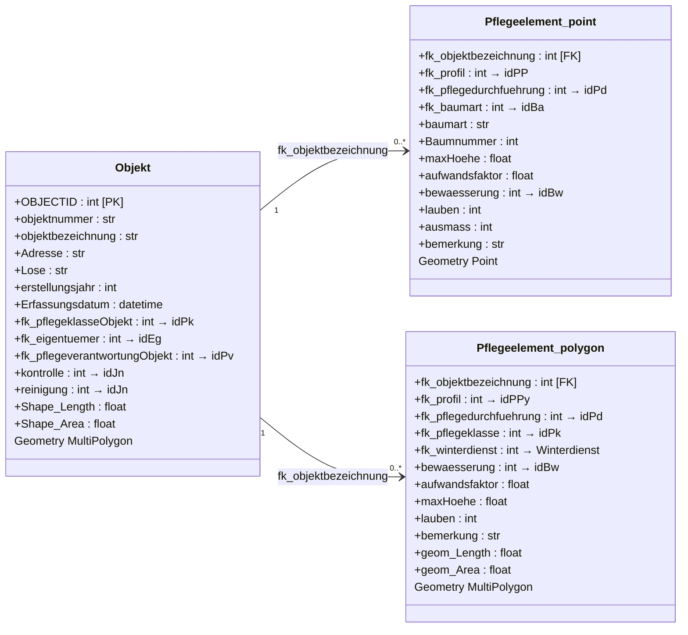
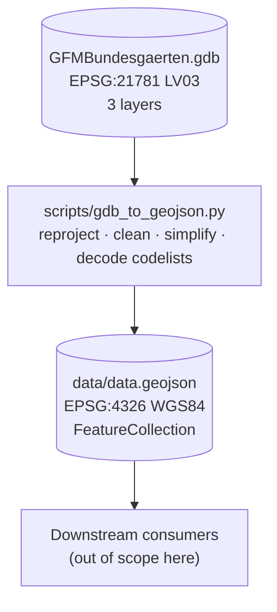
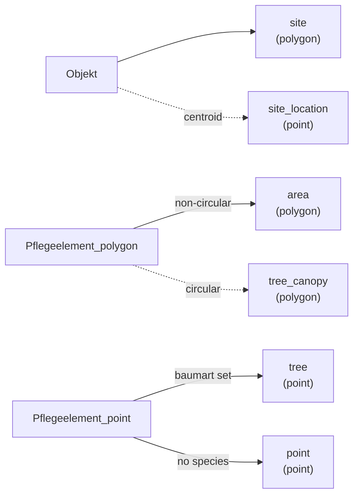

# Green Inventory — Data Model

This document is the contract between the source FileGDB
(`GFMBundesgaerten.gdb`), the conversion script
([`scripts/gdb_to_geojson.py`](../scripts/gdb_to_geojson.py)) and the
single output the web app consumes ([`data/data.geojson`](../data/data.geojson)).
It also covers the embedded codelists, the Swiss coordinate systems
involved, the geometry-processing rules, and the data contract the
frontend depends on.

The doc is **descriptive** — generated by reading the code and the source
GDB. When the code changes, update this file.

**Audience.** A software developer with no background in green-space
management. §1 introduces the domain and the German vocabulary. §2 gives
the conceptual model in two mermaid diagrams plus a one-row-per-entity
table. §3-§6 are the source schema, codelists, conversion script, and
output schema in reference detail. §7-§8 are the coordinate-system and
geometry-processing rules that any consumer of `data.geojson` should
know about. §9-§10 are limitations and how to re-run the pipeline.

This doc is intentionally scoped to the **data model and conversion** —
not how the frontend renders it. Layer stack, legend styling, filter UI,
and identify-on-click logic live alongside the code in `js/`.

---

## 1. Domain primer

The app is an inventory tool for the **Bundesgärtnerei (BG)** — the
federal nursery service inside the Swiss **BBL** (Bundesamt für Bauten und
Logistik / Federal Office for Buildings and Logistics). The BG maintains
the grounds of federal real estate: courthouses, ministries, embassies,
the BG's own facilities. Each property is a **Standort** ("site") — a
parcel with some mixture of lawn, beds, hedges, trees, paths, furniture.

For every site, surveyors catalogue three kinds of thing:

1. **The site boundary** itself — a parcel outline. One per site.
2. **Maintenance areas** inside the boundary — a lawn, a flower bed, a
   hedge, a gravel path. Polygons.
3. **Point features** — every tree, planter, bench, waste bin, bird box,
   log pile. Points.

Each area and each point is tagged with a **Profil** ("care profile") —
a value from a controlled vocabulary that says what the thing is and,
implicitly, how the BG maintains it (mowing cadence, watering, pruning).
For example *Geb.Rasen kf.* is "ornamental lawn, fine-cut"; *Wildhecke*
is "wild hedge"; *Sitzbank* is "bench". The profile drives both the
colour on the map and the grouping in the legend.

### 1.1 Why split points from polygons?

The source GDB ships green-area data in two layers — one for points,
one for polygons. They share most attributes (which site, which profile,
who maintains it, irrigation, effort multiplier, etc.) but the
geometry-type split is mirrored in **two separate profile codelists**:

* **`idPP`** — 22 *point* profiles: tree types, furniture, small structures.
* **`idPPy`** — 44 *polygon* profiles: lawn types, hedges, surfaces, water.

> ⚠️ The two codelists share integer keys but mean **completely different
> things.** Profile `1` is *Laubb. nat. grossk.* ("naturally-grown large
> deciduous tree") on points but *Geb.Rasen kf.* ("ornamental lawn,
> fine-cut") on polygons. Never join `fk_profil` across the two layers
> — the conversion always carries the geometry layer along (as
> `entity_type`) so consumers can disambiguate.

### 1.2 Glossary

The source data is in German; many field names and codelist labels carry
over verbatim into the output GeoJSON. Skim the table once; you'll
recognize them everywhere downstream.

| German | English | Notes |
|---|---|---|
| Bundesgärtnerei (BG) | Federal nursery service | The data owner; a unit inside BBL |
| Standort | Site, parcel, property | The top-level container |
| Objekt | (≈ Standort) | The GDB layer name for sites |
| Pflegeelement | Maintenance element | Anything inside a site that gets cared for: a lawn, a tree, a bench |
| Pflegefläche | Maintenance area | A `Pflegeelement` with polygon geometry |
| Profil / Profilkatalog | Care profile / catalogue | Controlled vocabulary of what something *is*, which implies how it's maintained |
| Pflegeklasse (PK) | Maintenance class | Intensity tier (`PK 1` / `PK 2` / `PK 3`) — how much attention the site gets |
| Pflegeverantwortung | Maintenance responsibility | Who's accountable — internal / external / both |
| Pflegedurchführung | Maintenance execution | Who actually does the work — BG, external contractor, city of Bern, … |
| Eigentümer | Owner | Of the land: federal (`Bund`), third party, or unrecorded |
| Los / DLZ | District / operational region | `DLZ` = *Dienstleistungszentrum* (regional service centre). `DLZ 1`–`DLZ 5` are the operational regions; `Gebiet Schweiz` covers the catch-all (mostly representations abroad); `ALT` flags legacy sites not yet reassigned to a DLZ |
| Werkhof | Depot / yard | A maintenance facility — appears as a Pflegedurchführung value |
| Strassenbaum | Street tree | Source data uses the abbreviation `Strassenb.` (idPP codes 4–6) |
| Schwarzräumung | "Black clearing" | Winter-service mode: snow cleared down to bare asphalt |
| Baumart | Tree species | Free-text plus a 430-entry Latin/German codelist |
| Bewässerung | Irrigation | automatic / by hand / not needed |
| Winterdienst | Winter service | Snow & ice treatment policy |
| Aufwandsfaktor | Effort multiplier | 0.5–5.0; weight applied to the standard care budget for a feature |
| Belag | Surface (hardscape) | Asphalt, gravel, paving, sand, etc. |
| Gehölz | Woody plant | Shrub-or-tree-ish vegetation |
| Rasen vs. Wiese | Mown lawn vs. meadow | Distinct categories: Rasen is short-cut; Wiese is biodiverse, cut 1–3×/year |
| Rabatte | Flower / perennial bed | |
| Hecke | Hedge | |
| Bollensteine | River-rock paving | Decorative round-stone surface; appears as small circles in the source data |
| Kontrolle / Reinigung | Inspection / Cleaning | Yes/no flags on a site |

Two non-domain terms a non-Swiss reader will hit:

| Term | Meaning |
|---|---|
| **LV03 / LV95** | Swiss national projected coordinate systems. Units are metres. `LV95` (EPSG:2056) is the modern one (introduced 2016); `LV03` (EPSG:21781) the legacy one. The source GDB is LV03; the frontend works in WGS84 with LV95 as a side channel for surveyors. |
| **FileGDB** | ESRI's proprietary geodatabase format — a directory of binary files with a `.gdb` extension. Readable via GDAL / pyogrio. |

---

## 2. Overview

### 2.1 Source data model (UML)

The source GDB has three layers joined by `fk_objektbezeichnung → Objekt.OBJECTID`.
Most attribute columns are integer foreign keys into one of the 17 field-domain
codelists (`idPP`, `idPPy`, `idBa`, `idPk`, `idPv`, …).


```mermaid
classDiagram
    direction LR

    class Objekt {
        +OBJECTID : int [PK]
        +objektnummer : str
        +objektbezeichnung : str
        +Adresse : str
        +Lose : str
        +erstellungsjahr : int
        +Erfassungsdatum : datetime
        +fk_pflegeklasseObjekt : int → idPk
        +fk_eigentuemer : int → idEg
        +fk_pflegeverantwortungObjekt : int → idPv
        +kontrolle : int → idJn
        +reinigung : int → idJn
        +Shape_Length : float
        +Shape_Area : float
        Geometry MultiPolygon
    }

    class Pflegeelement_point {
        +fk_objektbezeichnung : int [FK]
        +fk_profil : int → idPP
        +fk_pflegedurchfuehrung : int → idPd
        +fk_baumart : int → idBa
        +baumart : str
        +Baumnummer : int
        +maxHoehe : float
        +aufwandsfaktor : float
        +bewaesserung : int → idBw
        +lauben : int
        +ausmass : int
        +bemerkung : str
        Geometry Point
    }

    class Pflegeelement_polygon {
        +fk_objektbezeichnung : int [FK]
        +fk_profil : int → idPPy
        +fk_pflegedurchfuehrung : int → idPd
        +fk_pflegeklasse : int → idPk
        +fk_winterdienst : int → Winterdienst
        +bewaesserung : int → idBw
        +aufwandsfaktor : float
        +maxHoehe : float
        +lauben : int
        +bemerkung : str
        +geom_Length : float
        +geom_Area : float
        Geometry MultiPolygon
    }

    Objekt "1" --> "0..*" Pflegeelement_point : fk_objektbezeichnung
    Objekt "1" --> "0..*" Pflegeelement_polygon : fk_objektbezeichnung
```

> **Gotcha:** `fk_profil` on the two child layers points to **different**
> codelists (`idPP` vs `idPPy`). Code 1 is `Laubb. nat. grossk.` for points
> but `Geb.Rasen kf.` for polygons. See §3.5.

### 2.2 Pipeline


```mermaid
flowchart TD
    GDB[(GFMBundesgaerten.gdb<br/>EPSG:21781 LV03<br/>3 layers)]
    Script["scripts/gdb_to_geojson.py<br/>reproject · clean · simplify · decode codelists"]
    Out[(data/data.geojson<br/>EPSG:4326 WGS84<br/>FeatureCollection)]
    Front["Downstream consumers<br/>(out of scope here)"]

    GDB --> Script --> Out --> Front
```

The script uses **pyogrio** for layer reads, **ctypes against GDAL** for
field-domain extraction (the public pyogrio API doesn't expose
`OGR_FldDomain_GetEnumeration`), **pyproj** for reprojection (CHENyx06 NTv2
grid for LV03→LV95, 7-parameter Helmert for LV95→WGS84), and **shapely**
for geometry validity and Douglas-Peucker simplification.

### 2.3 Output entity types

The conversion fans the three source layers out into **six** `entity_type`
values. Two of the splits are non-obvious:

* `Objekt` produces **two** output features per row — a polygon (`site`)
  and a representative-point centroid (`site_location`) — so the zoomed-out
  "where are the parcels?" view has something to render.
* `Pflegeelement_point` is split on species: rows with `baumart` text or
  `fk_baumart > 0` become `tree`; everything else (furniture, structures)
  becomes `point`. Rows with a null `fk_profil` are dropped.
* `Pflegeelement_polygon` is split on shape: polygons that pass the
  circularity heuristic (§8.3) become `tree_canopy`; the rest become
  `area`. Rows with a null `fk_profil` are dropped.


```mermaid
flowchart LR
    O["Objekt"]
    PPy["Pflegeelement_polygon"]
    PPp["Pflegeelement_point"]

    O --> SITE["site<br/>(polygon)"]
    O -. centroid .-> SL["site_location<br/>(point)"]

    PPy -- non-circular --> AREA["area<br/>(polygon)"]
    PPy -. circular .-> CAN["tree_canopy<br/>(polygon)"]

    PPp -- baumart set --> TREE["tree<br/>(point)"]
    PPp -- no species --> PT["point<br/>(point)"]
```

#### Entity overview

Each output feature carries `entity_type` (machine key), `feature_type`
(German display label), `subtype` (specific label such as a species or
profile name), and the full `site_*` context block mirrored from its
parent `Objekt`.

| `entity_type` | Geometry | Source | Profile codelist | Description |
|---|---|---|---|---|
| `site` | Polygon | `Objekt` | — | Parcel / site boundaries (Standorte). Carry the full `Objekt` attribute set: address, Los (DLZ district), Eigentümer, Pflegeklasse, control/cleaning flags. |
| `site_location` | Point | `Objekt` centroid | — | Generated representative-point per site for the zoomed-out overview. Carries the same attributes as `site`. |
| `area` | Polygon | `Pflegeelement_polygon` (non-circle) | `idPPy` | Pflegeflächen — Rasen, Wiesen, Rabatten, Hecken, Gehölzflächen, Spez. Bepflanzungsformen, Beläge, Wasserflächen, Anderes. |
| `tree_canopy` | Polygon | `Pflegeelement_polygon` (circle) | `idPPy` | Polygons that pass the circularity heuristic. Mostly decorative shrub circles (Profil 19 "Gehölzrabatte", Profil 21 "Gehölz & Bodend.") — **not** literal tree crowns despite the name. Carry `crown_radius_m` / `crown_diameter_m`. |
| `tree` | Point | `Pflegeelement_point` (species set) | `idPP` | Tree positions where `baumart` or `fk_baumart` is populated. Carry species (`baumart`), `baumnummer`, `max_hoehe_m`. |
| `point` | Point | `Pflegeelement_point` (no species) | `idPP` | Non-tree point features — Abfalleimer, Sitzbank, Spielgerät, Ausstattung, Asthaufen, Baumstamm, Steinhaufen, Wildbienenhotel, Nistkasten, Pflanzgefässe, Schling-/Kletterpflanzen, Solitärstrauch, Anderes. |

Consumers typically partition these into two business-level groups:
**Standorte** = `site`, **Grünflächen** = everything else. The
`site_location` type is a rendering aid (it duplicates `site` as a
point) and is typically hidden in tabular views.

---

## 3. Source GDB

Path: `Daten_Bundesgärtnerei/GFMBundesgaerten.gdb` (ESRI FileGDB v10.x).

**CRS:** `EPSG:21781` (CH1903 / LV03, Bessel ellipsoid). Verified at
runtime — the script asserts the source CRS matches one of the
expected variants (LV03 or LV95) before proceeding.

### 3.1 Layers

| Layer | Geometry | Purpose |
|---|---|---|
| `Objekt` | MultiPolygon | Site / parcel boundaries (Standorte) |
| `Pflegeelement_point` | Point | Tree positions + furniture + small structures |
| `Pflegeelement_polygon` | MultiPolygon | Vegetation + surfaces + tree-canopy circles |

### 3.2 `Objekt` fields (18 + geometry)

Site-level identifiers and metadata. Joined to children via OBJECTID.

| Field | Type | Notes |
|---|---|---|
| `objektnummer` | str(20) | Internal site number, sometimes alphanumeric (e.g. `1602GR`) |
| `objektbezeichnung` | str(255) | Human-readable site name |
| `Adresse` | str(200) | Street address |
| `parzelle` | str(255) | Cadastral parcel number(s); CSV in some rows |
| `Lose` | str(20) | Maintenance district: `DLZ 1..5`, `Gebiet Schweiz`, `ALT` |
| `erstellungsjahr` | int32 | Year of construction (often null) |
| `Erfassungsdatum` | datetime | Survey date |
| `objektausmass` | float | Always null in current data |
| `TitelObjektblatt` | str(255) | Filename of the data sheet |
| `TitelKalkulation` | str(255) | Filename of the cost calculation sheet |
| `bemerkung` | str | Free-text remarks |
| `fk_pflegeklasseObjekt` | int32 | → `idPk` codelist |
| `fk_eigentuemer` | int32 | → `idEg` codelist |
| `fk_pflegeverantwortungObjekt` | int32 | → `idPv` codelist |
| `kontrolle` | int32 | → `idJn` codelist (ja/nein) |
| `reinigung` | int32 | → `idJn` codelist |
| `Shape_Length` | float | Source-CRS perimeter in metres |
| `Shape_Area` | float | Source-CRS area in m² |

### 3.3 `Pflegeelement_point` fields (23 + geometry)

| Field | Type | Notes |
|---|---|---|
| `fk_objektbezeichnung` | int32 | FK → `Objekt.OBJECTID` |
| `fk_profil` | int32 | → `idPP` codelist (point profile). Null rows are dropped by the conversion. |
| `fk_pflegedurchfuehrung` | int32 | → `idPd` codelist |
| `fk_pflegeklasse` | int32 | → `idPk`. Effectively always 0 — points inherit their site's Pflegeklasse instead of carrying their own. |
| `fk_pflegeverantwortung` | int32 | → `idPv`. Effectively always 0 |
| `fk_zustand` | int32 | → `idZs`. Always 0 |
| `fk_kostenstelle` | int32 | → `idKs`. Always 0 |
| `fk_baumart` | int32 | → `idBa` codelist (tree species) |
| `baumart` | str(255) | Free-text species name. Redundant with `fk_baumart` when both are set, but either may be populated alone. Either field being non-empty is what classifies the row as a `tree` (entity type) rather than a `point`. |
| `Baumnummer` | int32 | Per-site tree number |
| `bewaesserung` | int32 | → `idBw` codelist |
| `lauben` | int32 | Pergola/canopy flag (0/1/2) |
| `maxHoehe` | float | Max. tree height in m, where measured |
| `hoehe` | int32 | Always null; legacy field |
| `aufwandsfaktor` | float32 | Care-effort multiplier (0.5–5.0) |
| `naturobjekt` | int32 | "Natural object" flag. Always 0 |
| `parzelle_name` | int32 | Legacy denormalisation. Always 0 or null; never non-zero. |
| `kostenstelle_name` | str(255) | Always `'0'`; legacy denormalisation |
| `objektbezeichnung_name` | str | Always `'0'`; legacy denormalisation |
| `eigentuemer_name` | int32 | Always 0; legacy denormalisation |
| `ausmass` | int16 | Quantity (mostly 1) |
| `bemerkung` | str | Free-text remarks |
| `letzte_aenderung` | datetime | Always null |

### 3.4 `Pflegeelement_polygon` fields (21 + geometry)

| Field | Type | Notes |
|---|---|---|
| `fk_objektbezeichnung` | int32 | FK → `Objekt.OBJECTID` |
| `fk_profil` | int32 | → `idPPy` codelist (polygon profile, **different from `idPP`!**). Null rows are dropped by the conversion. |
| `fk_pflegedurchfuehrung` | int32 | → `idPd` codelist |
| `fk_pflegeklasse` | int32 | → `idPk`. Mostly 0; when set, only `2` (`PK 2`) is observed. No other class is ever explicitly assigned at the polygon level — everything else inherits from the parent site. |
| `fk_pflegeverantwortung` | int32 | → `idPv`. Always 0 |
| `fk_zustand` | int32 | → `idZs`. Always 0 |
| `fk_kostenstelle` | int32 | → `idKs`. Always 0 |
| `fk_winterdienst` | int32 | → `Winterdienst` codelist |
| `bewaesserung` | int32 | → `idBw` codelist |
| `lauben` | int32 | Pergola/canopy flag |
| `maxHoehe` | float | Max. plant height where applicable |
| `aufwandsfaktor` | float32 | Care-effort multiplier (0.5–5.0) |
| `naturobjekt` | int32 | Always 0 |
| `parzelle_name` | int32 | Always 0 |
| `kostenstelle_name` | str(255) | Always `'0'` |
| `objektbezeichnung_name` | str | Always `'0'` |
| `eigentuemer_name` | int32 | Always 0 |
| `ausmass` | float | Almost always null; effectively unused |
| `bemerkung` | str | Free-text remarks |
| `geom_Length` | float | Source-CRS perimeter in m |
| `geom_Area` | float | Source-CRS area in m² |

### 3.5 Critical insight: `fk_profil` is two distinct domains

`fk_profil` on `Pflegeelement_point` references **`idPP`**
(23 entries: trees + small structures + furniture).
`fk_profil` on `Pflegeelement_polygon` references **`idPPy`**
(44 entries: vegetation + surfaces + water).

Profile **1** is `Laubb. nat. grossk.` for points but `Geb.Rasen kf.`
for polygons. The two domains share integer codes but mean different
things — never merge them. The conversion script and frontend keep
them separate via `entity_type`.

---

## 4. Codelists

Extracted from the GDB's own field-domain catalog at conversion time
via `ctypes` against pyogrio's bundled GDAL DLL (the public Python
binding doesn't expose `OGR_FldDomain_GetEnumeration`). All 17 domains
are embedded in the output GeoJSON as `metadata.codelists` so the
frontend (and any downstream consumer) can introspect them without
re-querying the GDB.

### 4.1 Inventory

| Domain | Type | Entries | Fields that reference it |
|---|---|---:|---|
| `idPP` | coded | 22 | `Pflegeelement_point.fk_profil` |
| `idPPy` | coded | 44 | `Pflegeelement_polygon.fk_profil` |
| `idBa` | coded | 430 | `Pflegeelement_point.fk_baumart` |
| `idPd` | coded | 9 | `fk_pflegedurchfuehrung` (both layers) |
| `idPk` | coded | 4 | `fk_pflegeklasse*` (all layers) |
| `idPv` | coded | 4 | `fk_pflegeverantwortung*` (all layers) |
| `idJn` | coded | 3 | `kontrolle`, `reinigung` |
| `idEg` | coded | 3 | `Objekt.fk_eigentuemer` |
| `idBw` | coded | 3 | `bewaesserung` |
| `Winterdienst` | coded | 2 | `Pflegeelement_polygon.fk_winterdienst` |
| `idZs` | coded | 1 | `fk_zustand` — only `0 → "nicht erfasst"` defined. Effectively unused. |
| `idKs` | coded | 1 | `fk_kostenstelle` — only `0 → "nicht erfasst"` defined. Effectively unused. |
| `idPL` | coded | 0 | _truly empty — likely reserved for linear features_ |
| `AnnotationStatus`, `BooleanSymbolValue`, `HorizontalAlignment`, `VerticalAlignment` | coded | – | ESRI internal symbology metadata; ignored |

### 4.2 idPP — Point profiles (22 entries)

Used by `Pflegeelement_point.fk_profil`.

```
 1  Laubb. nat. grossk.                  (large deciduous tree, naturally grown)
 2  Laubb. nat. kleink.                  (small deciduous tree, naturally grown)
 3  Laubb. Kopf-/Form                    (deciduous tree, pollarded/shaped)
 4  Strassenb. Laub nat. grossk.         (street tree, natural large)
 5  Strassenb. Laub nat. kleink.         (street tree, natural small)
 6  Strassenb. Laub Kopf/Form            (street tree, pollarded/shaped)
 7  Nadelb. nat.                          (coniferous tree, natural)
 8  Hochstammobst                         (high-stem fruit tree)
 9  Schling-& Kletterpf.                 (climbing plant)
10  Pflanzgefäss mobil Dauerbepflanzung  (mobile planter, permanent)
11  Pflanzgefäss Wechselflor             (planter, seasonal display)
12  Abfalleimer                           (waste bin)
13  Sitzbank                              (bench)
15  Spielgerät                            (playground equipment)
16  Ausstattung                           (furniture / equipment, generic)
17  Anderes                               (other, point)
18  Asthaufen                             (branch pile)
19  Baumstamm                             (log)
20  Steinhaufen                           (stone pile)
21  Wildbienenhotel                       (wild-bee hotel)
22  Nistkasten                            (bird nest box)
23  Solitärstrauch                        (solitary shrub)
```

Note: code **14 is missing from the codelist** itself — the codelist
defines 22 entries, not 23. The dominant point profile in practice is
`1 Laubb. nat. grossk.` (large naturally-grown deciduous trees).

### 4.3 idPPy — Polygon profiles (44 entries)

Used by `Pflegeelement_polygon.fk_profil`.

```
 1  Geb.Rasen kf.                       Rasen
 2  Geb.Rasen gf.                       Rasen
 3  Strap./Sportr. kf.                  Rasen (Strapazierrasen)
 4  Strap./Sportr. gf.                  Rasen (Strapazierrasen)
 5  Blumenrasen                         Rasen
 6  Blumenwiese kf.                     Wiesen
 7  Blumenwiese gf.                     Wiesen
 8  Feuchtwiese                         Wiesen
 9  Wechselflor                         Rabatten
10  Grab                                Rabatten
11  Beetrosen                           Rabatten
12  Moorbeet                            Rabatten
13  Stauden. ext.                       Rabatten
14  Stauden. int.                       Rabatten
15  Ruderalfl.                          Rabatten
16  Formhecke - 1.5 m                   Hecken
17  Formhecke + 1.5 m                   Hecken
18  Wildhecke                           Hecken
19  Gehölzrabatte                       Gehölzflächen
20  Bodendecker                         Gehölzflächen
21  Gehölz & Bodend.                    Gehölzflächen
22  Parkwald                            Gehölzflächen
23  Wald                                Gehölzflächen
24  Dach: ext. Stauden                  Spezielle Bepflanzungsformen
25  Asphaltbelag                        Beläge
26  Betonpl./Verbund/Naturstein         Beläge
27  Chaussierung                        Beläge
28  Sand                                Beläge
29  Rasengittersteine                   Beläge
30  Holzhäckselbelag                    Beläge
31  Fallschutzpl./-beläge               Beläge
32  Kunststoff-/Sportbelag              Beläge
33  Kunstrasen                          Beläge
34  Gewässer, ruhend                    Wasserflächen
35  Brunnen                             Wasserflächen
36  Anderes                             Anderes
37  Geröllstreifen/Bollensteine         Beläge
38  Dach: intensiv begrünt              Spezielle Bepflanzungsformen
39  Flachdach ohne Bewuchs              Spezielle Bepflanzungsformen
40  Steildach                           Spezielle Bepflanzungsformen
41  Dachterrasse                        Spezielle Bepflanzungsformen
42  Naturstein-Pflästerung              Beläge
43  Saumvegetation                      Wiesen
44  Magerrasen                          Wiesen
```

The category column is the GSZ-Profilkatalog grouping (Rasen / Wiesen /
Rabatten / Hecken / Gehölzflächen / Spezielle Bepflanzungsformen /
Beläge / Wasserflächen / Anderes) used downstream for legend buckets.

### 4.4 Other small codelists

```
idBw — bewaesserung_name (3 entries)
   1  automatisch
   2  von Hand
   3  nicht erforderlich

idEg — eigentuemer_name (3 entries)
   1  Bund
   2  Dritte
   0  nicht erfasst

idJn — ja_nein_name (3 entries)
   0  nicht erfasst
   1  ja
   2  nein

idPd — pflegedurchfuehrer (9 entries)
   1  BG          (Bundesgärtnerei)
   2  extern
   3  unbekannt
   4  Stadt Bern
   5  Dritte
   6  Baumpfleger
   7  DLZ 2
   8  Werkhof
   9  intern

idPk — pflegeklasse_name (4 entries)
   0  nicht erfasst
   1  PK 1
   2  PK 2
   3  PK 3

idPv — pflegeverantwortung_name (4 entries)
   0  nicht erfasst
   1  intern
   2  extern
   3  intern / extern

Winterdienst — winter-service treatment (2 entries)
   1  Schwarzräumung
   2  Gehweg, ca. 2 m breit

idZs — zustand (1 entry, effectively unused)
   0  nicht erfasst

idKs — kostenstelle (1 entry, effectively unused)
   0  nicht erfasst

idPL — (0 entries, truly empty)
```

### 4.5 idBa — Tree species (430 entries)

Full Latin/German species list. See `metadata.codelists.idBa` in
the output GeoJSON for the verbatim mapping.

---

## 5. Conversion pipeline

[`scripts/gdb_to_geojson.py`](../scripts/gdb_to_geojson.py)

### 5.1 Steps

1. **Verify source CRS.** `pyogrio.read_info(GDB, layer="Objekt")` is
   asserted to return one of `EPSG:21781` or `EPSG:2056`. Refuses to
   run otherwise — this guards against silent double-reprojection
   if a future GDB drop changes CRS.
2. **Build CRS transformers.** `_best_transformer()` enumerates
   `pyproj.transformer.TransformerGroup` and selects the lowest
   `accuracy` operation. Logs the operation chain and accuracy at
   start.
3. **Extract codelists** via `extract_codelists()` — see §4.
4. **Load `Objekt`** — each site becomes two output features (a polygon
   + a representative-point centroid). Site fields are denormalised
   onto every child feature.
5. **Load `Pflegeelement_point`** — split into trees vs other points
   based on whether `baumart` text or `fk_baumart` integer is populated.
6. **Load `Pflegeelement_polygon`** — split into tree-canopy circles vs
   regular area polygons based on a circularity heuristic (see §8.3).
7. **Assemble output** — order features site → area → canopy → tree
   → point → site_location, assign `id = array_index`.
8. **Validate + clean** — recursive walk replaces any stray NaN
   with `null`, then `json.dump(allow_nan=False)`.

### 5.2 Dependencies

```
pyogrio    0.12+   (FileGDB driver, full-schema reader)
pyproj     3.x     (CRS transforms; uses bundled CHENyx06 grid)
shapely    2.x     (geometry ops, validity, simplify, orient)
pandas     1.x     (Excel codelist read — legacy fallback only)
```

GDAL itself is bundled with pyogrio (pyogrio.libs); we load it
directly via `ctypes` for the field-domain API which pyogrio doesn't
expose.

---

## 6. Output schema

Single file: [`data/data.geojson`](../data/data.geojson).

```jsonc
{
  "type": "FeatureCollection",
  "bbox": [west, south, east, north],         // RFC 7946 §5
  "metadata": { ... },                         // see §6.1
  "features": [ ... ]                          // see §6.2
}
```

**RFC 7946 compliance:** no `crs` member; coordinates are WGS84
(longitude, latitude); right-hand winding rule applied to all
polygons.

### 6.1 `metadata` block

| Key | Type | Description |
|---|---|---|
| `source` | string | Absolute path of the source GDB at conversion time |
| `attribution` | string | "© Bundesamt für Bauten und Logistik (BBL) — Bundesgärtnerei" |
| `license` | string | Currently "Internal use only" |
| `extracted_at` | ISO-8601 | UTC timestamp of conversion run |
| `src_crs` | string | "EPSG:21781" or "EPSG:2056" |
| `out_crs` | string | "EPSG:4326 (WGS84, RFC 7946)" |
| `transform_accuracy_m` | object | Published accuracy in metres for each leg of the reprojection chain |
| `simplify_tolerance_m_lv95` | number | DP tolerance applied to outlier polygons (5 cm) |
| `simplify_vertex_threshold` | int | Minimum vertex count to trigger simplification (200) |
| `canopy_min_area_m2` | number | Threshold below which "circular polygons" are treated as decorative, not tree crowns (1.5 m²) |
| `canopy_circularity_tol` | number | Circularity ratio tolerance for canopy detection (0.08) |
| `lv95_in_properties` | bool | true — every feature carries Swiss-grid coordinates as properties |
| `codelists` | object | Verbatim copy of all 17 GDB field domains. Format `{ domainName: { code: label } }` |
| `counts` | object | Per-`entity_type` row counts at conversion time: `{ sites, site_locations, trees, points_other, tree_canopies, areas, total }`. Snapshot value — do not depend on absolute numbers. |
| `fk_profil_values` | int[] | Distinct `fk_profil` integers seen across all features |
| `fk_profil_area_counts` | object | Per-code feature count for area features (snapshot, used downstream for legend ordering) |
| `todo_codelists` | string[] | List of codelist names whose decoding is still TODO. Currently empty |

### 6.2 Feature schema by `entity_type`

Every feature has these common properties (from the conversion script's
`base` dict):

| Field | Type | Notes |
|---|---|---|
| `entity_type` | string | One of `site`, `site_location`, `area`, `tree_canopy`, `tree`, `point` |
| `feature_type` | string | German display label (e.g. `"Standort"`, `"Pflegefläche"`, `"Baum"`) |
| `subtype` | string | More specific label (e.g. `"Geb.Rasen kf."`, `"Platanus x hispanica"`) |
| `category` | string | Used by some legacy filter paths |
| `source` | string | Origin layer / synthesis (e.g. `"GDB:Pflegeelement_polygon (circle)"`) |
| `area_m2` | number | LV95-projected area, 1-decimal precision |

Plus **site-context** fields, mirrored from `Objekt` onto every child:

| Field | Notes |
|---|---|
| `site_oid` | OBJECTID of the parent site |
| `site_name` | `Objekt.objektbezeichnung` |
| `site_objektnummer` | |
| `site_adresse` | |
| `site_lose` | DLZ district |

Site features themselves *also* carry these `site_*` keys (mirrored
from their own native columns), so a single column in the table works
for every entity type.

#### `entity_type: "site"`

Polygon. `Objekt` boundaries.

```
objectid, objektnummer, name, adresse, parzelle, lose, erstellungsjahr,
erfassungsdatum, objektausmass, titel_objektblatt, titel_kalkulation,
bemerkung, shape_length_m, shape_area_m2,
pflegeklasse, eigentuemer, pflegeverantwortung, kontrolle, reinigung,
fk_pflegeklasse_raw, fk_eigentuemer_raw, fk_pflegeverantwortung_raw,
kontrolle_raw, reinigung_raw,
lv95_east_centroid, lv95_north_centroid
```

#### `entity_type: "site_location"`

Point. Generated centroid (using `geom.representative_point()` so
L-shaped polygons get a point that's actually inside).
Same property set as `site` — exists for the zoomed-out "where are
the parcels?" affordance.

#### `entity_type: "area"`

Polygon. The non-circle output of `Pflegeelement_polygon`.

```
site_*…,
fk_profil, profil_label,                       // idPPy decoded
fk_pflegedurchfuehrung, pflegedurchfuehrung,    // idPd decoded
fk_pflegeklasse, pflegeklasse,                  // idPk decoded
fk_winterdienst, winterdienst,                  // Winterdienst decoded
aufwandsfaktor,
bewaesserung, bewaesserung_label,               // idBw decoded
lauben, max_hoehe_m, ausmass, bemerkung,
geom_length_m, geom_area_m2, area_m2
```

#### `entity_type: "tree_canopy"`

Polygon. The circle output of `Pflegeelement_polygon` — small
decorative round elements (Bollensteine, ornamental shrub patches
drawn as circles in the source plan). Same property set as `area`,
plus:

```
crown_radius_m, crown_diameter_m
```

> **Naming caveat.** Despite the name `tree_canopy`, most of these
> are decorative circular elements — Profil 19 ("Gehölzrabatte"),
> Profil 21 ("Gehölz & Bodend.") etc. — not actual tree crowns.
> The heuristic identifies them by circularity, not semantics.
> See §8.3.

#### `entity_type: "tree"`

Point. Tree positions from `Pflegeelement_point` (those with
`baumart` populated, or `fk_baumart > 0`).

```
site_*…,
fk_profil, profil_label,                       // idPP decoded
pflegedurchfuehrung, pflegeverantwortung,
aufwandsfaktor,
bewaesserung, bewaesserung_label,
baumart, fk_baumart,                            // baumart text preferred; else idBa lookup
baumnummer,
lauben, max_hoehe_m, ausmass, bemerkung,
letzte_aenderung, lv95_east, lv95_north
```

#### `entity_type: "point"`

Point. Non-tree points from `Pflegeelement_point` — furniture,
benches, lamps, ornament, small structures. Same property set as
`tree` minus the species fields.

---

## 7. Coordinate systems & accuracy

### 7.1 Reprojection chain

The pipeline goes **LV03 → LV95 → WGS84**. Two-step instead of direct
because the LV03↔LV95 step uses the CHENyx06 grid (sub-decimetre) and
gives us a metric LV95 representation we can use for area calculations
and metric-tolerance simplification.

| Leg | Method | Published accuracy |
|---|---|---:|
| `EPSG:21781` → `EPSG:2056` (LV03 → LV95) | CHENyx06 NTv2 grid (bundled with pyproj-data) | **0.2 m** |
| `EPSG:2056` → `EPSG:4326` (LV95 → WGS84) | 7-parameter Helmert | **1.0 m** |
| Direct LV03 → WGS84 | Composed (1.5 m) | (not used) |

Sub-decimetre WGS84 would require swisstopo's Reframe Web API
(grid-based per request). For an inventory app, ~1 m is acceptable.

### 7.2 Coordinate precision in output

All WGS84 coordinates are rounded to **7 decimal places** =
~1.1 cm at 47°N latitude / ~0.8 cm in longitude. Source data is
cm-precision, so this is a faithful round-trip.

Each feature also carries Swiss-grid coordinates as properties:

| Property | Entity types | Precision |
|---|---|---|
| `lv95_east`, `lv95_north` | `tree`, `point` | 0.01 m |
| `lv95_east_centroid`, `lv95_north_centroid` | `site`, `site_location` | 0.01 m |

LV95 is the canonical reference for Swiss surveyors and BBL staff, so
the output preserves cm-precision LV95 alongside the RFC-7946 WGS84
geometry. Consumers that need to display Swiss-grid coordinates read
the properties directly instead of round-tripping through pyproj.

---

## 8. Geometry processing

### 8.1 Validity and orientation

Every polygon goes through `clean_polygon()` ([gdb_to_geojson.py:128](../scripts/gdb_to_geojson.py)):

1. `make_valid()` if `geom.is_valid` is false. If the result is a
   `GeometryCollection`, the largest polygon part is kept.
2. **Conditional simplification** — Douglas-Peucker at 5 cm tolerance
   in LV95 metres, applied **only when vertex count > 200**. This
   trims the digitization-noise outliers (originally up to 41 823
   vertices on a 1 060 m² polygon) while keeping normal polygons
   pixel-perfect at any zoom. Tree-canopy candidates are skipped from
   simplification (they're regular polygons by design and we don't
   want to flatten the curvature).
3. `orient(sign=1.0)` — RFC 7946 §3.1.6 right-hand rule (outer rings
   CCW, inner rings CW). Required for Turf.js / D3-geo / leaflet-pip
   point-in-polygon tests; MapLibre is forgiving but other tools aren't.

### 8.2 Effect of conditional simplification

The conditional Douglas-Peucker pass collapses a small number of
digitization-noise outliers (polygons with thousands of vertices on a
small footprint) while leaving the bulk of the data untouched. Median
polygon vertex count is unchanged; the maximum drops by roughly an
order of magnitude. Output file size is roughly 60 % of the raw GDB
geometry payload on a typical drop. Exact numbers vary per drop; the
script logs them at conversion time.

### 8.3 Tree-canopy circle detection

Polygons in `Pflegeelement_polygon` whose perimeter and area satisfy
the regular-polygon-as-circle relation `P²/(4πA) ≈ 1` are classified
as canopies. Two thresholds gate this:

```python
CANOPY_MIN_AREA_M2 = 1.5
CANOPY_CIRCULARITY_TOL = 0.08
```

The min-area check rejects ornamental Bollensteine (round paving
stones, ~0.05 m² each) which are also 12-gon circles in the source
data. The 8 % circularity tolerance accepts 12-gons (typical),
decagons, and octagons; it rejects squares (ratio 1.273).

---

## 9. Known limitations

Data-model concerns; rendering concerns (legend pattern fills, missing
3D mesh, etc.) are tracked in the frontend codebase, not here.

- **WGS84 accuracy bottoms out at ~1 m** because no improved grid
  exists in PROJ's database for `CH1903+ → WGS 84`. Sub-decimetre
  needs the swisstopo Reframe Web API (out of scope).
- **`fk_zustand` and `fk_kostenstelle` codelists carry only the
  "nicht erfasst" sentinel.** `idZs` and `idKs` each define a single
  entry (`0 → "nicht erfasst"`), and every row in both child layers has
  value `0`. The fields exist for schema compatibility but carry no
  information; the conversion script decodes them to `null`.
- **`idPL` codelist is truly empty** (zero entries) — likely reserved
  for a linear-feature layer that doesn't exist in this GDB drop.
- **`fk_pflegeklasse` is barely used on individual elements.** On
  polygons only a small fraction of rows is non-zero, and every observed
  non-zero value is `2` (`PK 2`); on points the field is always `0`.
  Maintenance class is effectively a site-level attribute
  (`Objekt.fk_pflegeklasseObjekt`) inherited downward.
- **`tree_canopy` entity-type label is misleading.** Most circular
  polygons identified by the heuristic are decorative shrub plantings
  (Profil 19 "Gehölzrabatte", Profil 21 "Gehölz & Bodend."), not
  actual tree crowns. Renaming to `circular_shrub` or similar is a
  backlog item.
- **Several `fk_profil` codes have low or zero counts** (`Strap./Sportr.`,
  `Sand`, `Kunstrasen`, `Steildach`, `Dachterrasse`, some furniture
  points, `Nistkasten`) in the current GDB drop — they exist in the
  codelist but aren't well-represented in the data.

---

## 10. Re-running the pipeline

```sh
python scripts/gdb_to_geojson.py
```

Re-reads the GDB at `Daten_Bundesgärtnerei/GFMBundesgaerten.gdb`
(path hardcoded — change `GDB_PATH` constant if different),
overwrites `data/data.geojson`. Codelists, accuracy info, attribution,
and metadata block are regenerated each run from the live GDB.

Expected runtime: ~5–10 s on a modern machine. The first run also
fetches the CHENyx06 NTv2 grid from PROJ's CDN (`PROJ_NETWORK=ON`
is enabled at script start) — subsequent runs hit the local cache.
