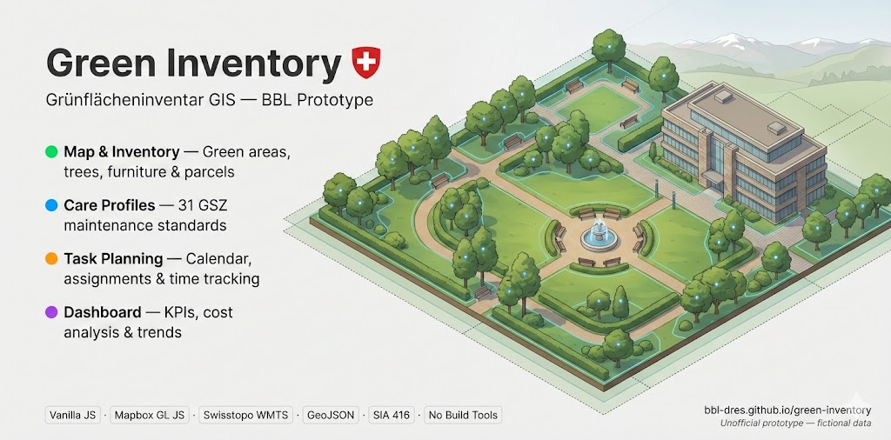

# Green Inventory — Care & Maintenance Prototype

> **Unofficial mockup.** Fictional data, not for production use. Part of the [`green-inventory`](../README.md) repo.



The earlier, feature-rich prototype: an interactive GIS mockup for urban green-space inventory, maintenance planning, and field survey — built around interactive maps, a care-profile library, and task management against a denormalised data model.

## Live app

https://bbl-dres.github.io/green-inventory/prototype-care/

The old `/prototype1/` path redirects here.

## Features

### Core Views
- **Map View** — Interactive Mapbox map with multi-layer management (green areas, trees, furniture, buildings, parcels), 4 basemap styles, swisstopo WMTS integration, measurement tools, and geometry editing
- **Wiki View** — Sortable table with search, filtering, configurable columns, and export to CSV/Excel/GeoJSON
- **Task View** — Maintenance planning with calendar, task assignment, checklists, and time tracking
- **Dashboard** — KPI display with cost analysis, budget utilization, and trend reporting
- **Detail View** — Comprehensive property dashboard with tabbed sections:
  - Overview (images, basic info, mini-map)
  - Measurements (SIA 416 compliant area data)
  - Documents (plans, certificates, permits)
  - Costs (operational expenses by category)
  - Contracts (service & maintenance agreements)
  - Contacts (personnel & stakeholders)
  - Facilities (equipment & infrastructure inventory)

### Inventory & Geometry Editing
- **Green Areas** (Polygons) — Profile types, area m², condition, usage intensity, soil type, irrigation status
- **Trees** (Points) — Species, trunk circumference, crown diameter, height, planting year, condition, protection status
- **Furniture** (Points) — Benches, fountains, play equipment with type classification
- **Buildings & Parcels** — Building identifiers, cadastral data integration
- Full polygon/point/line editing with snapping, undo/redo, validation, and split/merge operations

### Care Profile Library (Pflegeprofil-Bibliothek)
- 31 standardized GSZ profiles across 9 categories (lawns, plantings, shrubs, trees, special surfaces, structural elements, surfaces, water features, usage areas)
- Structured maintenance instructions with timing, frequency, equipment, and cost data
- Automatic map coloring based on assigned care profile

### Search & Filtering
- Multi-source search: local objects + Swisstopo location API + geocat.ch layers
- Attribute filtering with complex combinations (profile type, condition, status, responsibility)
- Deep linking with URL-based navigation and filter persistence

### Data Export
- CSV, Excel (.xlsx), GeoJSON, and KML export
- Custom column selection before export

## Tech Stack

| Technology | Version | Usage |
|------------|---------|-------|
| Vanilla JavaScript | ES6+ | Application logic |
| Mapbox GL JS | v3.4.0 | Interactive WebGL map |
| CSS3 + Design Tokens | Modern | Styling (Flexbox, Grid, CSS Variables) |
| GeoJSON | RFC 7946 | Geospatial data format |
| Swisstopo API | v3 | Swiss location search & WMTS tiles |
| geo.admin.ch API | — | ÖREB-Kataster, Amtliche Vermessung |
| Material Symbols | Google | Icon library |

No build tools or frameworks — pure static files.

## Getting Started

```bash
# Python
python -m http.server 8000

# Node.js
npx http-server

# PHP
php -S localhost:8000
```

Then open <http://localhost:8000/prototype-care/>.

## Project Structure

```
prototype-care/
├── index.html              # App shell
├── js/
│   └── app.js              # Application logic (~4,800 lines)
├── css/
│   ├── tokens.css          # Design token system
│   └── main.css            # Styles & design system
├── data/                   # ~24 denormalised layers + lookup tables
│   ├── sites · parcels · buildings · gardens · forest · woodlands .geojson
│   ├── lawns · plantings · surfaces · trees · furniture · …  .geojson
│   ├── care-profiles.json  # GSZ care-profile library
│   └── contracts · costs · contacts · documents · inspections · tasks · species .json
├── scripts/                # FME workspaces + PDF feature extractor
│   ├── AV Landcover.fmw
│   ├── Parcels FME.fmw
│   └── extract_features.py # PDF plan → data/extracted_features.geojson
├── docs/
│   ├── DATAMODEL.md · DESIGNGUIDE.md · LAYERSTYLE.md
│   ├── REQUIEREMENTS.md    # detailed requirements (MoSCoW)
│   └── RESEARCH.md · Archive/
├── assets/                 # logos + preview screenshots
├── README.md
└── LICENSE
```

## Swiss Standards & Integrations

| Standard / Service | Description |
|--------------------|-------------|
| GSZ "Mehr als Grün" | Care profile catalog for green space maintenance |
| SIA 416 | Building area measurements (BGF, NGF, EBF) |
| SIA 380/1 | Energy reference area |
| LV95 (EPSG:2056) | Swiss coordinate system |
| WGS84 (EPSG:4326) | GeoJSON coordinate system |
| EGID / EGRID | Federal Building & Property Identifiers |
| swisstopo WMTS | Official Swiss mapping tiles |
| ÖREB-Kataster | Public-law restrictions on land ownership |
| Amtliche Vermessung | Official cadastral survey data |
| Infoflora | Invasive neophyte species database |

## Deployment

**GitHub Pages:** Push to `main` deploys automatically.

**Alternatives:** Netlify, Vercel, CloudFlare Pages, or any static file server.

## License

[MIT](LICENSE)

---

> [!CAUTION]
> **This is an unofficial mockup for demonstration purposes only.**
> All data is fictional. Not all features are fully functional. This project serves as a visual and conceptual prototype — it is not intended for production use.
