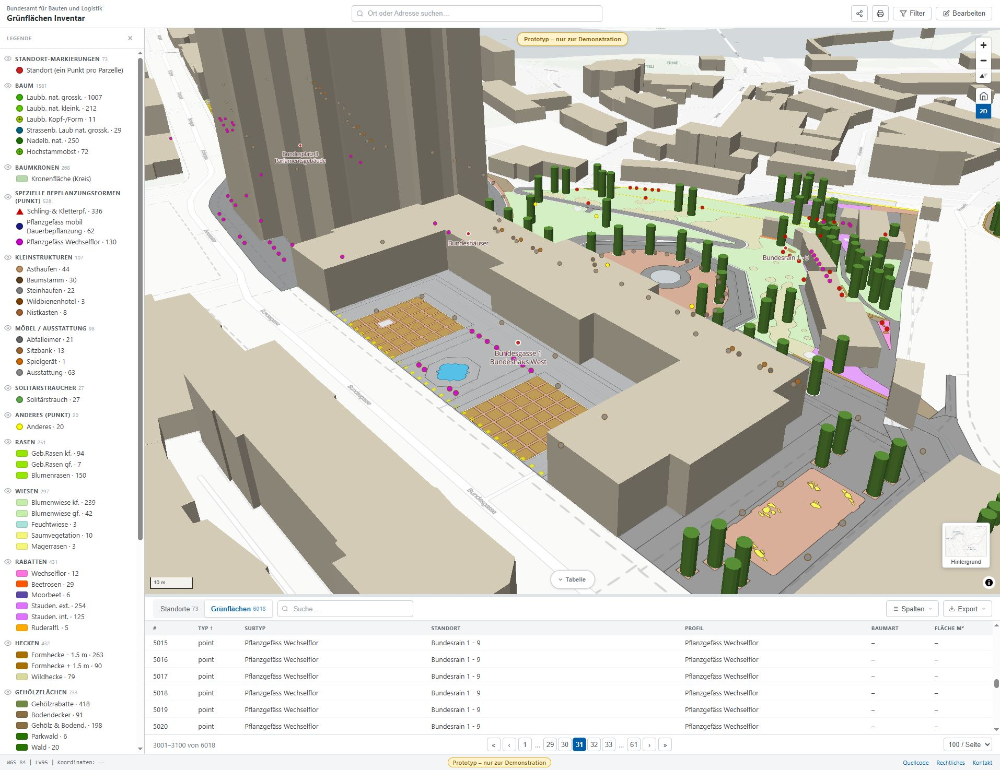
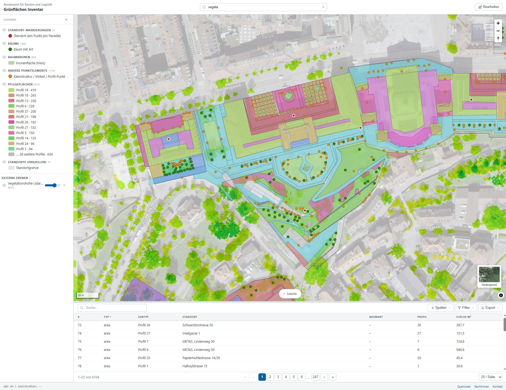

# Green Inventory — Main App (Green Areas)

> **Unofficial mockup.** Fictional data, not for production use. Part of the [`green-inventory`](../README.md) repo.

GDB-backed inventory of **73 sites (Standorte)** and **~6 000 green-area features** (areas, trees, canopies, small structures) on a MapLibre GL map, with care-profile classification, attribute filtering, a scoped table view, and identify against external swisstopo layers.

<p align="center">
  
  
</p>

## Live app

https://bbl-dres.github.io/green-inventory/prototype-main/

The repository root [`/`](https://bbl-dres.github.io/green-inventory/) redirects here.

## Features

### Map
- **MapLibre GL JS** map with four basemaps: CARTO Positron / Dark Matter / Voyager + **swisstopo Luftbild** (vector tiles).
- **2D / 3D toggle** — camera pitches to 60°; OSM building footprints extrude (via [OpenFreeMap](https://openfreemap.org) `render_height`, 8 m default); each tree renders as a 12-gon cylinder.
- **Home button** resets to the data bbox; full-screen zoom range to z22.
- **Identify on click** for external swisstopo layers via the federal MapServer API; results returned as GeoJSON in LV95 and re-projected client-side.

### Legend (left drawer)
- **BBL Standard Grünflächenunterhalt profile grouping** — Rasen / Wiesen / Rabatten / Hecken / Gehölzflächen / Spezielle Bepflanzungsformen / Beläge / Wasserflächen / Anderes, plus Baum / Spezielle Bepflanzungsformen (Punkt) / Kleinstrukturen.
- **PDF-faithful colours and pattern swatches** (Wechselflor purple dots, Magerrasen brown dots, Rasengittersteine cross-hatch, Bollensteine grey dots, etc.).
- Eye-toggle per group filters the map at the **profile-code** level (e.g. hide all `Hecken` codes 16/17/18 in one click).

### Filter sidebar (right drawer)
- Collapsible accordion groups: Standort / Profil / Baumart / Typ / Los / Pflegeklasse / Eigentümer / Pflege durch.
- Search-within-filters auto-expands matching groups; per-group active-count chip; "Alle zurücksetzen" link.

### Table panel
- **Standorte / Pflegeelemente tabs** — segmented control filters the table to sites only (73) or maintenance elements only (~6 000: polygons + points); per-tab column-visibility defaults.
- Search, sort, configurable columns, 100/200/500 rows-per-page pagination, CSV / GeoJSON / Excel export (all data or filtered set).
- Selecting a row pans the map and opens its popup; row hover highlights the feature on the map.

### Coordinates & header actions
- Footer shows live **WGS 84** + **LV95** (Swiss-grid) coordinates as the cursor moves; right-click copies both forms.
- **Filter** (active-count badge), **Share** (Web Share API + clipboard fallback), **Drucken** (`preserveDrawingBuffer` print pipeline), 2D/3D toggle.
- All view state — center, zoom, selection, active external layers, tab scope — round-trips through URL parameters (`?center=…&zoom=…&sel=…&ext=…&scope=…`).

## Data pipeline

The map data lives in [`data/data.geojson`](data/data.geojson) (~16 MB, 6 164 features). It's generated from a Bundesgärtnerei FileGDB by [`scripts/gdb_to_geojson.py`](scripts/gdb_to_geojson.py), which:

1. Reads three GDB layers via **pyogrio** + the bundled GDAL FileGDB driver.
2. Extracts **17 field-domain codelists** (idPPy polygon profiles, idPP point profiles, idBa species list, etc.) via `ctypes` against the GDAL OGR field-domain API.
3. Reprojects **LV03 → LV95** (CHENyx06 NTv2 grid, 0.2 m accuracy) **→ WGS 84** (1.0 m accuracy, the published ceiling for non-Reframe transforms).
4. Validates geometry (`make_valid`), simplifies high-vertex outliers at 5 cm in LV95, enforces RFC 7946 right-hand winding.
5. Embeds all codelists, accuracy info, attribution, and `bbox` into the output metadata.

The **data model** (conceptual model, output schema, Care-Profile catalogue, terminology) is documented in [`docs/DATAMODEL.md`](docs/DATAMODEL.md); the **source GDB schema, codelists and conversion pipeline** live in [`docs/SOURCE-GDB.md`](docs/SOURCE-GDB.md).

### Per-entity files (what the app loads)

The frontend no longer reads `data.geojson` directly. [`scripts/split_entities.mjs`](scripts/split_entities.mjs) splits it into one file per data-model entity in [`data/`](data/) — `sites.json`, `land_parcels.geojson`, `maintenance_polygons.geojson`, `maintenance_points.geojson`, `care_profiles.json` (Care Tasks nested), plus `codelists.json`. At load time [`js/data.js`](js/data.js) fetches these, joins them (element → parcel → site, element → Care Profile) and decodes the codelists into the in-memory FeatureCollection the map, table and report render from. `data.geojson` stays as the upstream source the split is regenerated from. Actor / Assignment, Cost rate and Image are intentionally not emitted (see [`docs/DATAMODEL.md`](docs/DATAMODEL.md) §4).

```bash
node scripts/split_entities.mjs   # data.geojson → data/*.json + *.geojson
```

## Tech stack

| Technology | Version | Usage |
|---|---|---|
| Vanilla JavaScript | ES6+ | Application logic |
| MapLibre GL JS | v4.7 | Map rendering (WebGL) |
| CSS3 | Modern | Design tokens + flex/grid layouts |
| GeoJSON | RFC 7946 | Geospatial data format |
| swisstopo MapServer | v3 | External-layer search + identify |
| OpenFreeMap | planet | 3D OSM building tiles |
| pyogrio + GDAL | 0.12 / 3.11 | FileGDB read + field-domain extraction (Python pipeline) |
| pyproj | 3.x | CRS reprojection (CHENyx06 grid) |
| shapely | 2.x | Geometry validation + simplification |

No build tools or frameworks for the frontend; pure static files.

## Running

Static files only — no build step. From the repo root:

```bash
python -m http.server 8000   # → http://localhost:8000/prototype-main/
npx http-server
```

Then open <http://localhost:8000/prototype-main/> (or the repo root, which redirects here).

To regenerate the data from a fresh GDB, run the two stages in order:

```bash
pip install pyogrio pyproj shapely pandas
python scripts/gdb_to_geojson.py    # GDB → data/data.geojson
node scripts/split_entities.mjs     # data.geojson → per-entity files the app loads
```

Edit the `GDB_PATH` constant at the top of the Python script if your GDB lives elsewhere.

## Layout

```
prototype-main/
├── index.html              # App entry point
├── js/
│   ├── config.js           # Legend groups, profile styles, table columns, basemaps
│   ├── data.js             # Load + join the per-entity files into one FeatureCollection
│   ├── map.js              # MapLibre init, layers, controls, popups, search
│   ├── table.js            # Table widget: tabs, scope, filtering, export
│   └── report.js           # Per-Standort Pflegebericht (PDF)
├── css/
│   ├── tokens.css          # Design tokens (colours, spacing, shadows, …)
│   └── styles.css          # Component styles
├── data/                   # ← what the app loads (per-entity, normalized)
│   ├── sites.json          # Site reference table
│   ├── land_parcels.geojson         # Parcel polygons
│   ├── maintenance_polygons.geojson # Areas + tree canopies
│   ├── maintenance_points.geojson   # Trees + point features
│   ├── care_profiles.json  # Care Profiles with nested Care Tasks
│   ├── codelists.json      # 17 field-domain codelists
│   └── data.geojson        # Upstream source the split is derived from (6 164 features)
├── scripts/
│   ├── gdb_to_geojson.py   # GDB → data.geojson conversion pipeline
│   └── split_entities.mjs  # data.geojson → per-entity files
├── docs/
│   ├── DATAMODEL.md        # Data model: conceptual model, output schema, Care Profiles, terminology
│   └── SOURCE-GDB.md       # Source GDB schema, codelists, conversion pipeline
└── assets/
    └── images/             # Preview screenshots (used by this README)
```

## License

[MIT](../LICENSE)
