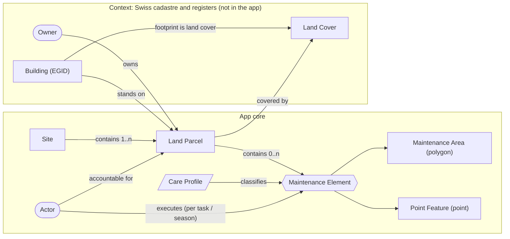
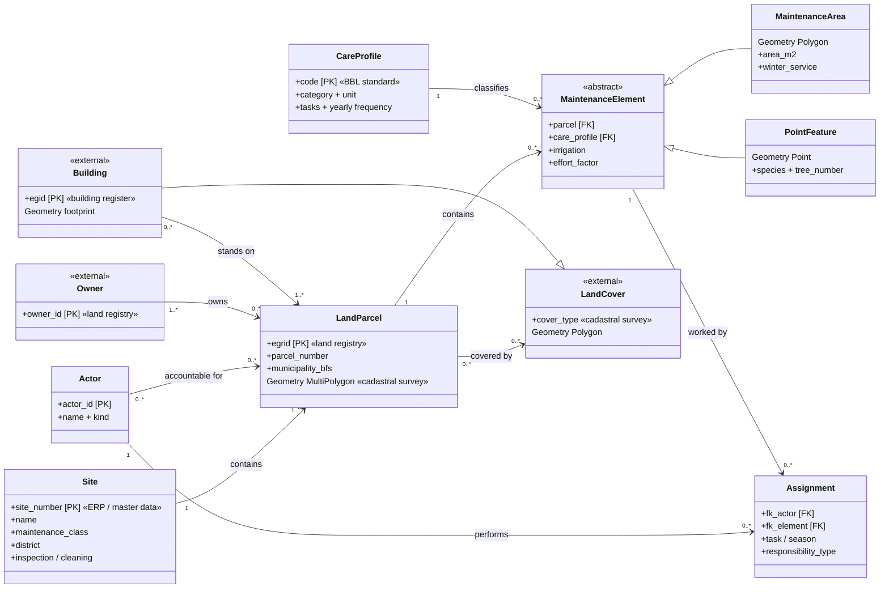

# Green Inventory — Data Model

## 1. Goal

This document defines the data model behind the Green Inventory app: the
entities, their attributes, and how they relate. It is the shared reference
for developers, BG staff and downstream consumers.

- Section 2 is the conceptual model: one diagram and one table, enough to
  grasp the whole picture in a minute.
- Section 3 documents each entity in detail (attributes).
- Section 4 lists the gaps between this reference model and today's data.
- Section 5 is reference material: detailed UML, code lists, standards,
  terminology, links.

The data model is written in English. German source terms are not used here;
the English-to-German mapping is in the terminology reference (Section 5.5),
and the physical German field names are in the source document
([`SOURCE-GDB.md`](SOURCE-GDB.md)). French and Italian translations are planned
but not yet provided.

The model is solution-neutral. "Master system" names who owns the data, not a
product: the operational ERP / master-data system is the organisation's choice
(the Swiss federal government happens to use SAP). The cadastral masters, by
contrast, are fixed national authorities: the land registry for EGRID and
ownership, the building register for EGID, and the official cadastral survey
for geometry.

---

## 2. Conceptual data model

The app maintains the green spaces of Swiss federal real estate, run by the
federal nursery service (BG) within the Federal Office for Buildings and
Logistics (BBL). The model is a three-level core (Site to Land Parcel to
Maintenance Element) plus reference data (Care Profile, Actor) and contextual
entities from the Swiss cadastre and registers that the app does not store but
the data depends on.

Diagram shapes:

- Rectangle: an entity.
- Hexagon: an abstract entity that has subtypes (Maintenance Element).
- Parallelogram: reference data, a controlled vocabulary (Care Profile).
- Rounded box: a party or actor (Actor, Owner).

The two boxed groups separate the app's core entities from contextual entities
held in external Swiss registers.

| Entity | Scope | Master system | What it is |
|---|---|---|---|
| Site | core | ERP / master data | An operational collection of land the BG manages as one unit. Not a legal boundary, but the set of its Land Parcels. |
| Land Parcel | core | land registry; geometry from cadastral survey | A legal parcel, keyed by EGRID. Carries ownership and cadastral identity. |
| Maintenance Element | core | BG survey | A cared-for feature inside a parcel. Abstract: every element is either an Area or a Point. |
| Maintenance Area | core | BG survey | Subtype of Maintenance Element. Polygon feature: lawn, bed, hedge, path, surface. |
| Point Feature | core | BG survey | Subtype of Maintenance Element. Point feature: tree, planter, bench, structure. |
| Care Profile | core (reference) | BBL standard | What an element is, plus its yearly maintenance schedule. |
| Actor | core (reference) | ERP / directory | A party that performs maintenance. Several actors may work the same element (for example winter versus summer), so the key relation is Actor to Maintenance Element. |
| Owner | context | land registry | Legal owner of a Land Parcel. |
| Land Cover | context | cadastral survey | Official surface classification: building, paved, vegetation, water, forest, rock, and so on. |
| Building | context | building register + cadastral survey | A building keyed by EGID; its footprint is a Land-Cover polygon. |

Delivered as `data.geojson`. The app's data arrives as one GeoJSON file with
six `entity_type` values. The conceptual entities map to them as follows (the
source fuses Site and Land Parcel, and adds a render-only centroid):

| Conceptual entity | `entity_type` in `data.geojson` |
|---|---|
| Site and Land Parcel (fused) | `site`, plus `site_location` (a centroid render aid) |
| Maintenance Area | `area`, `tree_canopy` (circular polygons) |
| Point Feature | `tree` (species set), `point` (everything else) |
| Care Profile | referenced by `fk_profil` (not its own feature) |
| Actor, Owner | coded attributes only (see Section 3) |
| Land Cover, Building | not present |

---

## 3. Entities

Each entity has an attribute table. Columns: the attribute id; Key (PK =
primary key, FK = foreign key); Type (basic format); Enum (code list
constraining the value, see Section 5.2); and a short description. The German
source field names and the delivered `data.geojson` properties are documented
in [`SOURCE-GDB.md`](SOURCE-GDB.md) Section 2.

### 3.1 Site

An operational collection of parcels, managed as one unit; mastered in the
organisation's ERP / master-data system. Today the source fuses Site into the
parcel feature.

| Attribute | Key | Type | Enum | Description |
|---|---|---|---|---|
| site_number | PK | string | — | Key in the ERP / master-data system; often alphanumeric (e.g. 2001) |
| name | | string | — | Site name |
| maintenance_class | | integer | idPk | Intensity tier, PK 1 to 3 |
| district | | string | — | Operational region: DLZ 1 to 5; nationwide catch-all; legacy |
| inspection | | integer | idJn | Inspection flag (yes / no) |
| cleaning | | integer | idJn | Cleaning flag (yes / no) |
| created_year | | integer | — | Year of construction |
| surveyed_at | | date | — | Survey date |
| remarks | | string | — | Free text |

### 3.2 Land Parcel

A legal parcel; identity EGRID, mastered in the land registry, geometry from
the official cadastral survey. Not modelled separately yet, since it is fused
into the parcel feature.

| Attribute | Key | Type | Enum | Description |
|---|---|---|---|---|
| egrid | PK | string | — | Federal parcel id; absent today |
| parcel_number | | string | — | Cadastral number(s); comma-separated when a Site spans several parcels |
| address | | string | — | Street address (stored on the fused parcel feature) |
| municipality_bfs | | integer | — | Municipality number; not delivered |
| owner | FK | integer | idEg | Legal owner; coarse code today (links to Owner, Section 3.6) |
| responsibility | FK | integer | idPv | Accountable party (links to Actor): internal / external / both |
| boundary | | geometry | — | Parcel polygon (MultiPolygon) |

### 3.3 Maintenance Element

A cared-for feature inside a parcel. Abstract: every element is either a
Maintenance Area (polygon) or a Point Feature (point). The two use different
Care-Profile code lists (`idPPy` versus `idPP`); never merge them.

Shared attributes:

| Attribute | Key | Type | Enum | Description |
|---|---|---|---|---|
| parcel | FK | integer | — | Link to the parcel (today the fused Site) |
| care_profile | FK | integer | idPP / idPPy | Link to Care Profile; code list chosen by geometry |
| execution | FK | integer | idPd | Performing party (links to Actor) |
| irrigation | | integer | idBw | Irrigation regime |
| effort_factor | | double | — | Care-effort multiplier, 0.5 to 5.0 |
| leaf_clearing | | integer | — | Leaf-clearing scope flag |
| max_height | | double | — | Max plant or tree height, where measured |
| quantity | | number | — | Recorded quantity |
| remarks | | string | — | Free text |

Maintenance Area (subtype) adds:

| Attribute | Key | Type | Enum | Description |
|---|---|---|---|---|
| area_m2 | | double | — | Area in square metres (LV95-projected) |
| perimeter | | double | — | Perimeter in metres |
| winter_service | | integer | Winterdienst | Winter-service treatment |
| crown_size | | double | — | Crown radius and diameter (circular polygons only) |

Point Feature (subtype) adds:

| Attribute | Key | Type | Enum | Description |
|---|---|---|---|---|
| species_text | | string | — | Free-text species; its presence classifies the row as a tree |
| species_code | FK | integer | idBa | Species code |
| tree_number | | integer | — | Per-site tree number |
| position | | double | — | Swiss-grid coordinates (centimetre precision) |

### 3.4 Care Profile

The controlled vocabulary of what a feature is and how it is maintained, from
the BBL green-space maintenance standard (2020). About 30 profiles in 9
categories; each defines a description, a unit of capture, and the maintenance
tasks with their yearly frequency.

| Attribute | Key | Type | Enum | Description |
|---|---|---|---|---|
| code | PK | integer | idPP / idPPy | Profile id within its code list |
| label | | string | — | Profile name |
| category | | string | — | BBL grouping (lawn, meadow, bed, and so on) |
| unit | | string | — | Unit of capture: square metres (areas) or count (points) |
| description | | string | — | What the profile is (from the standard) |
| tasks | | list | — | Maintenance tasks, each with a yearly frequency (below 1 means a multi-year cycle) |
| leaf_clearing | | boolean | — | Per-profile in / out flag |

It is not yet a dataset (Section 4): the schedule lives in `js/config.js`
(`CARE_CATALOG_*`). Object-level work (cleaning and leaf clearing) applies per
Site, not per profile. Raw code lists: [`SOURCE-GDB.md`](SOURCE-GDB.md)
Section 3.

### 3.5 Actor

A party that performs or is accountable for maintenance: the BG, an external
contractor, the city, a depot crew. The important relation is Actor to
Maintenance Element, and it is many-to-many: a parcel, or a single element, may
involve several actors, often split by task or season (for example one party
for winter service and another for summer care). Parcel-level accountability
is a separate, coarser link.

An assignment connects one Actor to one Maintenance Element, scoped by task or
season (see the detailed model, Section 5.1).

| Attribute | Key | Type | Enum | Description |
|---|---|---|---|---|
| actor_id | PK | string | — | The party |
| name | | string | — | Organisation, crew or person |
| kind | | string | — | Organisation, crew or individual |

Today the source has no Actor entity and no assignment: just two coded
attributes, responsibility on the parcel (idPv) and execution on the element
(idPd), a flat simplification of the relationship above.

### 3.6 Contextual entities

Swiss cadastre and registers; not stored by the app, but the data
conceptually depends on them.

| Entity | Key | Master | Geometry | Notes |
|---|---|---|---|---|
| Owner | party id | land registry | — | Ownership is recorded per parcel; a parcel may have several owners (co-ownership). The app keeps only a coarse code. |
| Land Cover | — | cadastral survey | Polygon | Official surface classes: building, paved, vegetation, water, forest, rock. Tiles every parcel. |
| Building | EGID | building register + cadastral survey | footprint | Footprint is a Land-Cover polygon of type building. Relevant for green roofs and facades. |

---

## 4. Gaps & open points

- Model is two-level, not three. The source fuses Site and Land Parcel into
  one layer, carries no EGRID, and reduces the parcel(s) to a free-text
  `parzelle` (sometimes comma-separated). Closing it needs an EGRID-keyed Land
  Parcel (from the land registry and cadastral survey) and an ERP-keyed Site
  above it. Example: site 2001 (the collection "Bundeshäuser") versus 2001BG,
  2001BH, 2001BW, 2001BN, 2001IG (its five parcels), all stored identically.
- Ownership is coarse. `eigentuemer` is a federal / third-party code on the
  fused feature; it should be an Owner linked at parcel level (land registry).
- No Care-Profile dataset. `fk_profil` resolves only to a code and label; the
  maintenance schedule lives in frontend code. A proposed
  `data/pflegeprofile.json`, keyed by code list and code, would hold name,
  category, unit, description, tasks and the leaf-clearing flag, sourced from
  the standard; `fk_profil` then becomes a foreign key into it.
- Code lists are wider than the standard. The source has 44 `idPPy` and 22
  `idPP` codes, but the standard defines about 30 profiles; the extras have no
  chapter (the report flags them). Categorisation also drifts (for example
  wild hedge sits under hedges in the app but under woody areas in the
  standard). A code-by-code crosswalk is the prerequisite for the dataset
  above.
- No per-task actor assignment. Execution is a single coded value per element
  (idPd); the model expects a many-to-many Actor-to-element assignment scoped
  by task or season, so one element can have several actors (for example
  winter versus summer).
- Maintenance class is effectively Site-level; it is barely set on elements.
- `tree_canopy` is a misnomer; most are decorative circles, not crowns.

Source and conversion limitations (WGS84 accuracy, empty or sentinel code
lists) are in [`SOURCE-GDB.md`](SOURCE-GDB.md) Section 7.

---

## 5. References

### 5.1 Detailed model (UML)

Full class diagram with attributes, specialisation and cardinalities (the
Section 2 flowchart is the readable summary of this):

### 5.2 Code lists

Controlled vocabularies that back the coded attributes. Full code-and-label
tables are embedded in `data.geojson` (`metadata.codelists`) and documented in
[`SOURCE-GDB.md`](SOURCE-GDB.md) Section 3.

| Attribute | Code list | Entries |
|---|---|---|
| Care Profile (areas) | `idPPy` | 44 |
| Care Profile (points) | `idPP` | 22 |
| Species | `idBa` | 430 |
| Execution | `idPd` | 9 |
| Maintenance class | `idPk` | 4 (PK 0 to 3) |
| Responsibility | `idPv` | 4 |
| Irrigation | `idBw` | 3 |
| Owner | `idEg` | 3 (federal / third party / unrecorded) |
| Inspection, Cleaning | `idJn` | 3 |
| Winter service | `Winterdienst` | 2 |

### 5.3 Standards

- BBL green-space maintenance standard (Standard Grünflächenunterhalt, 2020),
  by EFD / BBL / Bundesgärtnerei. The Care-Profile authority; profiles are
  based on the VSSG catalogue (Association of Swiss Municipal Parks
  Departments), adapted by nateco, with 2020 biodiversity revisions.
- Official cadastral survey (Amtliche Vermessung, AV): source of Land Parcel
  boundaries and Land Cover.
- Land registry (Grundbuch): EGRID and ownership. Building and dwelling
  register (GWR): EGID.
- RFC 7946: GeoJSON (output format).
- Coordinate systems: LV95 (`EPSG:2056`), LV03 (`EPSG:21781`),
  WGS84 (`EPSG:4326`).

### 5.4 Output file structure

Single file [`data/data.geojson`](../data/data.geojson): an RFC 7946
`FeatureCollection` (WGS84, right-hand winding, no `crs` member). Key
`metadata` members: `attribution`, `extracted_at`, `src_crs` / `out_crs`,
`transform_accuracy_m`, `codelists`, `counts`, `fk_profil_values`. Every
feature carries `entity_type`, `feature_type`, `subtype`, `source`, `area_m2`,
the `site_*` context block, and Swiss-grid `lv95_*` coordinates.

### 5.5 Terminology (EN to DE)

Entity, attribute and concept names map to their German source terms as
follows. This is the only place the model records German.

| EN | DE |
|---|---|
| Site | Standort |
| Land Parcel | Grundstück |
| Maintenance Element | Pflegeelement |
| Maintenance Area | Pflegefläche |
| Point Feature | Punktelement |
| Care Profile | Pflegeprofil |
| Actor | Akteur |
| Owner | Eigentümer |
| Land Cover | Bodenbedeckung |
| Building | Gebäude |
| Maintenance class | Pflegeklasse |
| Responsibility | Pflegeverantwortung |
| Execution | Pflegedurchführung |
| Irrigation | Bewässerung |
| Winter service | Winterdienst |
| Effort factor | Aufwandsfaktor |
| Land registry | Grundbuch |
| Cadastral survey | Amtliche Vermessung |
| Building register | Gebäude- und Wohnungsregister (GWR) |
| Federal nursery service | Bundesgärtnerei (BG) |
| Depot / yard | Werkhof |
| Street tree | Strassenbaum |
| Surface (hardscape) | Belag |
| Lawn | Rasen |
| Meadow | Wiese |
| Hedge | Hecke |

Abbreviations: EGRID (federal parcel id); EGID (federal building id, from the
GWR); AV (cadastral survey); BBL (Federal Office for Buildings and Logistics);
DLZ (regional service centre); PK (maintenance class).

### 5.6 Links & literature

- Swiss geodata portal: <https://geo.admin.ch> (cadastral survey, imagery,
  cadastre).
- GeoJSON, RFC 7946: <https://www.rfc-editor.org/rfc/rfc7946>.
- Source GDB and conversion pipeline: [`SOURCE-GDB.md`](SOURCE-GDB.md).
- VSSG (Association of Swiss Municipal Parks Departments): basis of the
  profile catalogue.
- BBL green-space maintenance standard (2020): internal PDF.
