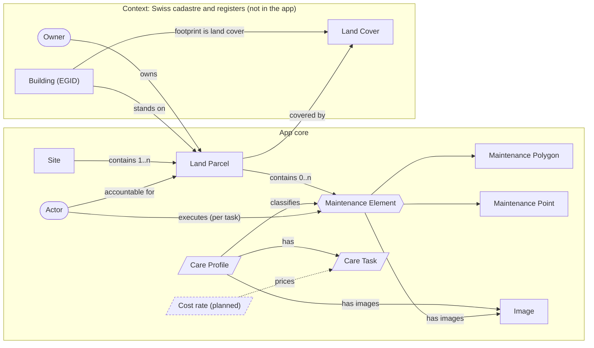
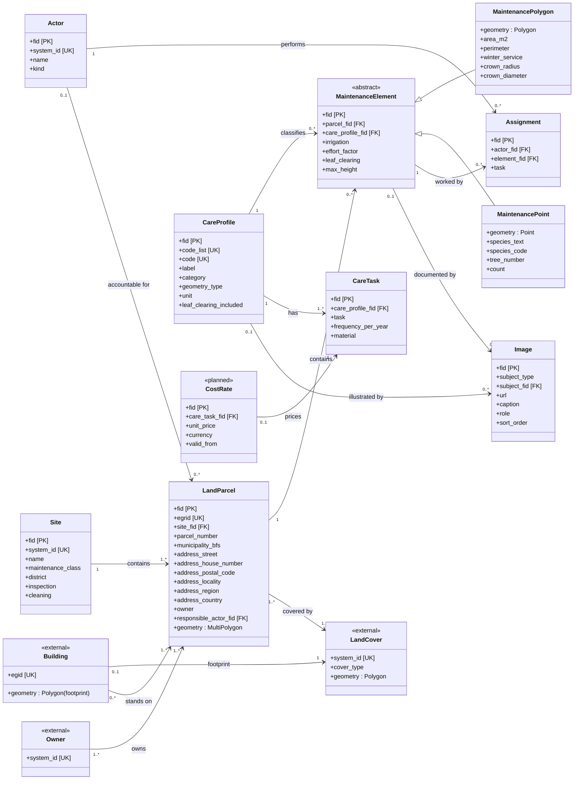

# Green Inventory — Data Model

## 1. Goal

This document defines the data model behind the Green Inventory app: the
entities, their attributes, and how they relate. It is the shared reference
for developers, BG staff and downstream consumers. The main use-case is data
export for tenders (bills of quantities for green-space maintenance).

- Section 2 is the conceptual model: one diagram and one table, enough to
  grasp the whole picture in a minute.
- Section 3 documents each entity in detail (attributes).
- Section 4 lists the gaps between this reference model and today's data.
- Section 5 is the enumerations (controlled vocabularies).
- Section 6 is reference material: detailed UML, standards, terminology, links.

### 1.1 Principles

- Tidy data: one fact per field, atomic values, no concatenation. Composite
  real-world values are split into components (for example an address into
  street, house number, postal code and locality); repeating values become
  rows, not comma-separated lists.
- Identity: every entity has a `fid` (feature id) — the surrogate primary key
  the app maintains and the target of all foreign keys. It must be stable
  across data refreshes. A `system_id` is a separate unique key holding the
  identifier from the authoritative master system (for example SAP for a Site);
  the national keys EGRID and EGID play the same role for parcels and buildings.
  A `system_id` lets us join to that master system, but it is never used as the
  app's own join key.
- Solution-neutral: a master system names who owns the data, not a product.
  The operational ERP / master-data system is the organisation's choice (the
  Swiss federal government happens to use SAP). The cadastral masters are fixed
  national authorities: the land registry for EGRID and ownership, the building
  register for EGID, and the official cadastral survey for geometry.
- English-first model: entity names carry their German equivalent (EN / DE);
  attributes stay English, since most are self-explanatory. The full glossary
  is the terminology reference (Section 6.4), and the physical German field
  names are in the source document ([`SOURCE-GDB.md`](SOURCE-GDB.md)). French
  and Italian are planned.
- Conform to authorities: cadastral facts (parcel, ownership, land cover,
  building) follow the Swiss registers; the app does not redefine them.

---

## 2. Conceptual data model

The app maintains the green spaces of Swiss federal real estate, run by the
federal nursery service (BG) within the Federal Office for Buildings and
Logistics (BBL). The model is a three-level core (Site to Land Parcel to
Maintenance Element) plus reference data (Care Profile, Care Task, Actor, and
the planned Cost rate) and contextual entities from the Swiss cadastre and
registers that the app does not store but the data depends on.

Diagram shapes:

- Rectangle: an entity.
- Hexagon: an abstract entity that has subtypes (Maintenance Element).
- Parallelogram: reference data, a controlled vocabulary (Care Profile, Care
  Task, Cost rate).
- Rounded box: a party or actor (Actor, Owner).
- Dashed: planned, not yet implemented (Cost rate).

The two boxed groups separate the app's core entities from contextual entities
held in external Swiss registers.

| Entity (EN) | Entity (DE) | Scope | Master system | What it is |
|---|---|---|---|---|
| Site | Standort | core | ERP / master data | An operational collection of land the BG manages as one unit. Not a legal boundary, but the set of its Land Parcels. |
| Land Parcel | Grundstück | core | land registry; geometry from cadastral survey | A legal parcel, keyed by EGRID. Carries ownership and accountability. |
| Maintenance Element | Pflegeelement | core | BG survey | A cared-for feature inside a parcel. Abstract: every element is either an Area or a Point. |
| Maintenance Polygon | Pflegepolygon | core | BG survey | Subtype of Maintenance Element. Polygon feature: lawn, bed, hedge, path, surface. |
| Maintenance Point | Pflegepunkt | core | BG survey | Subtype of Maintenance Element. Point feature: tree, planter, bench, structure. |
| Care Profile | Pflegeprofil | core (reference) | BBL standard | What an element is; groups the maintenance tasks that apply to it. |
| Care Task | Pflegemassnahme | core (reference) | BBL standard | A single maintenance task of a Care Profile, with its yearly frequency and material. |
| Actor | Akteur | reference (planned) | ERP / directory | A party that performs maintenance. Several actors may work the same element (for example winter versus summer), so the key relation is Actor to Maintenance Element. Not part of this MVP — no actor data is held. |
| Assignment | Pflegeauftrag | relationship (planned) | BG / ERP | Links one Actor to one Maintenance Element for a task (shown as the "executes" edge). Not part of this MVP — no assignment data is held. |
| Cost rate | Einheitspreis | core (reference, planned) | price catalogue | Planned. Unit price for a Care Task; with element measures it yields tender costs. |
| Image | Bild | core | app / media store | A picture (URL) attached to a Care Profile (standard illustration) or a Maintenance Element / Site (field photo); several allowed. |
| Owner | Eigentümer | context | land registry | Legal owner of a Land Parcel. |
| Land Cover | Bodenbedeckung | context | cadastral survey | Official surface classification: building, paved, vegetation, water, forest, rock, and so on. |
| Building | Gebäude | context | building register + cadastral survey | A building keyed by EGID; its footprint is a Land-Cover polygon. A parcel may carry several buildings. |

Delivered as `data.geojson`. The app's data arrives as one GeoJSON file with
six `entity_type` values. The conceptual entities map to them as follows (the
source fuses Site and Land Parcel, and adds a render-only centroid):

| Conceptual entity | `entity_type` in `data.geojson` |
|---|---|
| Site and Land Parcel (fused) | `site`, plus `site_location` (a centroid render aid) |
| Maintenance Polygon | `area`, `tree_canopy` (circular polygons) |
| Maintenance Point | `tree` (species set), `point` (everything else) |
| Care Profile, Care Task | referenced by `fk_profil`; tasks live in `js/config.js` |
| Actor, Assignment | coded attributes only: responsibility on the parcel, execution on the element |
| Owner | coarse coded attribute |
| Cost rate, Image, Land Cover, Building | not present |

---

## 3. Entities

Each entity has an attribute table. Columns: the attribute id; Key (PK =
primary key `fid`, UK = unique key, FK = foreign key); Type (basic format);
Enum (enumeration constraining the value, see Section 5); and a short
description. Foreign keys reference the parent's `fid`. Where an attribute is a
foreign key in the target model but only a coarse code today, the Enum column
names today's code list. The German source field names and the delivered
`data.geojson` properties are in [`SOURCE-GDB.md`](SOURCE-GDB.md) Section 2.

### 3.1 Site (Standort)

An operational collection of parcels, managed as one unit; mastered in the
organisation's ERP / master-data system. Today the source fuses Site into the
parcel feature.

| Attribute | Key | Type | Enum | Description |
|---|---|---|---|---|
| fid | PK | integer | — | Feature id maintained by the app |
| system_id | UK | string | — | Key in the master system (ERP / SAP); the object number, often alphanumeric (e.g. 2001) |
| name | | string | — | Site name |
| maintenance_class | | integer | idPk | Intensity tier, PK 1 to 3 |
| district | | string | — | Operational region: DLZ 1 to 5; nationwide catch-all; legacy |
| inspection | | integer | idJn | Inspection flag (yes / no) |
| cleaning | | integer | idJn | Cleaning flag (yes / no) |
| created_year | | integer | — | Year of construction |
| surveyed_at | | date | — | Survey date |
| remarks | | string | — | Free text |

A Site has no address of its own; it is labelled by its primary Land Parcel
(Section 3.2).

### 3.2 Land Parcel (Grundstück)

A legal parcel; geometry from the official cadastral survey, identity and
ownership from the land registry. Not modelled separately yet, since it is
fused into the parcel feature. Its address is split into components (tidy
data); the authoritative address is the Building's (GWR).

| Attribute | Key | Type | Enum | Description |
|---|---|---|---|---|
| fid | PK | integer | — | Feature id maintained by the app |
| egrid | UK | string | — | EGRID, the parcel's key in the land registry (master); absent today |
| site_fid | FK | integer | — | Parent Site (Site.fid) |
| parcel_number | | string | — | One cadastral number per parcel (the source concatenates several when fused) |
| municipality_bfs | | integer | — | Municipality (BFS) number; not delivered |
| address_street | | string | — | Street |
| address_house_number | | string | — | House number (may be alphanumeric) |
| address_postal_code | | string | — | Postal code |
| address_locality | | string | — | Town or city |
| address_region | | string | — | Region or canton (state / province abroad) |
| address_country | | string | — | Country (ISO 3166-1); the portfolio is worldwide |
| owner | | integer | idEg | Coarse owner category today; conceptual ownership is the n:m relation to Owner (co-ownership), Section 3.8 |
| responsible_actor_fid | FK | integer | idPv | Accountable party (Actor.fid); a coarse code today |
| geometry | | geometry | — | Parcel polygon (MultiPolygon) |

### 3.3 Maintenance Element (Pflegeelement)

A cared-for feature inside a parcel. Abstract: every element is either a
Maintenance Polygon or a Maintenance Point. The two use different
Care-Profile code lists (`idPPy` versus `idPP`); a subtype's `care_profile_fid`
must point to a Care Profile in the matching code list.

Shared attributes:

| Attribute | Key | Type | Enum | Description |
|---|---|---|---|---|
| fid | PK | integer | — | Feature id maintained by the app |
| parcel_fid | FK | integer | — | Parent Land Parcel (LandParcel.fid); today the fused Site |
| care_profile_fid | FK | integer | — | Care Profile (CareProfile.fid) |
| irrigation | | integer | idBw | Irrigation regime |
| effort_factor | | double | — | Care-effort multiplier, 0.5 to 5.0 (weights tender cost) |
| leaf_clearing | | integer | — | Leaf-clearing scope flag (Lauben): 0, 1 or 2 |
| max_height | | double | — | Max plant or tree height, where measured |
| remarks | | string | — | Free text |

Maintenance Polygon (Pflegepolygon) adds:

| Attribute | Key | Type | Enum | Description |
|---|---|---|---|---|
| geometry | | geometry | — | Polygon |
| area_m2 | | double | — | Area in square metres (LV95-projected); the tender measure for area profiles |
| perimeter | | double | — | Perimeter in metres |
| winter_service | | integer | Winterdienst | Winter-service treatment |
| crown_radius | | double | — | Crown radius (circular polygons only) |
| crown_diameter | | double | — | Crown diameter (circular polygons only) |

Maintenance Point (Pflegepunkt) adds:

| Attribute | Key | Type | Enum | Description |
|---|---|---|---|---|
| geometry | | geometry | — | Point (Swiss-grid, centimetre precision) |
| species_text | | string | — | Free-text species; its presence classifies the row as a tree |
| species_code | | integer | idBa | Species code |
| tree_number | | integer | — | Per-parcel tree number |
| count | | integer | — | Number of items; the tender measure for point profiles (usually 1) |

### 3.4 Care Profile and Care Task (Pflegeprofil, Pflegemassnahme)

A Care Profile is what a feature is and how it is maintained, from the BBL
green-space maintenance standard (2020): 33 profiles in 10 categories (the
authoritative list is in Section 5.1). Its business key is `(code_list, code)`,
because a bare code is unique only within its code list.

| Attribute | Key | Type | Enum | Description |
|---|---|---|---|---|
| fid | PK | integer | — | Feature id maintained by the app |
| code_list | UK | string | — | Domain: idPP (points) or idPPy (areas); part of the business key |
| code | UK | integer | — | Profile code within its code list; part of the business key |
| label | | string | — | Profile name |
| category | | string | — | BBL grouping (lawn, meadow, bed, and so on) |
| geometry_type | | string | — | Capture geometry of the elements it classifies: polygon (idPPy) or point (idPP) |
| unit | | string | — | Unit of capture: square metres (areas) or count (points) |
| description | | string | — | What the profile is (from the standard) |
| leaf_clearing_included | | boolean | — | Whether the profile includes leaf clearing (Lauben) |
| style | | object | — | Presentation only — rendering style `{ fill, swatchClass? }`; see note below |

`geometry_type` mirrors the Maintenance Element subtype split and matches
`code_list` (idPPy → polygon, idPP → point). `style` is a **presentation
attribute**, not part of the conceptual model: `fill` is the feature colour and
`swatchClass` names an optional CSS pattern class (in `css/styles.css`). It is
carried in `care_profiles.json`, which the app reads as the single source for
every feature colour (map fill, point/tree symbols, legend, popup, PDF). The
values are seeded from the frontend's curated catalogue (`js/config.js`,
`AREA_PROFILE_STYLE` / `POINT_PROFILE_STYLE`).

A Care Task is one maintenance activity of a profile (its Haupttätigkeit), with
the yearly frequency that defines the standard.

| Attribute | Key | Type | Enum | Description |
|---|---|---|---|---|
| fid | PK | integer | — | Feature id maintained by the app |
| care_profile_fid | FK | integer | — | Parent Care Profile (CareProfile.fid) |
| task | | string | — | The activity (for example mowing, pruning, leaf clearing) |
| frequency_per_year | | double | — | Passes per year (below 1 means a multi-year cycle) |
| material | | string | — | Equipment or material used |

Care Profiles and Tasks are delivered as `data/care_profiles.json` — one record
per profile (business key `(code_list, code)`) with its Care Tasks nested, so a
task's `care_profile_fid` is implicit in the nesting. The maintenance schedule
itself is still authored in `js/config.js` (`CARE_CATALOG_*`) and seeded into
that file. Each profile would also carry one or more illustrative images from
the standard (modelled as Image, Section 3.7), not yet delivered.

### 3.5 Actor and Assignment (Akteur, Pflegeauftrag)

An Actor is a party that performs or is accountable for maintenance: the BG, an
external contractor, the city, a depot crew. The important relation is Actor to
Maintenance Element, and it is many-to-many: a single element may involve
several actors, often split by task (for example one party for winter
service and another for summer care). That relation is the Assignment.
Parcel-level accountability is a separate, simpler link (one responsible Actor
per parcel, see Section 3.2).

Actor:

| Attribute | Key | Type | Enum | Description |
|---|---|---|---|---|
| fid | PK | integer | — | Feature id maintained by the app |
| system_id | UK | string | — | Key in the ERP / directory (master), where available |
| name | | string | — | Organisation, crew or person |
| kind | | string | — | organisation / crew / individual |

Assignment (one Actor working one element, scoped by task):

| Attribute | Key | Type | Enum | Description |
|---|---|---|---|---|
| fid | PK | integer | — | Feature id maintained by the app |
| actor_fid | FK | integer | — | The actor (Actor.fid) |
| element_fid | FK | integer | — | The maintenance element (MaintenanceElement.fid) |
| task | | string | — | Specific task scope, where applicable |

Grain: one row per actor, element and scope. Today the source has neither
Actor nor Assignment: just two coded attributes, responsibility on the parcel
(idPv) and execution on the element (idPd), a flat simplification of the above.

### 3.6 Cost rate (Einheitspreis, planned)

Planned, not yet implemented. The main use-case is data export for tenders: a
bill of quantities lists, per Maintenance Element, the maintenance tasks to be
priced. A Cost rate is the unit price for a Care Task. The tender position cost
is derived: the element's measure (area or count) times the task
`frequency_per_year` times `effort_factor` times `unit_price`.

| Attribute | Key | Type | Enum | Description |
|---|---|---|---|---|
| fid | PK | integer | — | Feature id maintained by the app |
| care_task_fid | FK | integer | — | The priced Care Task (CareTask.fid) |
| unit_price | | double | — | Price per unit (m² or count) for one pass |
| currency | | string | — | Currency (for example CHF) |
| valid_from | | date | — | Start of the price's validity |
| source | | string | — | Price catalogue or tender reference |

### 3.7 Image (Bild)

A picture attached to an entity, stored as a URL (not a blob); an entity may
have several. Care Profiles carry illustrations from the standard that show
what a profile is; Maintenance Elements and Sites carry field photos. The link
is polymorphic: `subject_type` plus `subject_fid` name the entity the image
belongs to.

| Attribute | Key | Type | Enum | Description |
|---|---|---|---|---|
| fid | PK | integer | — | Feature id maintained by the app |
| subject_type | | string | — | Entity the image belongs to: care_profile, maintenance_element, site, ... |
| subject_fid | FK | integer | — | The subject's fid (polymorphic, paired with subject_type) |
| url | | string | — | Image location (URL) |
| caption | | string | — | Caption or alt text |
| role | | string | — | photo (field) or illustration (from the standard) |
| sort_order | | integer | — | Display order when several images apply |

### 3.8 Contextual entities

Swiss cadastre and registers; not stored by the app, but the data
conceptually depends on them. They are keyed by their master identifier; the
app assigns no `fid` to them.

| Entity | Key | Master | Geometry | Notes |
|---|---|---|---|---|
| Owner (Eigentümer) | system_id | land registry | — | Ownership is recorded per parcel; a parcel may have several owners (co-ownership). The app keeps only a coarse code. |
| Land Cover (Bodenbedeckung) | system_id | cadastral survey | Polygon | `cover_type` from the AV land-cover catalogue: building, paved, vegetation, water, forest, rock. Tiles every parcel. |
| Building (Gebäude) | egid | building register + cadastral survey | Polygon (footprint) | Footprint is a Land-Cover polygon of type building. Relevant for green roofs and facades. |

---

## 4. Gaps & open points

The deltas between the reference model (Sections 1-3) and today's data, roughly
by impact. Source- and conversion-level limitations (WGS84 accuracy, empty or
sentinel code lists) are in [`SOURCE-GDB.md`](SOURCE-GDB.md) Section 7.

### 4.1 Gaps to close

- Model is two-level, not three. The source fuses Site and Land Parcel into
  one layer, carries no EGRID, and reduces the parcel(s) to a free-text
  `parzelle` (sometimes comma-separated). Closing it needs an EGRID-keyed Land
  Parcel (from the land registry and cadastral survey) and an ERP-keyed Site
  above it. Example: site 2001 (the collection "Bundeshäuser") versus 2001BG,
  2001BH, 2001BW, 2001BN, 2001IG (its five parcels), all stored identically.
- `fid` is positional today. The conversion assigns `id = array index`
  ([`SOURCE-GDB.md`](SOURCE-GDB.md) Section 4), which changes on every run. A
  stable `fid` (or a stable mapping from the source) is required before foreign
  keys are dependable.
- Address is delivered concatenated. The source carries one `adresse` string;
  the model splits it into components on the Land Parcel (tidy data). The
  authoritative address is the Building's (GWR).
- Portfolio is worldwide. The Swiss cadastral keys (EGRID, EGID) and registers
  (land registry, cadastral survey, GWR) apply only to domestic sites; sites
  abroad (for example embassies) have no EGRID/EGID and use the local
  equivalent or none. `address_country` distinguishes them.
- Ownership is coarse and not n:m. `eigentuemer` (idEg) is a category code on
  the fused feature; the model treats ownership as the n:m relation to Owner
  (co-ownership) at parcel level. Accountability (`pflegeverantwortung`, idPv)
  is likewise a coarse code, linked to an Actor.
- No Actor entity or per-task assignment. Execution is a single coded value per
  element (idPd); the model expects a many-to-many Assignment scoped by task, so one element can have several actors.
- Care-Profile / Care-Task dataset now delivered, schedule still seeded from
  code. `data/care_profiles.json` (business key `(code_list, code)`) holds one
  record per profile with its tasks nested, and `care_profile_fid` is a foreign
  key into it. But the schedule (task, frequency, material) is still authored in
  frontend code (`CARE_CATALOG_*`) and seeded in, not sourced as data; and a
  code-by-code crosswalk from the wider source code lists to the 33 standard
  profiles (the categorisation drift below) is still open.
- Images are not delivered. Care-Profile illustrations from the standard and
  field photos of elements and sites are modelled (Section 3.7) but no image
  URLs exist in the data yet.
- Code lists are wider than the standard. The source has 44 `idPPy` and 22
  `idPP` codes, but the standard defines 33 profiles (Section 5.1); the extras
  have no chapter (the report flags them). Categorisation also drifts (for
  example wild hedge sits under hedges in the app but under woody areas in the
  standard). A code-by-code crosswalk from `(code_list, code)` to a standard
  profile is the prerequisite for the dataset above.
- Cost is planned, not implemented (Section 3.6). It is the data the tender
  export ultimately needs; no pricing exists yet.
- `tree_canopy` is a misnomer; most are decorative circles, not crowns.
  Renaming it (the delivered `entity_type`) is a backlog item.

### 4.2 Open design decisions

- Maintenance class granularity. It is modelled at Site level because the
  source barely sets it on individual elements; per-element classes would
  need a real source.
- No linear feature subtype. The source reserves an empty `idPL` code list for
  linear elements (edges, hedgerows as lines). If line geometry comes into
  scope, Maintenance Element needs a third subtype.
- Tree as its own subtype. Trees are modelled as a Maintenance Point with species
  set; given their domain weight (protection, individual inventory), promoting
  Tree to a subtype is an option.
- Maintenance Polygon versus Land Cover. Both describe the ground surface (BG
  survey versus cadastral survey); whether the inventory should derive from, or
  reconcile with, the official land cover is not modelled.
- No temporal or condition dimension. The model has no validity period,
  history or plant condition (Zustand); fine for an inventory snapshot, noted
  here so it is a deliberate omission.

---

## 5. Enumerations

### 5.1 Care Profiles (BBL standard)

The Care-Profile vocabulary is the BBL standard catalogue: 33 profiles in 10
categories. Areas are captured in square metres, point features as a count
(Stk.). "Ref." is the profile's chapter in the standard (the standard itself is
listed in Section 6.2). The source GDB code lists (`idPPy`, 44 entries; `idPP`,
22) are wider supersets; the crosswalk from those codes to these profiles is an
open item (Section 4).

| Category | Profile (EN) | Profile (DE) | Geometry | Unit | Ref. |
|---|---|---|---|---|---|
| Lawn | Utility lawn, small-area | Gebrauchsrasen kleinflächig | polygon | m² | 2.1.1 |
| Lawn | Flowering lawn | Blumenrasen | polygon | m² | 2.1.2 |
| Meadows | Flowering meadow, small-area | Blumenwiese kleinflächig | polygon | m² | 2.2.1 |
| Meadows | Flowering meadow, large-area | Blumenwiese grossflächig | polygon | m² | 2.2.2 |
| Meadows | Wet meadow | Feuchtwiese | polygon | m² | 2.2.3 |
| Meadows | Margin vegetation / hedge margins | Saumvegetation / Säume von Hecken | polygon | m² | 2.2.4 |
| Meadows | Nutrient-poor grassland | Magerrasen | polygon | m² | 2.2.5 |
| Beds | Bedding roses | Beetrosen | polygon | m² | 2.3.1 |
| Beds | Bog bed | Moorbeet | polygon | m² | 2.3.2 |
| Beds | Extensive perennial planting | Extensivstaudenpflanzung | polygon | m² | 2.3.3 |
| Beds | Intensive perennial planting | Intensivstaudenpflanzung | polygon | m² | 2.3.4 |
| Hedges | Formal hedge, up to 1.5 m | Formhecke, - 1.5 m | polygon | m² | 2.4.1 |
| Hedges | Formal hedge, over 1.5 m | Formhecke + 1.5 m | polygon | m² | 2.4.2 |
| Woody areas | Shrub bed | Gehölzrabatte | polygon | m² | 2.5.1 |
| Woody areas | Ground cover | Bodendecker | polygon | m² | 2.5.2 |
| Woody areas | Shrub bed with ground cover | Gehölzrabatte mit Bodendecker | polygon | m² | 2.5.3 |
| Woody areas | Wild hedge | Wildhecke | polygon | m² | 2.5.4 |
| Special planting forms | Climbing plant | Schling- und Kletterpflanze | point | count | 2.6.1 |
| Special planting forms | Roof, extensive planting | Dach, extensiv bepflanzt | polygon | m² | 2.6.2 |
| Special planting forms | Mobile planter, permanent | Mobiles Pflanzgefäss Dauerbepflanzung | point | count | 2.6.3 |
| Surfaces | Concrete slabs, interlocking, natural stone | Betonplatten, Verbund-, Natursteine | polygon | m² | 2.7.1 |
| Surfaces | Gravel surfacing | Chaussierung | polygon | m² | 2.7.2 |
| Surfaces | Grass pavers | Rasengittersteine | polygon | m² | 2.7.3 |
| Surfaces | Gravel strips and river stones | Geröllstreifen und Bollensteine | polygon | m² | 2.7.4 |
| Surfaces | Sand | Sand | polygon | m² | 2.7.5 |
| Water | Water body, still, near-natural | Gewässer, ruhend, naturnah | polygon | m² | 2.8.5 |
| Water | Fountain | Brunnen | polygon | m² | 2.8.6 |
| Trees | Deciduous tree, small-crowned / large shrub | Laubbaum, kleinkronig, Grossstrauch | point | count | 2.9.5 |
| Trees | Conifer | Nadelgehölze | point | count | 2.9.6 |
| Small structures | Brush pile | Asthaufen | point | count | 2.10.1 |
| Small structures | Logs | Baumstämme | point | count | 2.10.2 |
| Small structures | Stone pile / stone lens | Steinhaufen / Steinlinsen | point | count | 2.10.3 |
| Small structures | Wild-bee hotel | Wildbienenhotel | point | count | 2.10.4 |

### 5.2 Operational and cadastral enumerations

The coded attributes in Section 3 draw on these code lists. Full tables are
embedded in `data.geojson` (`metadata.codelists`); the source detail is in
[`SOURCE-GDB.md`](SOURCE-GDB.md) Section 3.

Maintenance class (`idPk`) — backs `maintenance_class`:

| Code | Value (EN) | Value (DE) |
|---|---|---|
| 0 | not recorded | nicht erfasst |
| 1 | PK 1 | PK 1 |
| 2 | PK 2 | PK 2 |
| 3 | PK 3 | PK 3 |

Responsibility (`idPv`) — backs `responsible_actor_fid` (coarse code today):

| Code | Value (EN) | Value (DE) |
|---|---|---|
| 0 | not recorded | nicht erfasst |
| 1 | internal | intern |
| 2 | external | extern |
| 3 | internal and external | intern / extern |

Execution (`idPd`) — the source's coded execution party; in the model this is
the Assignment to an Actor (no single attribute):

| Code | Value (EN) | Value (DE) |
|---|---|---|
| 1 | federal nursery service | BG |
| 2 | external | extern |
| 3 | unknown | unbekannt |
| 4 | city of Bern | Stadt Bern |
| 5 | third party | Dritte |
| 6 | tree-care contractor | Baumpfleger |
| 7 | DLZ 2 | DLZ 2 |
| 8 | depot | Werkhof |
| 9 | internal | intern |

Irrigation (`idBw`) — backs `irrigation`:

| Code | Value (EN) | Value (DE) |
|---|---|---|
| 1 | automatic | automatisch |
| 2 | by hand | von Hand |
| 3 | not needed | nicht erforderlich |

Owner (`idEg`) — backs `owner` (coarse code today):

| Code | Value (EN) | Value (DE) |
|---|---|---|
| 0 | not recorded | nicht erfasst |
| 1 | federal | Bund |
| 2 | third party | Dritte |

Inspection / Cleaning (`idJn`) — backs `inspection`, `cleaning`:

| Code | Value (EN) | Value (DE) |
|---|---|---|
| 0 | not recorded | nicht erfasst |
| 1 | yes | ja |
| 2 | no | nein |

Winter service (`Winterdienst`) — backs `winter_service`:

| Code | Value (EN) | Value (DE) |
|---|---|---|
| 1 | black clearing | Schwarzräumung |
| 2 | walkway, about 2 m wide | Gehweg, ca. 2 m breit |

Tree species (`idBa`) — backs `species_code`: 430 entries (Latin / German);
not listed here — see `metadata.codelists.idBa`.

Land cover (`cover_type`) — backs Land Cover: the AV land-cover catalogue
(building, paved, vegetation, water, forest, rock, and so on).

---

## 6. References

### 6.1 Detailed model (UML)

Full class diagram with attributes, specialisation and cardinalities (the
Section 2 flowchart is the readable summary of this):

### 6.2 Standards

- BBL green-space maintenance standard (Standard Grünflächenunterhalt, 2020),
  by EFD / BBL / Bundesgärtnerei. The Care-Profile authority (Section 5.1);
  profiles are based on the VSSG catalogue (Association of Swiss Municipal
  Parks Departments), adapted by nateco, with 2020 biodiversity revisions.
- Official cadastral survey (Amtliche Vermessung, AV): source of Land Parcel
  boundaries and Land Cover.
- Land registry (Grundbuch): EGRID and ownership. Building and dwelling
  register (GWR): EGID and authoritative addresses.
- RFC 7946: GeoJSON (output format).
- Coordinate systems: LV95 (`EPSG:2056`), LV03 (`EPSG:21781`),
  WGS84 (`EPSG:4326`).

### 6.3 Output file structure

Single file [`data/data.geojson`](../data/data.geojson): an RFC 7946
`FeatureCollection` (WGS84, right-hand winding, no `crs` member). Key
`metadata` members: `attribution`, `extracted_at`, `src_crs` / `out_crs`,
`transform_accuracy_m`, `codelists`, `counts`, `fk_profil_values`. Every
feature carries `entity_type`, `feature_type`, `subtype`, `source`, `area_m2`,
the `site_*` context block, and Swiss-grid `lv95_*` coordinates.

### 6.4 Terminology (EN to DE)

Entity, attribute and concept names map to their German source terms as
follows (profile names are in Section 5.1).

| EN | DE |
|---|---|
| Site | Standort |
| Land Parcel | Grundstück |
| Maintenance Element | Pflegeelement |
| Maintenance Polygon | Pflegepolygon |
| Maintenance Point | Pflegepunkt |
| Care Profile | Pflegeprofil |
| Care Task | Pflegemassnahme (Haupttätigkeit) |
| Actor | Akteur |
| Assignment | Pflegeauftrag |
| Cost rate | Einheitspreis |
| Image | Bild |
| Tender | Ausschreibung |
| Owner | Eigentümer |
| Land Cover | Bodenbedeckung |
| Building | Gebäude |
| Maintenance class | Pflegeklasse |
| Responsibility | Pflegeverantwortung |
| Execution | Pflegedurchführung |
| Irrigation | Bewässerung |
| Winter service | Winterdienst |
| Leaf clearing | Lauben |
| Effort factor | Aufwandsfaktor |
| Land registry | Grundbuch |
| Cadastral survey | Amtliche Vermessung |
| Building register | Gebäude- und Wohnungsregister (GWR) |
| Federal nursery service | Bundesgärtnerei (BG) |
| Region / canton | Kanton |
| Depot / yard | Werkhof |

Abbreviations: EGRID (federal parcel id); EGID (federal building id, from the
GWR); AV (cadastral survey); BBL (Federal Office for Buildings and Logistics);
DLZ (regional service centre); PK (maintenance class).

### 6.5 Links & literature

- Swiss geodata portal: <https://geo.admin.ch> (cadastral survey, imagery,
  cadastre).
- GeoJSON, RFC 7946: <https://www.rfc-editor.org/rfc/rfc7946>.
- Source GDB and conversion pipeline: [`SOURCE-GDB.md`](SOURCE-GDB.md).
- VSSG (Association of Swiss Municipal Parks Departments): basis of the
  profile catalogue.
- BBL green-space maintenance standard (2020): internal PDF.
