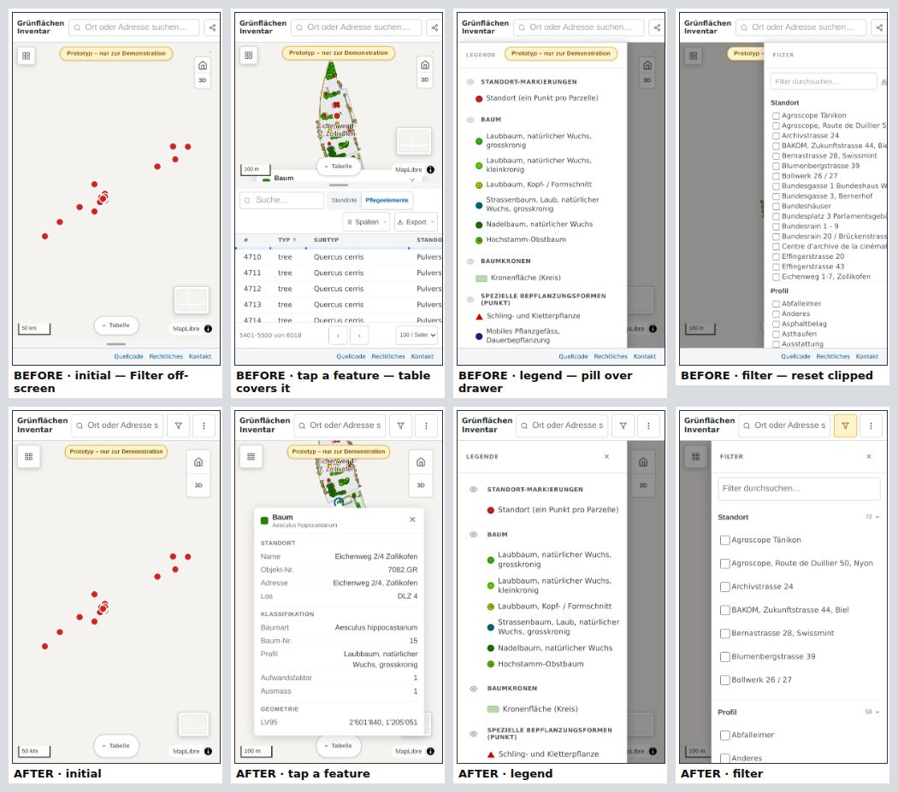
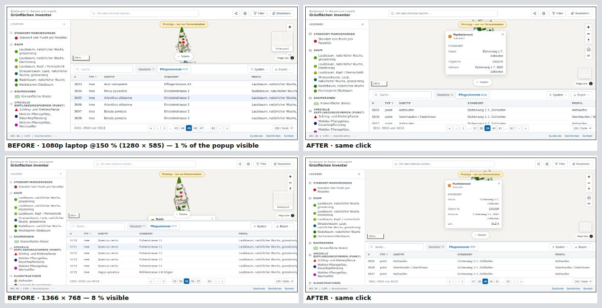
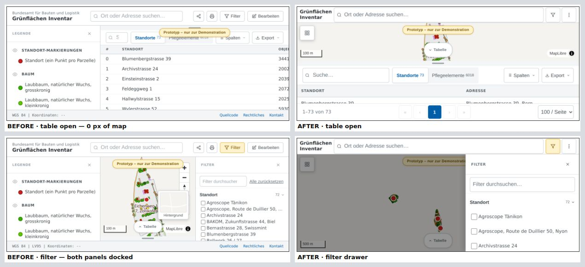
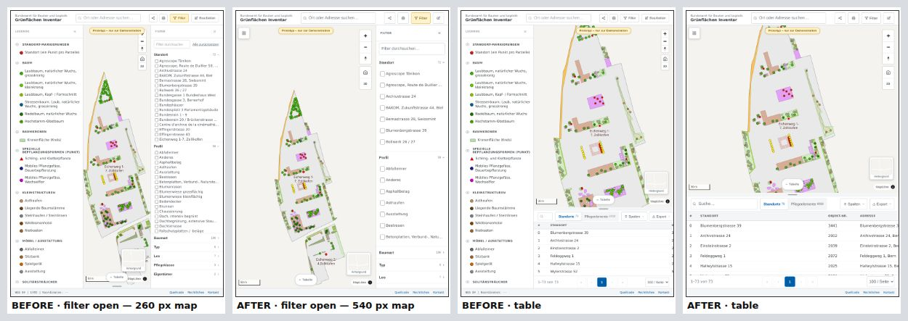
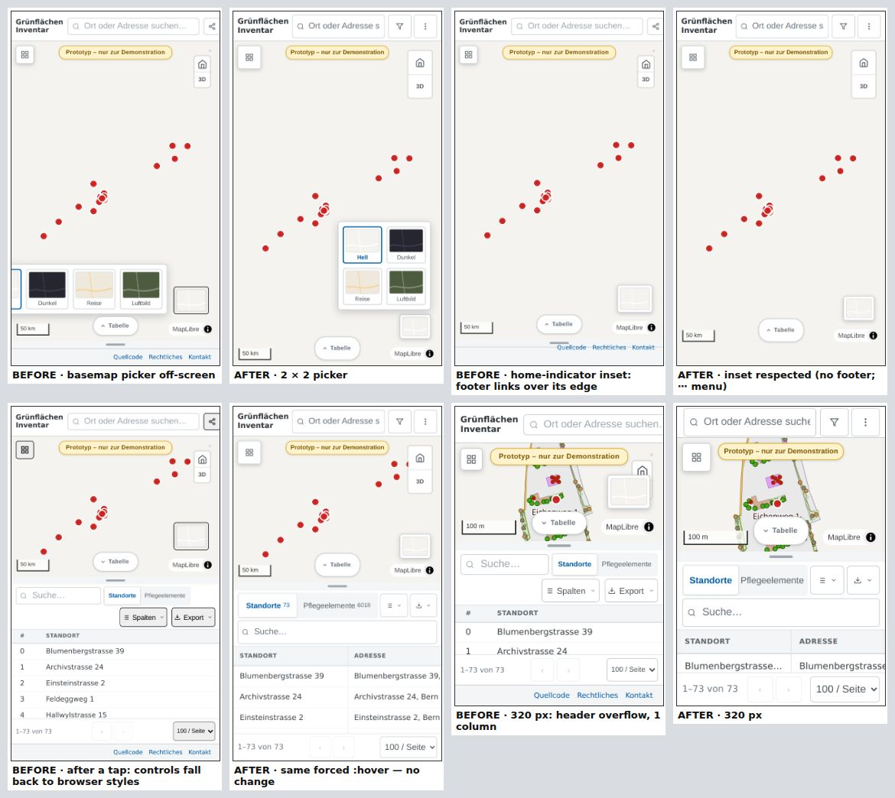
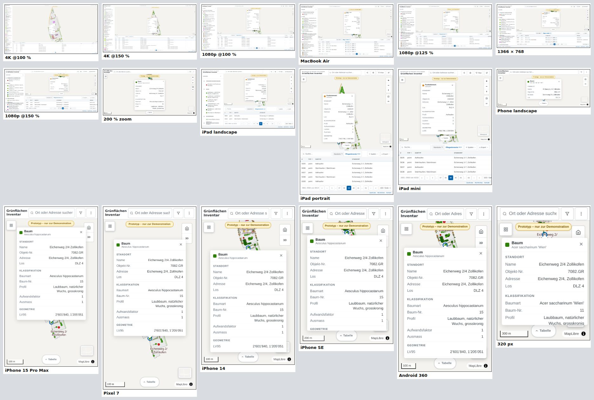

# Responsive & mobile design review — Main App

> Scope: `prototype-main`, the app the repository root opens · Review date: 2026-09-24
> Method: 18 device profiles × 10 UI states, measured with Playwright ([`tools/responsive-audit`](../tools/responsive-audit/README.md))

## Summary

The main app was built desktop-first and works well on a full-HD monitor at 100 %
scaling. Every other screen class was worse, and most of the problems traced back to
three assumptions:

1. **Width is the only constraint.** The single 768 px breakpoint ignored height, so
   landscape phones, zoomed windows and laptops at 150 % scaling all got the full
   desktop layout. On an iPhone in landscape, opening the table left **0 px of map**.
2. **There is always room for a 380 px popup.** Selecting a feature opened the table
   automatically, and the table then covered that feature and its popup. On every
   screen shorter than about 900 px, only **0–17 %** of the popup stayed visible. That
   covers laptops at 125–150 %, 1366 × 768, the MacBook Air, the iPads and all phones.
3. **The header fits.** On every phone the header overflowed by 68–178 px. **Filter and
   Print could not be reached**, and the whole page panned sideways.

The changes add a layout system with three tiers (wide / medium / compact) that
responds to height as well as width. Container queries let the map and table chrome
adapt to the space they actually get. A touch layer brings 44 px targets and 16 px
inputs, and the notch and home indicator are respected. A few interaction defects are
fixed as well: popup reveal, long-press menu, backdrop tap, sticky hover and loading
state. On desktop monitors the layout is unchanged apart from small refinements:
11 px minimum text, darker secondary text, and consistent 32 px header controls.

Measured across all 18 device profiles; per-device tables are [below](#results-per-device).

| Measure | Before | After |
|---|---|---|
| Phones whose header overflows (Filter off-screen) | 6 / 6 | **0 / 6** |
| Devices where a clicked feature’s popup is fully visible | 4 / 18 | **18 / 18** |
| Smallest map height with the table open | 0 px | **113 px** |
| Devices with overlapping map controls | 5 / 18 | **0 / 18** |
| Targets < 24 px on phones, filter open (WCAG 2.5.8) | 17–35 | **0** |
| Text below 4.5:1 contrast, 1080p desktop (all states) | 15 | **0** |
| Inputs that make iOS zoom on focus (touch devices) | 1–2 | **0** |
| Basemap options unreachable on a 320 px phone | 2 of 4 | **0 of 4** |
| JavaScript errors (18 devices × 10 states) | 0 | **0** |

## Contents

- [How the review was done](#how-the-review-was-done)
- [Findings](#findings) — [critical](#critical) · [major](#major) · [minor](#minor) · [checked, not an issue](#checked--not-an-issue)
- [The responsive system after the changes](#the-responsive-system-after-the-changes)
- [Results per device](#results-per-device)
- [Screenshots](#screenshots)
- [Recommendations not implemented](#recommendations-not-implemented)
- [Files changed](#files-changed)

## How the review was done

**Device profiles.** A CSS viewport is the physical resolution divided by the OS
scaling factor, minus the browser chrome (Chrome on Windows ≈ 87 px for tabs and
toolbar, Windows 11 taskbar 48 px, Safari and Chrome bars on phones). For example, a
full-HD laptop at 150 % scaling leaves a **1280 × 585** viewport. That is the tightest
desktop case in the matrix, and exactly the 150 % laptop setup this review was asked
to cover.

| Group | Profile | CSS viewport | DPR |
|---|---|---|---|
| Desktop | 4K 32" @100 % | 3840 × 2025 | 1 |
| | 4K 27" @150 % (1440p in CSS px) | 2560 × 1305 | 1.5 |
| | Full-HD 24" @100 % | 1920 × 945 | 1 |
| | MacBook Air 13" (Safari-sized viewport) | 1470 × 832 | 2 |
| | Full-HD laptop @125 % | 1536 × 729 | 1.25 |
| | HD laptop 1366 × 768 @100 % | 1366 × 633 | 1 |
| | Full-HD laptop @150 % | 1280 × 585 | 1.5 |
| | Full-HD @100 % + browser zoom 200 % | 960 × 472 | 2 |
| Tablet (touch) | iPad Air landscape / portrait | 1180 × 746 / 820 × 1106 | 2 |
| | iPad mini portrait | 768 × 954 | 2 |
| Phone (touch) | iPhone 15 Pro Max · Pixel 7 · iPhone 14 · iPhone SE · small Android | 430 × 740 · 412 × 811 · 390 × 664 · 375 × 553 · 360 × 640 | 3 · 2.625 · 3 · 2 · 3 |
| | 320 px floor (WCAG 1.4.10 reflow width) | 320 × 460 | 2 |
| | iPhone 14 landscape | 844 × 340 | 3 |

**States.** Each profile was put through the same 10 states: initial load; a dense
site zoomed in; table open; a tap or click on a feature in the lower part of the map;
legend open; basemap picker open; filter open; header search with results; column
picker open; and right-click (long-press on touch devices).

**Measurements (per state).** Header overflow and search width · map, table and panel
sizes · toolbar clipping · visible table columns · overlaps between floating map
controls · popup visibility (% of the popup inside the visible map) · drawer occlusion ·
basemap options on screen · touch targets < 24 px (WCAG 2.2 SC 2.5.8, AA) and < 44 px
(Apple HIG) · text < 12 px · text contrast < 4.5:1 · placeholder contrast · inputs
< 16 px, which make iOS zoom the page on focus. Targeted probes then checked the
things a static state misses: sticky hover after a tap, safe-area insets (emulated
over the Chrome DevTools protocol), whether a backdrop tap closes the drawer, the
popup position over time, and border rendering at each scale factor.

**Verification.** Besides the before/after matrix, 23 functional checks ran against
the new build and all pass: overflow menu, one drawer at a time, backdrop tap and
Escape, table resize by touch drag, long-press, then measuring by taps, tier switching
on resize and rotation, the context menu staying inside the map, the error state with
retry, and no page errors.

**Limitations.**
- **Chromium only.** WebKit and Firefox were not available in the review environment.
  Where a finding depends on iOS Safari (no `contextmenu` on long-press, page zoom on
  focused inputs, safe-area insets), it relies on documented platform behaviour
  checked in Chromium's mobile emulation. Validate on real devices (see
  [recommendations](#recommendations-not-implemented)).
- **Basemap stand-in.** The environment blocks the basemap and CDN hosts, so the
  screenshots show a neutral background instead of CARTO or swisstopo tiles. The
  app's own data layers, controls and panels are real.

## Findings

Severity: **Critical**: a core task cannot be completed on some devices.
**Major**: the task is possible but clearly impaired. **Minor**: polish, consistency
or accessibility hygiene. Every finding was measured or reproduced, and all were fixed.

### Critical

#### R1 · Header overflows on every phone — Filter and Print unreachable
- **Evidence:** the header overflows by 68 px at 430 px, 108 px at 390 px and 178 px
  at 320 px. On the 390 px iPhone this widened the layout viewport to 498 px, so the
  whole app shell pans sideways. The Filter button, the only entry to filtering, is
  completely off-screen on every phone.
- **Cause:** the search field could not shrink below the intrinsic width of its
  `<input>` (≈ 255 px), because `#search-area` lacked `min-width: 0`. With the title
  (89 px) and three header buttons (138 px) beside it, that does not fit on any phone.
- **Fix:** `min-width: 0`. The compact header shows the app name on two lines, search,
  an icon-only Filter button (badge and count in its accessible name) and a **⋯ menu**
  holding Share, Print and the footer links. While the search has focus the name steps
  aside, so the field grows to 220–290 px; below 360 px the name is always hidden.

#### R2 · Selecting a feature hides it under the table
- **Evidence:** after clicking a feature in the lower part of the map, this share of the
  popup stayed visible: 1080p @150 % **1 %**, 1366 × 768 **8 %**, 1080p @125 % **14 %**,
  MacBook Air **17 %**, iPad landscape **16 %**, phones **5–11 %**, landscape phone and
  200 % zoom **0 %**. Only screens at least 945 px tall were unaffected.
- **Cause:** `selectFeature()` opens the table. The map shrinks by 300 px, and the popup
  stays anchored to the feature, which is now behind the table (z 7). The popup body
  had a fixed 380 px maximum height, and MapLibre never pans the map for a popup.
- **Fix:** three changes.
  1. In the compact layout, selecting a feature no longer opens the table. The row is
     still selected for when the user opens it.
  2. The popup body height follows the map (`clamp(96px, 100cqh − 160px, 380px)`).
  3. The new `revealPopup()` pans just enough to bring the popup fully into view. It
     runs after a selection, after camera animations and after every map resize. A
     plain timer was not enough: it raced the table's height transition, which starts
     late while the table re-renders.

#### R3 · Landscape phones and zoomed windows get the desktop layout
- **Evidence:** on an 844 × 340 landscape phone, both 280 px panels were docked and the
  map was 564 × 238 px. With the table open, the map was **0 px** tall and the
  disclaimer pill floated over the table toolbar. A 1080p screen at 200 % browser
  zoom (960 × 472) left **78 px** of map.
- **Cause:** the only phone breakpoint was `max-width: 768px`, and the table height was
  a fixed 300 px.
- **Fix:** the compact tier also triggers at **≤ 500 px height**. The table height is
  relative to the viewport (48 dvh in compact, `clamp(160px, 32vh, 440px)` elsewhere),
  the landscape header is 48 px, and the compact layout drops the footer (its links
  move into the ⋯ menu).

### Major

#### R4 · Tablet in portrait: two docked panels leave a 260 px map
- **Evidence:** on an iPad Air in portrait (820 px), legend and filter docked side by
  side left a **260 px** strip of map between them. The iPad mini (768 px) got the phone
  layout while the iPad Air (820 px) got the desktop one: two near-identical devices,
  two different apps.
- **Fix:** a **medium tier** (700–1099 px). Panels still dock, which keeps the map
  interactive while filtering, but only one at a time, and the legend starts closed so
  the map opens at full width. The placeholder "Bearbeiten" button becomes icon-only.

#### R5 · Table toolbar clips and phones show 1 of 10 columns
- **Evidence:** at 540 px (tablet with a docked panel) the table search collapsed to
  about 30 px. Phones showed 1 of 10 columns, the 1080p @150 % laptop 3 of 10, and even
  1080p @100 % scrolled horizontally.
- **Fix:** the toolbar layout is driven by a container query on the table panel. When
  narrow, tabs and icon-only buttons share the first row and the search gets a
  full-width second row. Phones get a name-first default of 4 columns (still editable
  under "Spalten"), with the first column pinned while the others scroll. Cell padding
  is 12 px instead of 16 px.

#### R6 · Map controls collide or fall off-screen
- **Evidence:** the zoom/compass group overlapped the basemap button on 1366 × 768,
  1080p @150 %, 200 % zoom, 320 px and landscape (up to 27 × 87 px). Hiding the zoom
  buttons on phones left an **empty control box** behind. The basemap picker opened to
  the left of its button and started off-screen: on 390 px, "Hell" was at
  x = −61…19; on 320 px, "Hell" and most of "Dunkel" could not be reached.
- **Fix:** `#map` is now a size container, so its chrome adapts to the space the map
  actually has, not to the viewport:
  - ≤ 440 px map height: compact basemap button.
  - ≤ 480 px wide or ≤ 260 px tall: the whole zoom group is hidden via `:has()` (pinch,
    wheel, double-tap and keyboard still zoom).
  - ≤ 560 px wide: the basemap picker opens upward as a 2 × 2 grid.
  - ≤ 240 px and ≤ 180 px map height: the secondary chrome gives way.

#### R7 · Map tools are right-click-only, so unreachable on phones
- **Evidence:** measuring distance and area, copying coordinates, sharing a location and
  "Problem melden" live only in the right-click menu. iOS Safari never fires
  `contextmenu` on a long-press, so on iPhones and iPads these tools don't exist.
- **Fix:** a **long-press** (550 ms, 10 px tolerance) opens the same menu. The
  synthetic click some browsers send as the finger lifts is swallowed, but only within
  250 ms, so a deliberate tap on a menu item still works. The menu's position used
  to rely on a hard-coded 200 × 180 px estimate; it is now measured and clamped to the
  map. Menu rows are 44 px on touch, and the long coordinate line wraps on narrow maps.

#### R8 · The sticky-hover workaround broke tapped controls
- **Evidence:** a tapped element keeps `:hover` on touch screens. The old
  `@media (hover: none)` block reset hover styles with `revert`, which rolls back to
  **browser defaults**. After a tap, controls such as the header buttons, "Spalten",
  "Export", the page-size select and the legend button showed a grey `#EFEFEF` fill
  with black text and a black or dark-grey border. This was measured with forced
  `:hover` on iPhone emulation.
- **Fix:** all 45 `:hover` rules now sit inside `@media (hover: hover)`, and the
  `revert` block is removed.

#### R9 · Drawer defects on phones
- **Evidence:**
  - The "Prototyp" pill was painted over the legend drawer's header.
  - Tapping the dimmed backdrop did **not** close the drawer: the tap lands on
    `#body`, but the close handler listened on `#main-content` (reproduced).
  - "Alle zurücksetzen" was clipped to "Alle zur…".
  - Long filter values were hard-clipped with no ellipsis.
- **Fix:**
  - A z-index scale (map < table < scrim < drawers < header), with `#map` isolated as
    its own stacking context.
  - A backdrop-tap handler on `#body`.
  - The reset action moves to the panel header and shows only while filters are active.
  - `min-width: 0` on the label text so the ellipsis works.
  - Escape closes the drawers and menus.

#### R10 · Touch targets too small
- **Evidence:** filter rows 19 px, header text buttons 26 px, map buttons 29 px, legend
  eye buttons 20 px, footer links 13 px. With the filter open, phones had 17–35 targets
  under WCAG's 24 px minimum.
- **Fix:** size tokens. Desktop keeps a compact look with a **24 px** floor for rows and
  icon buttons. Touch devices (`pointer: coarse`) get **44 px** controls, rows and icon
  buttons (Apple HIG); only the dense table rows and pagination use 40 px. Checkboxes
  are 18 px on touch.

#### R11 · Notch and home indicator ignored
- **Evidence:** with the iPhone home-indicator inset (34 px) the footer's 32 px fixed
  height left its content box at 0 px, so the links rode up over the footer's top edge.
  With the iPad's 20 px inset the box shrank to 11 px, less than the link height. In
  landscape the header title sat under the notch.
- **Fix:** the footer height adds the inset. The header, drawers and bottom map controls
  respect the safe-area insets, and in the compact layout the controls only add the
  inset while the map actually reaches the screen edge (table closed).

#### R12 · iOS zooms into the filter search and page-size select
- **Evidence:** the filter search (13 px) and the page-size select (11 px on phones) are
  under 16 px, so iOS zooms the page when they get focus.
- **Fix:** all text fields and the select are 16 px on touch.

#### R13 · Table can't be resized on phones
- **Evidence:** below 768 px a CSS rule pinned the panel at `45vh`, which silently
  overrode the drag handle's value, so even a mouse drag did nothing. A touch drag
  also produced `pointerdown → pointermove → pointercancel`: the handle had no
  `touch-action`, so the browser took the gesture over as a scroll, or on Android as
  pull-to-refresh.
- **Fix:** the phone default is set through `--table-height`, so dragging works. The
  handle has `touch-action: none`, the app shell has `overscroll-behavior: none`, and
  the handle is hidden while the table is collapsed; it used to linger as a grey bar
  above the footer.
- **Watch-out found while verifying:** browsers snap an imprecise finger to the nearest
  element they consider tappable (Chromium's touch adjustment). The handle's only
  "tappable" signal had been its `:hover` style. Once hover was gated to mouse devices
  (R8), touches on the 16 px bar snapped to the map canvas. The handle is now a
  focusable `role="separator"` that also resizes with the arrow keys, which fixes both
  the touch targeting and keyboard access. Touch drag verified: 319 → 439 px.

### Minor

| # | Issue (evidence) | Fix |
|---|---|---|
| R14 | Contrast: section labels, popup section heads and search section headers 2.3–2.4:1; close “×” icons 2.4:1 (non-text needs 3:1); tab counts 2.7–3.2:1 (opacity .65); placeholders 2.4:1 | `grey-500` / `grey-600`; counts subordinate through size and weight instead of opacity |
| R15 | 10 px text: table headers, section labels, badges, map scale | 11 px floor; 14 px body text on touch devices |
| R16 | Header text buttons 26 px tall next to 32 px icon buttons and search field | One `--ctrl-h` for all header controls |
| R17 | No loading or error state while 12.6 MB of GeoJSON (1.2 MB gzipped) is fetched, parsed and joined — seconds of empty map on a phone; data fetch only started after the basemap style loaded | Loading pill with “slow connection” and error + retry states; fetch starts immediately, in parallel with the style |
| R18 | Search results not capped to the viewport (ran off-screen in landscape); only as wide as the small search box on phones | Height capped to the space below the header; full width in compact |
| R19 | Toasts `nowrap` could run off narrow screens | Wrap within the map width |
| R20 | Footer coordinates only follow the mouse and read “--” forever on touch devices | Hidden on `hover: none`; long-press shows coordinates |
| R21 | Large screens: legend labels wrap at 280 px; fixed 300 px table on 1440p / 4K | 320 px panels from 1800 px; table height scales up to 440 px |
| R22 | Popups painted under the basemap button on small maps | Popup stacks above the map chrome, below menus and the disclaimer pill |
| R23 | Markup: duplicate `id` on the legend list; search fields without accessible names; toggles without `aria-expanded` | Fixed |

### Checked — not an issue

- **Border weight at 125 / 150 / 200 % scaling.** The header buttons used 1.5 px borders
  next to 1 px ones. Measured in Chromium, both render as 1 px at every scale factor,
  so there is no visible difference. They are 1 px now anyway, for Firefox and Safari.
- **iPad mini header.** Tight but not overflowing: the Filter button ends at 760 of 768 px.
- **Disabled pagination buttons at 1.6:1.** Inactive controls are exempt from WCAG 1.4.3.

## The responsive system after the changes

| Tier | Trigger | Layout |
|---|---|---|
| **Wide** | ≥ 1100 px | Legend and filter can both be docked; legend open by default; full header and footer |
| **Medium** | 700–1099 px | Docked panels, one at a time; legend starts closed; “Bearbeiten” icon-only |
| **Compact** | < 700 px wide **or** ≤ 500 px tall | Drawers over the map with a backdrop · header = name, search, Filter icon, ⋯ menu · no footer · table as a resizable bottom sheet (48 dvh) · selecting a feature doesn't open the table · long-press menu |

Layers that work across tiers:

- **Touch** (`pointer: coarse`): 44 px controls, rows and icon buttons; 40 px dense table
  rows and pagination; 16 px inputs; 14 px body text.
- **Hover** (`hover: hover`): hover styles only where a pointer can hover.
- **Map chrome** (`#map { container: map / size }`): controls, basemap picker and popups
  adapt to the map's own size. That size changes with the table, the docked panels and
  the viewport, which is why media queries alone couldn't handle it.
- **Table** (`#table-panel { container: tbl / inline-size }`): toolbar layout, pinned
  first column and pagination density follow the panel width.
- **Safe areas**: header, footer, drawers and bottom map controls.

The tier queries appear twice, as `LAYOUT_MQ` in `js/config.js` and in the
*RESPONSIVE LAYER* section of `css/styles.css`. Keep them in sync.

## Results per device

The final run covered all 18 profiles × 10 states (“before” = commit `60e9cf2`).
Bold marks a change.

**Layout.** Header overflow, search-field width, map height with the table open, how
much of a clicked feature's popup is visible, how many table columns fit, and how many
floating map controls overlap.

- **Search width on phones.** The 223 px “before” only existed because the header
  overflowed and pushed Filter off-screen. The width shown for “after” is the idle
  state; with focus the field grows to 220–290 px.
- **iPad mini.** It now gets the tablet header instead of the phone one, so its search
  is narrower (214 px), which still fits the full placeholder.

| Device | Viewport | Header overflow | Search field width | Map height, table open | Popup visible after tap | Table cols visible | Control overlaps |
|---|---|---|---|---|---|---|---|
| 4K 32" @100 % | 3840×2025 @1 | 0 px | 456 px | 1631 px → **1491 px** | 100 % | 10/10 | 0 |
| 4K 27" @150 % | 2560×1305 @1.5 | 0 px | 456 px | 911 px → **793 px** | 100 % | 10/10 | 0 |
| Full-HD 24" @100 % | 1920×945 @1 | 0 px | 456 px | 551 px → **549 px** | 100 % | 7/10 → **8/10** | 0 |
| MacBook Air 13" | 1470×832 @2 | 0 px | 456 px | 438 px → **472 px** | 17 % → **100 %** | 5/10 | 0 |
| Full-HD laptop @125 % | 1536×729 @1.25 | 0 px | 456 px | 335 px → **402 px** | 14 % → **100 %** | 5/10 | 0 |
| HD laptop 1366 × 768 | 1366×633 @1 | 0 px | 456 px | 239 px → **337 px** | 8 % → **100 %** | 4/10 | 1 → **0** |
| Full-HD laptop @150 % | 1280×585 @1.5 | 0 px | 456 px | 191 px → **304 px** | 1 % → **100 %** | 3/10 | 2 → **0** |
| Full-HD + browser zoom 200 % | 960×472 @2 | 0 px | 369 px → **751 px** | 78 px → **192 px** | 0 % → **100 %** | 3/10 → **2/4** | 3 → **0** |
| iPad Air landscape | 1180×746 @2 | 0 px | 456 px | 344 px → **403 px** | 16 % → **100 %** | 3/10 | 0 |
| iPad Air portrait | 820×1106 @2 | 0 px | 229 px → **266 px** | 704 px → **648 px** | 100 % | 2/10 → **3/10** | 0 |
| iPad mini portrait | 768×954 @2 | 0 px | 419 px → **214 px** | 423 px → **545 px** | 10 % → **100 %** | 3/10 | 0 |
| iPhone 15 Pro Max | 430×740 @3 | 68 px → **0 px** | 223 px → **190 px** | 305 px → **313 px** | 11 % → **100 %** | 1/10 → **1/4** | 0 |
| Pixel 7 | 412×811 @2.625 | 86 px → **0 px** | 223 px → **172 px** | 344 px → **350 px** | 10 % → **100 %** | 1/10 → **1/4** | 0 |
| iPhone 14 | 390×664 @3 | 108 px → **0 px** | 223 px → **150 px** | 263 px → **273 px** | 11 % → **100 %** | 1/10 → **1/4** | 0 |
| iPhone SE | 375×553 @2 | 123 px → **0 px** | 223 px → **135 px** | 202 px → **216 px** | 10 % → **100 %** | 1/10 → **1/4** | 0 |
| Small Android 360 | 360×640 @3 | 138 px → **0 px** | 223 px → **120 px** | 250 px → **261 px** | 10 % → **100 %** | 1/10 → **1/4** | 0 |
| 320 px floor | 320×460 @2 | 178 px → **0 px** | 223 px → **180 px** | 151 px → **175 px** | 5 % → **100 %** | 1/10 → **1/4** | 1 → **0** |
| iPhone 14 landscape | 844×340 @3 | 0 px | 253 px → **604 px** | 0 px → **113 px** | 0 % → **100 %** | 2/10 → **1/4** | 1 → **0** |

**Targets, type and contrast.** Touch counts are taken with the filter panel open (the
densest state). The few remaining sub-44 px targets on touch are the 42 px text input
inside its 44 px field, and on tablets the footer links (25 px, above the 24 px WCAG
minimum). 11 px is the deliberate type floor, so only 10 px text is counted.

| Device | Targets < 24 px (filter open) | Targets < 44 px, touch (filter open) | 10 px text elements | Text contrast < 4.5:1 | Inputs < 16 px (touch) |
|---|---|---|---|---|---|
| 4K 32" @100 % | 57 → **0** | – | 2 → **0** | 15 → **0** | – |
| 4K 27" @150 % | 52 → **0** | – | 2 → **0** | 15 → **0** | – |
| Full-HD 24" @100 % | 50 → **0** | – | 2 → **0** | 15 → **0** | – |
| MacBook Air 13" | 46 → **0** | – | 2 → **0** | 14 → **0** | – |
| Full-HD laptop @125 % | 39 → **0** | – | 2 → **0** | 13 → **0** | – |
| HD laptop 1366 × 768 | 33 → **0** | – | 2 → **0** | 13 → **0** | – |
| Full-HD laptop @150 % | 31 → **0** | – | 2 → **0** | 14 → **0** | – |
| Full-HD + browser zoom 200 % | 25 → **0** | – | 2 → **0** | 12 → **0** | – |
| iPad Air landscape | 32 → **0** | 20 → **4** | 2 → **0** | 14 → **0** | 2 → **0** |
| iPad Air portrait | 39 → **0** | 27 → **4** | 2 → **0** | 14 → **0** | 2 → **0** |
| iPad mini portrait | 39 → **0** | 16 → **4** | 1 → **0** | 16 → **0** | 2 → **0** |
| iPhone 15 Pro Max | 31 → **0** | 10 → **1** | 1 → **0** | 10 → **0** | 2 → **0** |
| Pixel 7 | 35 → **0** | 10 → **1** | 1 → **0** | 10 → **0** | 2 → **0** |
| iPhone 14 | 27 → **0** | 10 → **1** | 1 → **0** | 9 → **0** | 2 → **0** |
| iPhone SE | 21 → **0** | 10 → **1** | 1 → **0** | 9 → **0** | 2 → **0** |
| Small Android 360 | 25 → **0** | 10 → **1** | 1 → **0** | 9 → **0** | 2 → **0** |
| 320 px floor | 17 → **0** | 9 → **1** | 1 → **0** | 9 → **0** | 2 → **0** |
| iPhone 14 landscape | 12 → **0** | 16 → **1** | 2 → **0** | 11 → **0** | 1 → **0** |

## Screenshots

### Phone — iPhone 14 (390 × 664)

*Before*: the header runs off-screen, so Filter can't be reached; a tapped feature
disappears under the auto-opened table; the “Prototyp” pill sits on top of the legend
drawer; the reset link is clipped. *After*: name, search, Filter and ⋯ fit; the popup
stays in view and the table stays closed; the drawers are clean.

### Laptops — 1080p at 150 % (1280 × 585) and 1366 × 768

*Before*: only the popup's title strip peeks above the table (1 % and 8 % visible).
*After*: the popup is capped to the map height and panned fully into view.

### Phone in landscape (844 × 340)

*Before*: desktop layout. Two docked panels, and with the table open 0 px of map.
*After*: compact layout, a 48 px header, a drawer instead of docked panels, and a
resizable table sheet.

### Tablet in portrait (iPad Air, 820 × 1106)

*Before*: legend and filter docked together left a 260 px map. *After*: one docked
panel at a time (540 px map), and the legend starts closed.

### Details

Basemap picker off-screen → 2 × 2 grid · footer links over the footer's edge with the
home-indicator inset → footer moved into the ⋯ menu · tapped controls falling back to
browser styles → unchanged · a 320 px phone with an overflowing header and 1 visible
column → pinned name column.

### Every profile after the change

The same “click a feature in the lower part of the map” state on all 18 profiles.
The popup is fully visible on every one.

## Recommendations not implemented

1. **Test on real iOS devices.** WebKit was not available for this review. Check the
   long-press menu, safe-area insets, `dvh` sizing and input zoom on an iPhone and an
   iPad, and run a Firefox pass.
2. **Data weight is the biggest remaining mobile issue.** Each visit downloads
   1.2 MB (gzipped; measured), which expands to 12.6 MB of GeoJSON. That is parsed and
   joined on the main thread before anything appears, which on mid-range phones means
   seconds of work and noticeable memory use. Vector tiles (e.g. PMTiles) or loading
   per site would fix this at the source.
3. **`preserveDrawingBuffer: true`** costs GPU time on every frame (the code estimates
   10–15 %), and matters most on phones. Consider capturing the canvas only when the
   user prints.
4. **Feature details as a bottom sheet on phones.** A map-anchored popup with 20+
   attribute rows is readable now but cramped. A swipeable bottom sheet, as in Google
   Maps, would scale better.
5. **Content.** The “Typ” column shows raw English codes (`tree`, `area`, …) in a German
   UI. The compact column set already uses the German “Feature” column instead.
6. **Focus management.** Move focus into an opened drawer and return it on close.
   Escape handling is in place.
7. **Default font-size preference.** The type tokens are in `px`. Browser zoom and OS
   scaling work, as measured above, but a user's larger *default font size* setting
   is ignored. Switching the `--text-*` tokens to `rem` would honour it without
   changing the default look.
8. **Care & Maintenance prototype.** `prototype-care` was not part of this review.

## Files changed

| File | Change |
|---|---|
| `css/tokens.css` | Touch sizing tokens, 11 px type floor, viewport-relative table height, z-index scale, wide-screen panel width |
| `css/styles.css` | Responsive layer (tiers, container queries, safe areas), hover gating, drawer / popup / table / control fixes, contrast |
| `index.html` | ⋯ menu, button labels in spans, loading overlay, filter reset in the panel header, accessible names |
| `js/config.js` | `LAYOUT_MQ` tier queries, compact default columns |
| `js/map.js` | Parallel data fetch and loading state, tier-aware panels, popup reveal, long-press and clamped context menu, ⋯ menu, Escape, backdrop tap |
| `js/table.js` | Tier-aware filter panel, compact columns, table state class, reset visibility, `aria-expanded` |
| `README.md` | “Responsive layout” section; long-press menu; links to this review and the harness |
| `tools/responsive-audit/` | The measurement harness used for this review |
