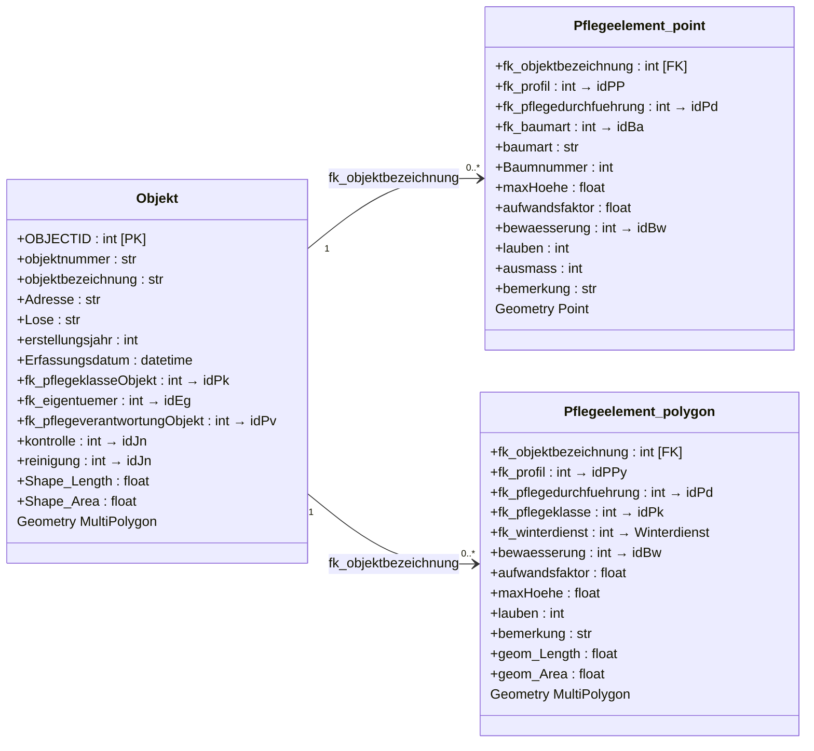
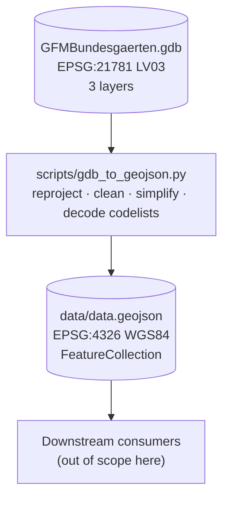

# Green Inventory — Source GDB & Conversion

Companion to [`DATAMODEL.md`](DATAMODEL.md). That document describes the
**data model** the app consumes (`data/data.geojson`); **this** one is the
contract for the **source FileGDB** (`GFMBundesgaerten.gdb`) and the
conversion script
([`scripts/gdb_to_geojson.py`](../scripts/gdb_to_geojson.py)) that produces
it — source schema, embedded codelists, the Swiss coordinate systems, the
geometry-processing rules, and how to re-run the pipeline.

The doc is **descriptive** — generated by reading the code and the source
GDB. When the conversion changes, update this file. The German field names
below are the **physical schema** and are intentionally not anglicised; the
English-first *concepts* they map to live in [`DATAMODEL.md`](DATAMODEL.md).

---

## 1. Source data model (UML)

The source GDB has three layers joined by `fk_objektbezeichnung → Objekt.OBJECTID`.
Most attribute columns are integer foreign keys into one of the 17 field-domain
codelists (`idPP`, `idPPy`, `idBa`, `idPk`, `idPv`, …).



> **Gotcha:** `fk_profil` on the two child layers points to **different**
> codelists (`idPP` vs `idPPy`). Code 1 is `Laubb. nat. grossk.` for points
> but `Geb.Rasen kf.` for polygons. See §2.5.

> **How this maps to the data model.** The single `Objekt` layer fuses two
> conceptual entities — **Site** (*Standort*) and **Land Parcel**
> (*Grundstück*) — and `Pflegeelement_{point,polygon}` are the **Maintenance
> Elements**. The target three-level model and this divergence are in
> [`DATAMODEL.md`](DATAMODEL.md) §1 and §4.

---

## 2. Source GDB

Path: `Daten_Bundesgärtnerei/GFMBundesgaerten.gdb` (ESRI FileGDB v10.x).

**CRS:** `EPSG:21781` (CH1903 / LV03, Bessel ellipsoid). Verified at
runtime — the script asserts the source CRS matches one of the
expected variants (LV03 or LV95) before proceeding.

### 2.1 Layers

| Layer | Geometry | Purpose |
|---|---|---|
| `Objekt` | MultiPolygon | Site / parcel boundaries (Standorte) |
| `Pflegeelement_point` | Point | Tree positions + furniture + small structures |
| `Pflegeelement_polygon` | MultiPolygon | Vegetation + surfaces + tree-canopy circles |

### 2.2 `Objekt` fields (18 + geometry)

Site-level identifiers and metadata. Joined to children via OBJECTID.

| Field | Type | Notes |
|---|---|---|
| `objektnummer` | str(20) | Internal site number, sometimes alphanumeric (e.g. `1602GR`) |
| `objektbezeichnung` | str(255) | Human-readable site name |
| `Adresse` | str(200) | Street address |
| `parzelle` | str(255) | Cadastral parcel number(s); CSV in some rows |
| `Lose` | str(20) | Maintenance district: `DLZ 1..5`, `Gebiet Schweiz`, `ALT` |
| `erstellungsjahr` | int32 | Year of construction (often null) |
| `Erfassungsdatum` | datetime | Survey date |
| `objektausmass` | float | Always null in current data |
| `TitelObjektblatt` | str(255) | Filename of the data sheet |
| `TitelKalkulation` | str(255) | Filename of the cost calculation sheet |
| `bemerkung` | str | Free-text remarks |
| `fk_pflegeklasseObjekt` | int32 | → `idPk` codelist |
| `fk_eigentuemer` | int32 | → `idEg` codelist |
| `fk_pflegeverantwortungObjekt` | int32 | → `idPv` codelist |
| `kontrolle` | int32 | → `idJn` codelist (ja/nein) |
| `reinigung` | int32 | → `idJn` codelist |
| `Shape_Length` | float | Source-CRS perimeter in metres |
| `Shape_Area` | float | Source-CRS area in m² |

### 2.3 `Pflegeelement_point` fields (23 + geometry)

| Field | Type | Notes |
|---|---|---|
| `fk_objektbezeichnung` | int32 | FK → `Objekt.OBJECTID` |
| `fk_profil` | int32 | → `idPP` codelist (point profile). Null rows are dropped by the conversion. |
| `fk_pflegedurchfuehrung` | int32 | → `idPd` codelist |
| `fk_pflegeklasse` | int32 | → `idPk`. Effectively always 0 — points inherit their site's Pflegeklasse instead of carrying their own. |
| `fk_pflegeverantwortung` | int32 | → `idPv`. Effectively always 0 |
| `fk_zustand` | int32 | → `idZs`. Always 0 |
| `fk_kostenstelle` | int32 | → `idKs`. Always 0 |
| `fk_baumart` | int32 | → `idBa` codelist (tree species) |
| `baumart` | str(255) | Free-text species name. Redundant with `fk_baumart` when both are set, but either may be populated alone. Either field being non-empty is what classifies the row as a `tree` (entity type) rather than a `point`. |
| `Baumnummer` | int32 | Per-site tree number |
| `bewaesserung` | int32 | → `idBw` codelist |
| `lauben` | int32 | Leaf-clearing scope flag (Lauben); 0 / 1 / 2 |
| `maxHoehe` | float | Max. tree height in m, where measured |
| `hoehe` | int32 | Always null; legacy field |
| `aufwandsfaktor` | float32 | Care-effort multiplier (0.5–5.0) |
| `naturobjekt` | int32 | "Natural object" flag. Always 0 |
| `parzelle_name` | int32 | Legacy denormalisation. Always 0 or null; never non-zero. |
| `kostenstelle_name` | str(255) | Always `'0'`; legacy denormalisation |
| `objektbezeichnung_name` | str | Always `'0'`; legacy denormalisation |
| `eigentuemer_name` | int32 | Always 0; legacy denormalisation |
| `ausmass` | int16 | Quantity (mostly 1) |
| `bemerkung` | str | Free-text remarks |
| `letzte_aenderung` | datetime | Always null |

### 2.4 `Pflegeelement_polygon` fields (21 + geometry)

| Field | Type | Notes |
|---|---|---|
| `fk_objektbezeichnung` | int32 | FK → `Objekt.OBJECTID` |
| `fk_profil` | int32 | → `idPPy` codelist (polygon profile, **different from `idPP`!**). Null rows are dropped by the conversion. |
| `fk_pflegedurchfuehrung` | int32 | → `idPd` codelist |
| `fk_pflegeklasse` | int32 | → `idPk`. Mostly 0; when set, only `2` (`PK 2`) is observed. No other class is ever explicitly assigned at the polygon level — everything else inherits from the parent site. |
| `fk_pflegeverantwortung` | int32 | → `idPv`. Always 0 |
| `fk_zustand` | int32 | → `idZs`. Always 0 |
| `fk_kostenstelle` | int32 | → `idKs`. Always 0 |
| `fk_winterdienst` | int32 | → `Winterdienst` codelist |
| `bewaesserung` | int32 | → `idBw` codelist |
| `lauben` | int32 | Leaf-clearing scope flag (Lauben) |
| `maxHoehe` | float | Max. plant height where applicable |
| `aufwandsfaktor` | float32 | Care-effort multiplier (0.5–5.0) |
| `naturobjekt` | int32 | Always 0 |
| `parzelle_name` | int32 | Always 0 |
| `kostenstelle_name` | str(255) | Always `'0'` |
| `objektbezeichnung_name` | str | Always `'0'` |
| `eigentuemer_name` | int32 | Always 0 |
| `ausmass` | float | Almost always null; effectively unused |
| `bemerkung` | str | Free-text remarks |
| `geom_Length` | float | Source-CRS perimeter in m |
| `geom_Area` | float | Source-CRS area in m² |

### 2.5 Critical insight: `fk_profil` is two distinct domains

`fk_profil` on `Pflegeelement_point` references **`idPP`**
(23 entries: trees + small structures + furniture).
`fk_profil` on `Pflegeelement_polygon` references **`idPPy`**
(44 entries: vegetation + surfaces + water).

Profile **1** is `Laubb. nat. grossk.` for points but `Geb.Rasen kf.`
for polygons. The two domains share integer codes but mean different
things — never merge them. The conversion script and frontend keep
them separate via `entity_type`.

---

## 3. Codelists

Extracted from the GDB's own field-domain catalog at conversion time
via `ctypes` against pyogrio's bundled GDAL DLL (the public Python
binding doesn't expose `OGR_FldDomain_GetEnumeration`). All 17 domains
are embedded in the output GeoJSON as `metadata.codelists` so the
frontend (and any downstream consumer) can introspect them without
re-querying the GDB.

> The profile domains `idPP` / `idPPy` are the **Care-Profile vocabulary**;
> their semantics and the BBL-standard mapping are in
> [`DATAMODEL.md`](DATAMODEL.md) §3.

### 3.1 Inventory

| Domain | Type | Entries | Fields that reference it |
|---|---|---:|---|
| `idPP` | coded | 22 | `Pflegeelement_point.fk_profil` |
| `idPPy` | coded | 44 | `Pflegeelement_polygon.fk_profil` |
| `idBa` | coded | 430 | `Pflegeelement_point.fk_baumart` |
| `idPd` | coded | 9 | `fk_pflegedurchfuehrung` (both layers) |
| `idPk` | coded | 4 | `fk_pflegeklasse*` (all layers) |
| `idPv` | coded | 4 | `fk_pflegeverantwortung*` (all layers) |
| `idJn` | coded | 3 | `kontrolle`, `reinigung` |
| `idEg` | coded | 3 | `Objekt.fk_eigentuemer` |
| `idBw` | coded | 3 | `bewaesserung` |
| `Winterdienst` | coded | 2 | `Pflegeelement_polygon.fk_winterdienst` |
| `idZs` | coded | 1 | `fk_zustand` — only `0 → "nicht erfasst"` defined. Effectively unused. |
| `idKs` | coded | 1 | `fk_kostenstelle` — only `0 → "nicht erfasst"` defined. Effectively unused. |
| `idPL` | coded | 0 | _truly empty — likely reserved for linear features_ |
| `AnnotationStatus`, `BooleanSymbolValue`, `HorizontalAlignment`, `VerticalAlignment` | coded | – | ESRI internal symbology metadata; ignored |

### 3.2 idPP — Point profiles (22 entries)

Used by `Pflegeelement_point.fk_profil`.

```
 1  Laubb. nat. grossk.                  (large deciduous tree, naturally grown)
 2  Laubb. nat. kleink.                  (small deciduous tree, naturally grown)
 3  Laubb. Kopf-/Form                    (deciduous tree, pollarded/shaped)
 4  Strassenb. Laub nat. grossk.         (street tree, natural large)
 5  Strassenb. Laub nat. kleink.         (street tree, natural small)
 6  Strassenb. Laub Kopf/Form            (street tree, pollarded/shaped)
 7  Nadelb. nat.                          (coniferous tree, natural)
 8  Hochstammobst                         (high-stem fruit tree)
 9  Schling-& Kletterpf.                 (climbing plant)
10  Pflanzgefäss mobil Dauerbepflanzung  (mobile planter, permanent)
11  Pflanzgefäss Wechselflor             (planter, seasonal display)
12  Abfalleimer                           (waste bin)
13  Sitzbank                              (bench)
15  Spielgerät                            (playground equipment)
16  Ausstattung                           (furniture / equipment, generic)
17  Anderes                               (other, point)
18  Asthaufen                             (branch pile)
19  Baumstamm                             (log)
20  Steinhaufen                           (stone pile)
21  Wildbienenhotel                       (wild-bee hotel)
22  Nistkasten                            (bird nest box)
23  Solitärstrauch                        (solitary shrub)
```

Note: code **14 is missing from the codelist** itself — the codelist
defines 22 entries, not 23. The dominant point profile in practice is
`1 Laubb. nat. grossk.` (large naturally-grown deciduous trees).

### 3.3 idPPy — Polygon profiles (44 entries)

Used by `Pflegeelement_polygon.fk_profil`.

```
 1  Geb.Rasen kf.                       Rasen
 2  Geb.Rasen gf.                       Rasen
 3  Strap./Sportr. kf.                  Rasen (Strapazierrasen)
 4  Strap./Sportr. gf.                  Rasen (Strapazierrasen)
 5  Blumenrasen                         Rasen
 6  Blumenwiese kf.                     Wiesen
 7  Blumenwiese gf.                     Wiesen
 8  Feuchtwiese                         Wiesen
 9  Wechselflor                         Rabatten
10  Grab                                Rabatten
11  Beetrosen                           Rabatten
12  Moorbeet                            Rabatten
13  Stauden. ext.                       Rabatten
14  Stauden. int.                       Rabatten
15  Ruderalfl.                          Rabatten
16  Formhecke - 1.5 m                   Hecken
17  Formhecke + 1.5 m                   Hecken
18  Wildhecke                           Hecken
19  Gehölzrabatte                       Gehölzflächen
20  Bodendecker                         Gehölzflächen
21  Gehölz & Bodend.                    Gehölzflächen
22  Parkwald                            Gehölzflächen
23  Wald                                Gehölzflächen
24  Dach: ext. Stauden                  Spezielle Bepflanzungsformen
25  Asphaltbelag                        Beläge
26  Betonpl./Verbund/Naturstein         Beläge
27  Chaussierung                        Beläge
28  Sand                                Beläge
29  Rasengittersteine                   Beläge
30  Holzhäckselbelag                    Beläge
31  Fallschutzpl./-beläge               Beläge
32  Kunststoff-/Sportbelag              Beläge
33  Kunstrasen                          Beläge
34  Gewässer, ruhend                    Wasserflächen
35  Brunnen                             Wasserflächen
36  Anderes                             Anderes
37  Geröllstreifen/Bollensteine         Beläge
38  Dach: intensiv begrünt              Spezielle Bepflanzungsformen
39  Flachdach ohne Bewuchs              Spezielle Bepflanzungsformen
40  Steildach                           Spezielle Bepflanzungsformen
41  Dachterrasse                        Spezielle Bepflanzungsformen
42  Naturstein-Pflästerung              Beläge
43  Saumvegetation                      Wiesen
44  Magerrasen                          Wiesen
```

The category column is the BBL profile-catalog grouping (Rasen / Wiesen /
Rabatten / Hecken / Gehölzflächen / Spezielle Bepflanzungsformen /
Beläge / Wasserflächen / Anderes) used downstream for legend buckets.

### 3.4 Other small codelists

```
idBw — bewaesserung_name (3 entries)
   1  automatisch
   2  von Hand
   3  nicht erforderlich

idEg — eigentuemer_name (3 entries)
   1  Bund
   2  Dritte
   0  nicht erfasst

idJn — ja_nein_name (3 entries)
   0  nicht erfasst
   1  ja
   2  nein

idPd — pflegedurchfuehrer (9 entries)
   1  BG          (Bundesgärtnerei)
   2  extern
   3  unbekannt
   4  Stadt Bern
   5  Dritte
   6  Baumpfleger
   7  DLZ 2
   8  Werkhof
   9  intern

idPk — pflegeklasse_name (4 entries)
   0  nicht erfasst
   1  PK 1
   2  PK 2
   3  PK 3

idPv — pflegeverantwortung_name (4 entries)
   0  nicht erfasst
   1  intern
   2  extern
   3  intern / extern

Winterdienst — winter-service treatment (2 entries)
   1  Schwarzräumung
   2  Gehweg, ca. 2 m breit

idZs — zustand (1 entry, effectively unused)
   0  nicht erfasst

idKs — kostenstelle (1 entry, effectively unused)
   0  nicht erfasst

idPL — (0 entries, truly empty)
```

### 3.5 idBa — Tree species (430 entries)

Full Latin/German species list. See `metadata.codelists.idBa` in
the output GeoJSON for the verbatim mapping.

---

## 4. Conversion pipeline

[`scripts/gdb_to_geojson.py`](../scripts/gdb_to_geojson.py)



The script uses **pyogrio** for layer reads, **ctypes against GDAL** for
field-domain extraction (the public pyogrio API doesn't expose
`OGR_FldDomain_GetEnumeration`), **pyproj** for reprojection (CHENyx06 NTv2
grid for LV03→LV95, 7-parameter Helmert for LV95→WGS84), and **shapely**
for geometry validity and Douglas-Peucker simplification.

### 4.1 Steps

1. **Verify source CRS.** `pyogrio.read_info(GDB, layer="Objekt")` is
   asserted to return one of `EPSG:21781` or `EPSG:2056`. Refuses to
   run otherwise — this guards against silent double-reprojection
   if a future GDB drop changes CRS.
2. **Build CRS transformers.** `_best_transformer()` enumerates
   `pyproj.transformer.TransformerGroup` and selects the lowest
   `accuracy` operation. Logs the operation chain and accuracy at
   start.
3. **Extract codelists** via `extract_codelists()` — see §3.
4. **Load `Objekt`** — each site becomes two output features (a polygon
   + a representative-point centroid). Site fields are denormalised
   onto every child feature.
5. **Load `Pflegeelement_point`** — split into trees vs other points
   based on whether `baumart` text or `fk_baumart` integer is populated.
6. **Load `Pflegeelement_polygon`** — split into tree-canopy circles vs
   regular area polygons based on a circularity heuristic (see §6.3).
7. **Assemble output** — order features site → area → canopy → tree
   → point → site_location, assign `id = array_index`.
8. **Validate + clean** — recursive walk replaces any stray NaN
   with `null`, then `json.dump(allow_nan=False)`.

The six output `entity_type`s this produces, and the resulting feature
schema, are documented in [`DATAMODEL.md`](DATAMODEL.md) §2.

### 4.2 Dependencies

```
pyogrio    0.12+   (FileGDB driver, full-schema reader)
pyproj     3.x     (CRS transforms; uses bundled CHENyx06 grid)
shapely    2.x     (geometry ops, validity, simplify, orient)
pandas     1.x     (Excel codelist read — legacy fallback only)
```

GDAL itself is bundled with pyogrio (pyogrio.libs); we load it
directly via `ctypes` for the field-domain API which pyogrio doesn't
expose.

---

## 5. Coordinate systems & accuracy

### 5.1 Reprojection chain

The pipeline goes **LV03 → LV95 → WGS84**. Two-step instead of direct
because the LV03↔LV95 step uses the CHENyx06 grid (sub-decimetre) and
gives us a metric LV95 representation we can use for area calculations
and metric-tolerance simplification.

| Leg | Method | Published accuracy |
|---|---|---:|
| `EPSG:21781` → `EPSG:2056` (LV03 → LV95) | CHENyx06 NTv2 grid (bundled with pyproj-data) | **0.2 m** |
| `EPSG:2056` → `EPSG:4326` (LV95 → WGS84) | 7-parameter Helmert | **1.0 m** |
| Direct LV03 → WGS84 | Composed (1.5 m) | (not used) |

Sub-decimetre WGS84 would require swisstopo's Reframe Web API
(grid-based per request). For an inventory app, ~1 m is acceptable.

### 5.2 Coordinate precision in output

All WGS84 coordinates are rounded to **7 decimal places** =
~1.1 cm at 47°N latitude / ~0.8 cm in longitude. Source data is
cm-precision, so this is a faithful round-trip.

Each feature also carries Swiss-grid coordinates as properties:

| Property | Entity types | Precision |
|---|---|---|
| `lv95_east`, `lv95_north` | `tree`, `point` | 0.01 m |
| `lv95_east_centroid`, `lv95_north_centroid` | `site`, `site_location` | 0.01 m |

LV95 is the canonical reference for Swiss surveyors and BBL staff, so
the output preserves cm-precision LV95 alongside the RFC-7946 WGS84
geometry. Consumers that need to display Swiss-grid coordinates read
the properties directly instead of round-tripping through pyproj.

---

## 6. Geometry processing

### 6.1 Validity and orientation

Every polygon goes through `clean_polygon()` ([gdb_to_geojson.py:128](../scripts/gdb_to_geojson.py)):

1. `make_valid()` if `geom.is_valid` is false. If the result is a
   `GeometryCollection`, the largest polygon part is kept.
2. **Conditional simplification** — Douglas-Peucker at 5 cm tolerance
   in LV95 metres, applied **only when vertex count > 200**. This
   trims the digitization-noise outliers (originally up to 41 823
   vertices on a 1 060 m² polygon) while keeping normal polygons
   pixel-perfect at any zoom. Tree-canopy candidates are skipped from
   simplification (they're regular polygons by design and we don't
   want to flatten the curvature).
3. `orient(sign=1.0)` — RFC 7946 §3.1.6 right-hand rule (outer rings
   CCW, inner rings CW). Required for Turf.js / D3-geo / leaflet-pip
   point-in-polygon tests; MapLibre is forgiving but other tools aren't.

### 6.2 Effect of conditional simplification

The conditional Douglas-Peucker pass collapses a small number of
digitization-noise outliers (polygons with thousands of vertices on a
small footprint) while leaving the bulk of the data untouched. Median
polygon vertex count is unchanged; the maximum drops by roughly an
order of magnitude. Output file size is roughly 60 % of the raw GDB
geometry payload on a typical drop. Exact numbers vary per drop; the
script logs them at conversion time.

### 6.3 Tree-canopy circle detection

Polygons in `Pflegeelement_polygon` whose perimeter and area satisfy
the regular-polygon-as-circle relation `P²/(4πA) ≈ 1` are classified
as canopies. Two thresholds gate this:

```python
CANOPY_MIN_AREA_M2 = 1.5
CANOPY_CIRCULARITY_TOL = 0.08
```

The min-area check rejects ornamental Bollensteine (round paving
stones, ~0.05 m² each) which are also 12-gon circles in the source
data. The 8 % circularity tolerance accepts 12-gons (typical),
decagons, and octagons; it rejects squares (ratio 1.273).

---

## 7. Source & conversion limitations

Source- and pipeline-level concerns. Data-model concerns (the two-level
vs. three-level gap, the missing Care-Profile dataset, etc.) are in
[`DATAMODEL.md`](DATAMODEL.md) §4.

- **WGS84 accuracy bottoms out at ~1 m** because no improved grid
  exists in PROJ's database for `CH1903+ → WGS 84`. Sub-decimetre
  needs the swisstopo Reframe Web API (out of scope).
- **`fk_zustand` and `fk_kostenstelle` codelists carry only the
  "nicht erfasst" sentinel.** `idZs` and `idKs` each define a single
  entry (`0 → "nicht erfasst"`), and every row in both child layers has
  value `0`. The fields exist for schema compatibility but carry no
  information; the conversion script decodes them to `null`.
- **`idPL` codelist is truly empty** (zero entries) — likely reserved
  for a linear-feature layer that doesn't exist in this GDB drop.
- **Several `fk_profil` codes have low or zero counts** (`Strap./Sportr.`,
  `Sand`, `Kunstrasen`, `Steildach`, `Dachterrasse`, some furniture
  points, `Nistkasten`) in the current GDB drop — they exist in the
  codelist but aren't well-represented in the data.

---

## 8. Re-running the pipeline

```sh
python scripts/gdb_to_geojson.py
```

Re-reads the GDB at `Daten_Bundesgärtnerei/GFMBundesgaerten.gdb`
(path hardcoded — change `GDB_PATH` constant if different),
overwrites `data/data.geojson`. Codelists, accuracy info, attribution,
and metadata block are regenerated each run from the live GDB.

Expected runtime: ~5–10 s on a modern machine. The first run also
fetches the CHENyx06 NTv2 grid from PROJ's CDN (`PROJ_NETWORK=ON`
is enabled at script start) — subsequent runs hit the local cache.
